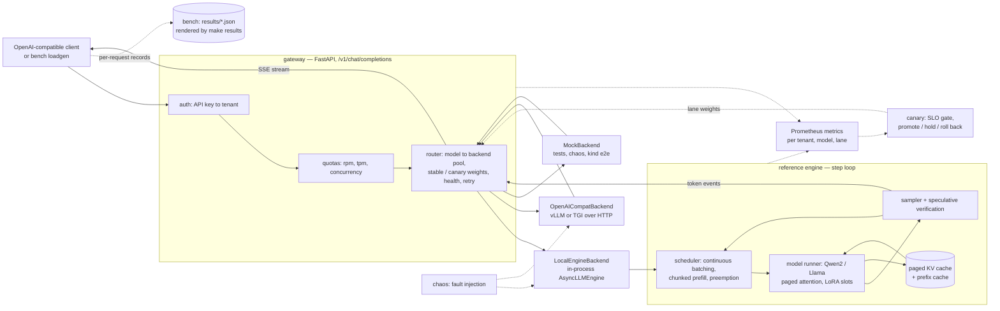

# turboserve

**Serve many tenants from one GPU pool.** A from-scratch reference LLM engine (continuous
batching, paged KV cache with automatic prefix caching, speculative decoding, batched
multi-LoRA), an OpenAI-compatible multi-tenant gateway with SLO-gated canaries and chaos
testing, and a vLLM + Kubernetes production deployment path.

## Status

**Scaffold phase.** This commit contains the repository skeleton only: packaging, the
`turboserve` CLI with its `version` and `hwinfo` commands, configuration, logging, tooling
and CI. The engine, gateway, canary, chaos and benchmark modules are empty packages that
module owners fill in next. No benchmark has been run, so this README contains no results
table yet; measured numbers will live in `docs/results.md` and be generated from
`results/*.json`, never hand-written.

## Architecture

Request path and the pieces that observe it. Solid arrows are the data path, dashed arrows are
control and instrumentation. Every box except the client and the results store is a package
under `src/turboserve/`; the ones marked `[planned]` in the layout below are drawn here because
this is the shape the modules are being written to, not because they exist today.



## Layout

The tree below is the target layout. `[planned]` marks a directory that exists and is tracked
but whose contents are still to be written by the owning module; everything unmarked is in the
repository today.

```
turboserve/
  pyproject.toml uv.lock Makefile .pre-commit-config.yaml
  Dockerfile.gateway  Dockerfile.engine
  .github/workflows/ci.yml
  src/turboserve/
    __init__.py  _version.py  config.py  cli.py  logging_utils.py  hwinfo.py
    engine/      reference engine
      core/      sequences, block allocator, KV cache, prefix cache, scheduler, sampler  [planned]
      model/     Qwen2 + Llama with paged KV, reference and Triton attention             [planned]
      runtime/   model runner, LLMEngine / AsyncLLMEngine, naive baselines, streaming    [planned]
      spec/      speculative decoding: drafters, verification, spec engine               [planned]
      lora/      adapter loading, GPU slot registry, grouped LoRA linears                [planned]
    gateway/     OpenAI-compatible multi-tenant API                                      [planned]
      backends/  local engine, OpenAI-compatible HTTP, mock                              [planned]
    canary/      SLO-gated progressive delivery                                          [planned]
    chaos/       fault injection and chaos harness                                       [planned]
    bench/       load generator, metrics, scenarios, reports                             [planned]
      scenarios/                                                                         [planned]
  deploy/        helm/ kustomize/ kind/ grafana/ prometheus/ vllm/                       [planned]
  configs/       tenants.yaml, models.yaml, canary.yaml, bench/*.yaml                    [planned]
  scripts/       model download, adapter creation, benchmark driver, hardware info       [planned]
    vastai/      provision, sync, run_remote, pull_results, destroy on the rented H100   [planned]
  tests/         unit/ gpu/ conftest.py
    integration/ gateway + engine end-to-end tests                                       [planned]
  docs/          index.md
    (rest)       architecture, per-module pages, benchmarking, runbook, adr/             [planned]
  results/       measured JSON, generated markdown, plots                [empty until the first run]
```

A `[planned]` package under `src/turboserve/` currently holds only its `__init__.py`
docstring; every other `[planned]` directory holds only a `.gitkeep`.

Four spec deliverables are not here yet — `docker-compose.yml`, the `kind-e2e` workflow, the
`helm lint` + `kubeconform` CI job, and `scripts/vastai/` together with the `make bench-h100`
target that drives the whole measurement suite on a rented H100. The first three are blocked on
the (still empty) Helm chart and Prometheus/Grafana assets; the fourth is blocked on the `bench/`
scenarios it would run remotely. A fifth item is blocked on hardware rather than on code:
`Dockerfile.engine` has never been built, because its CUDA layers do not fit a hosted CI
runner's disk. (`Dockerfile.gateway` is built and started by CI on every push.) All five are
tracked in [CONTRIBUTING.md](CONTRIBUTING.md#deliverables-not-built-yet).

## Quickstart (development)

```bash
uv sync --all-groups          # creates .venv (CPython 3.12) and installs runtime + dev deps
uv run turboserve version
uv run turboserve hwinfo      # JSON record of GPU, driver, CUDA, torch, git sha
uv run pytest -q              # CPU unit tests (slow and gpu markers excluded)

make docker-build             # gateway container image; needs Docker, which WSL does not have
docker run --rm turboserve-gateway:dev        # same hwinfo record, from inside the image
```

`make setup lint typecheck test` does the first four through the Makefile. See
[CONTRIBUTING.md](CONTRIBUTING.md) for the full development workflow, test markers and GPU
etiquette, and [docs/index.md](docs/index.md) for the documentation map.

## Results

This README states no performance numbers of its own. Every table it will show is rendered by
`make results` from the JSON files under `results/`, each of which records the hardware, the
software versions, the configuration and the timestamp of the run that produced it, and each
rendered table carries a one-line provenance note. Until a run happens, `docs/results.md`
lists the scenarios and the exact command that measures each one.

## License

Apache-2.0. See [LICENSE](LICENSE).
