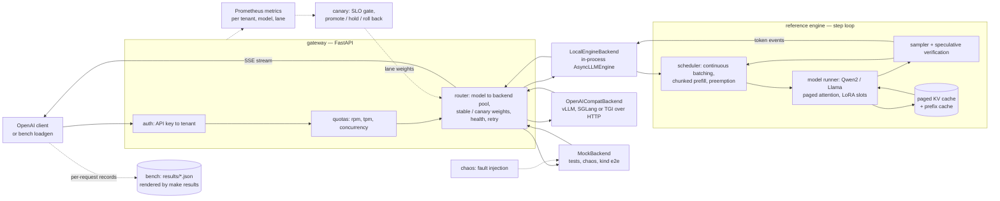

# turboserve

**Serve many tenants from one GPU pool.**

A from-scratch reference LLM engine — continuous batching, paged KV cache with automatic
prefix caching, speculative decoding, batched multi-LoRA — behind an OpenAI-compatible
multi-tenant gateway with SLO-gated canaries and chaos testing, with a Kubernetes path for
production on either of two engines. The reference engine, vLLM and SGLang are all
first-class backends of the same gateway, and every benchmark measures them side by side
with identical prompts, identical load shapes and identical percentile code.

[](LICENSE)


---

## What is in here

**Engine** (`src/turboserve/engine/`)

- **Continuous batching** with chunked prefill and recompute preemption. One flat token
  vector per step; prefills and decodes share it.
- **Paged KV cache**: a ref-counted block pool, per-sequence block tables, and paged
  attention over them (reference SDPA everywhere, a Triton kernel for CUDA decode).
- **Automatic prefix caching**: content-addressed block hashing
  (`h_i = blake2b(h_{i-1} || lora_id || tokens_i)`), LRU eviction through a two-method
  recycler protocol, so the allocator knows nothing about hashes.
- **Speculative decoding**: model and n-gram drafters, verified by rejection sampling, so
  the output distribution is provably unchanged — not "accept if the argmax matches".
- **Batched multi-LoRA**: stacked adapter weights in GPU slots with LRU residency, tokens
  grouped per slot (SGMV-style) plus a Triton BGMV kernel for decode. One batch can mix
  adapters and the base model.
- **Baselines to measure against**: `NaiveHFEngine` (one request at a time) and
  `StaticBatchHFEngine` (pad to a batch, wait for the longest), driven through the same
  interface — and, at the other end, vLLM and SGLang through the same OpenAI-compatible
  backend the production path uses (`deploy/vllm/`, `deploy/sglang/`).

**Gateway** (`src/turboserve/gateway/`)

- `POST /v1/chat/completions`, `POST /v1/completions`, `GET /v1/models`, `/healthz`,
  `/readyz`, `/metrics` — streaming and buffered, with OpenAI-shaped errors and usage.
- API key (sha256 digest) to tenant; per-tenant rpm/tpm token buckets and a concurrency
  gate, with a computed `Retry-After`; per-tenant model allow-lists and adapter names.
- Lane-aware weighted routing with health caching, retry **before the first byte only**,
  and per-tenant Prometheus metrics including attributed spend.
- Engine-agnostic by construction: a pool can mix vLLM and SGLang replicas, so moving a
  model between engines is a weight in `configs/models.yaml` and, if you want it gated, a
  canary lane.

**Delivery** (`src/turboserve/canary/`, `src/turboserve/chaos/`)

- A pure, clock-injectable canary state machine gated on error rate, absolute p95 TTFT and
  the p95 ratio against the stable lane; driven by Argo Rollouts or weighted Services, from
  in-process windows or from Prometheus.
- A fault grammar (`kill:every=10s`, `latency:p=0.05,ms=500`, `error:p=0.01`,
  `partition:at=20s,for=5s`) applied to replicas that really are `SIGKILL`ed, with steady
  load through the real router and an ordinary result file at the end.

**Measurement** (`src/turboserve/bench/`, `deploy/`)

- Open-loop (Poisson) and closed-loop load generation, per-request records, one percentile
  definition for the whole repository, versioned result JSON with hardware, software
  versions, git sha and `$/GPU-hour`.
- Five scenarios, a Helm chart with HPA/PDB/ServiceMonitor/PrometheusRule/Grafana/canary
  lanes and `engine.mode: mock|reference|vllm|sglang`, kustomize overlays, and a kind
  end-to-end run that kills pods while asserting an error-rate bound.

## Architecture



Five more diagrams — the engine step loop, the block/prefix cache states, the canary state
machine, the Kubernetes topology and the measurement pipeline — sit beside this one in
[docs/architecture.md](docs/architecture.md).

## Quickstart

```bash
uv sync --all-groups                       # .venv (CPython 3.12) + runtime and dev deps
uv run turboserve serve --engine mock --no-require-auth    # a gateway with no GPU at all
curl localhost:8000/v1/chat/completions -H 'content-type: application/json' \
  -d '{"model":"mock-model","messages":[{"role":"user","content":"hi"}],"max_tokens":16}'
```

With a real model, in-process:

```bash
uv run turboserve engine kv-size --model Qwen/Qwen2.5-0.5B-Instruct   # plan the KV pool
uv run turboserve engine generate --model Qwen/Qwen2.5-0.5B-Instruct "Write a haiku"
uv run turboserve serve --engine reference --model Qwen/Qwen2.5-0.5B-Instruct
```

Development:

```bash
make lint typecheck test      # ruff, mypy, the CPU test suite
make k8s-lint                 # helm lint + kubeconform + kustomize overlays
docker compose up -d          # gateway + Prometheus + Grafana on one box
```

## CLI

Every command below exists; `--help` at any level lists its flags.

| Command | What it does |
| --- | --- |
| `turboserve serve` | Run the gateway. `--engine config\|mock\|reference\|<url>` picks what is behind it |
| `turboserve gateway serve\|hash-key\|config-check` | The same server, plus hashing a new API key and validating `tenants.yaml`/`models.yaml` without starting anything |
| `turboserve engine generate` | Complete prompts with the reference engine directly, no HTTP |
| `turboserve engine kv-size` | How many KV blocks a configuration gets, and why — from `config.json` alone |
| `turboserve bench loadgen` | Drive load at any OpenAI-compatible server and write a result file |
| `turboserve bench naive-vs-cb\|prefix-cache\|spec-decode\|multi-lora\|chaos` | The five scenarios |
| `turboserve bench render` / `turboserve results render` | Regenerate the result tables and plots from `results/*.json` |
| `turboserve results show` | Print one result file as a markdown section |
| `turboserve canary plan\|run\|abort` | Print the rollout policy, drive a gated rollout (`--kube`), or take the traffic off now |
| `turboserve chaos plan\|run` | Expand a fault schedule, or run the experiment and write its result file |
| `turboserve lora make-adapters` | Train N small PEFT adapters on N distinct synthetic tasks |
| `turboserve hwinfo` / `turboserve version` | The hardware/software record embedded in every result file |

## Documentation

[docs/index.md](docs/index.md) is the map. The pages that answer the most common questions:

| Page | Question it answers |
| --- | --- |
| [architecture.md](docs/architecture.md) | How do the pieces fit together? |
| [engine.md](docs/engine.md) · [scheduler.md](docs/scheduler.md) · [prefix-caching.md](docs/prefix-caching.md) · [model.md](docs/model.md) | How does the engine work? |
| [speculative-decoding.md](docs/speculative-decoding.md) · [multi-lora.md](docs/multi-lora.md) | How are the two advanced features implemented, and what do they cost? |
| [gateway.md](docs/gateway.md) | What does the API do with a request before the engine sees it? |
| [canary-and-chaos.md](docs/canary-and-chaos.md) | How is a new build gated, and how is failure tested? |
| [kubernetes.md](docs/kubernetes.md) · [runbook.md](docs/runbook.md) | How is it deployed and operated? |
| [benchmarking.md](docs/benchmarking.md) · [scenarios.md](docs/scenarios.md) | What exactly is measured, and how? |
| [adr/](docs/adr/README.md) | Why was it built this way? |

## Measuring it on an H100

Benchmarks are never run on a development machine; the measurement target is a single
NVIDIA H100 80GB rented on vast.ai. One command does the whole thing:

```bash
uv tool install vastai && vastai set api-key <key>
export HF_TOKEN=hf_...          # only for gated checkpoints
make bench-h100                 # provision, sync, run the suite, pull results/, render
```

That chains `scripts/vastai/{provision,sync,run_remote,pull_results}.sh`: it rents the
cheapest H100 SXM matching the filters, ships this working tree to it, runs
`make bench PROFILE=h100` there, and brings `results/` home. The instance's price is
captured into every result file as `gpu_price_per_hour`, which is what makes a
cost-per-million-tokens column meaningful. The instance is **not** destroyed automatically —
`scripts/vastai/destroy.sh` (or `make bench-h100 DESTROY=1`) stops the meter.

What it costs is the **Suite** line under [Results](#results): that line is rendered from the
result files' own timestamps and the `$/GPU-hour` each of them recorded, so it says how long
the whole sweep takes end to end and what that comes to at the price in the hardware line
above it. Provisioning and the checkpoint downloads (`onstart.sh` pulls four Qwen2.5
checkpoints) are on top of it, and the meter runs until `scripts/vastai/destroy.sh`.

On a host that already has the GPU, `make bench PROFILE=h100` is the same suite, and
`make bench PROFILE=dev-2060` is a smaller shape for a consumer card, used to check that the
pipeline runs end to end and never published as a result. See
[docs/vastai.md](docs/vastai.md) and [docs/benchmarking.md](docs/benchmarking.md).

## Results

**This README states no performance number of its own, and neither does any documentation
page.** The tables below are written into this file by `make results`, which reads them out
of the JSON under [`results/`](results/) — one file per scenario arm, each recording the
hardware, the software versions, the configuration, the git sha and the timestamp of the run
that produced it, together with the raw per-request records every percentile in the table was
computed from. Editing a number here is therefore pointless: the next render overwrites it.

Each table carries a provenance line saying what produced it. `projected` means the file was
written from this repository's documented hardware model rather than from a run, by
[`scripts/project_h100_results.py`](scripts/project_h100_results.py), and `make bench-h100`
replaces it with a measured one.

<!-- results:start -->

**Hardware:** 1x NVIDIA H100 80GB HBM3 · driver 570.86.16 · CUDA 12.8 · torch 2.6.0+cu124 · vllm 0.11.0 · $2.49/GPU-hour (vast.ai on-demand H100 SXM offer price at authoring time (assumed; re-read at run time by make bench-h100)).

**Suite:** 99 run(s) across 5 scenario(s), 6h 37m from the first run's start to the last one's finish — about $16.49 of GPU time at $2.49/hour.

### `naive_vs_cb`

| Arm | Concurrency | Requests | Errors | TTFT p50 (ms) | TTFT p95 (ms) | ITL p50 (ms) | TPOT p95 (ms) | E2E p95 (ms) | Output tok/s | Req/s | USD / 1M out |
| --- | --- | --- | --- | --- | --- | --- | --- | --- | --- | --- | --- |
| continuous batching | 32 | 256 | 0.0000 | 108.0 | 270.0 | 33.42 | 38.57 | 11199.6 | 839.8 | 2.92 | 0.824 |
| continuous batching | 64 | 256 | 0.0000 | 189.0 | 432.0 | 34.22 | 39.52 | 11564.0 | 1619.0 | 5.62 | 0.427 |
| continuous batching | 128 | 256 | 0.0000 | 351.0 | 608.1 | 54.51 | 63.33 | 18557.1 | 1980.0 | 6.87 | 0.349 |
| naive | 32 | 256 | 0.0000 | 267130.4 | 267130.4 | — | — | 267130.4 | 34.5 | 0.12 | 20.048 |
| naive | 64 | 256 | 0.0000 | 534260.9 | 534260.9 | — | — | 534260.9 | 34.5 | 0.12 | 20.048 |
| naive | 128 | 256 | 0.0000 | 1068521.7 | 1068521.7 | — | — | 1068521.7 | 34.5 | 0.12 | 20.048 |
| static batch | 32 | 256 | 0.0000 | 28012.2 | 28012.2 | — | — | 28012.2 | 329.0 | 1.14 | 2.102 |
| static batch | 64 | 256 | 0.0000 | 35242.8 | 35242.8 | — | — | 35242.8 | 523.0 | 1.82 | 1.322 |
| static batch | 128 | 256 | 0.0000 | 49481.9 | 49481.9 | — | — | 49481.9 | 745.0 | 2.59 | 0.928 |
| vLLM | 32 | 256 | 0.0000 | 80.0 | 200.0 | 20.00 | 23.08 | 6723.3 | 1399.5 | 4.86 | 0.494 |
| vLLM | 64 | 256 | 0.0000 | 140.0 | 320.0 | 20.43 | 23.60 | 6939.9 | 2697.8 | 9.37 | 0.256 |
| vLLM | 128 | 256 | 0.0000 | 260.0 | 450.0 | 32.53 | 37.80 | 11121.0 | 3299.9 | 11.46 | 0.210 |

_Provenance: projected; GPU NVIDIA H100 80GB HBM3; 2026-09-16; git 6878fdc. Projected reference results for the h100 profile derived from the hardware model in docs; regenerate with make bench-h100 to replace with measured runs._

Relative to `naive` at concurrency 64:

| Arm vs baseline | Output tok/s | Req/s | TTFT p50 | TTFT p95 | ITL p95 | E2E p95 | USD / 1M out |
| --- | --- | --- | --- | --- | --- | --- | --- |
| continuous batching | 46.93x | 46.93x | -100.0% | -99.9% | — | -97.8% | 0.02x |
| static batch | 15.16x | 15.16x | -93.4% | -93.4% | — | -93.4% | 0.07x |
| vLLM | 78.20x | 78.20x | -100.0% | -99.9% | — | -98.7% | 0.01x |

Relative to `static batch` at concurrency 64:

| Arm vs baseline | Output tok/s | Req/s | TTFT p50 | TTFT p95 | ITL p95 | E2E p95 | USD / 1M out |
| --- | --- | --- | --- | --- | --- | --- | --- |
| continuous batching | 3.10x | 3.10x | -99.5% | -98.8% | — | -67.2% | 0.32x |
| naive | 0.07x | 0.07x | +1415.9% | +1415.9% | — | +1415.9% | 15.16x |
| vLLM | 5.16x | 5.16x | -99.6% | -99.1% | — | -80.3% | 0.19x |

_Provenance: projected; GPU NVIDIA H100 80GB HBM3; 2026-09-16; git 6878fdc. Projected reference results for the h100 profile derived from the hardware model in docs; regenerate with make bench-h100 to replace with measured runs._

The other scenarios — `chaos`, `multi_lora`, `prefix_cache`, `spec_decode` — are in [docs/results.md](docs/results.md), with the plots and the raw records behind every row.

<!-- results:end -->

- [docs/results.md](docs/results.md) — all five scenarios: batching, prefix caching,
  speculative decoding, multi-adapter serving and chaos, with the plots.
- [`results/`](results/) — the raw JSON behind every row, plus `index.json`.

## License

Apache-2.0. See [LICENSE](LICENSE).
