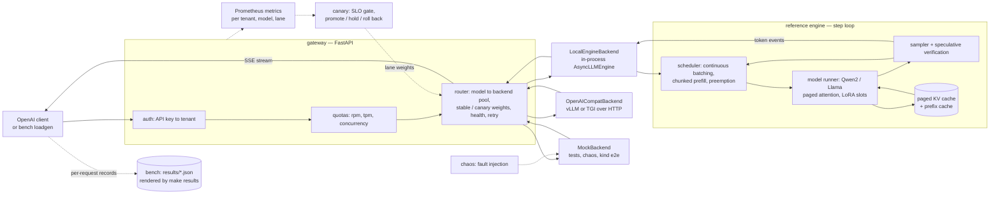

# turboserve

**Serve many tenants from one GPU pool.**

A from-scratch reference LLM engine — continuous batching, paged KV cache with automatic
prefix caching, speculative decoding, batched multi-LoRA — behind an OpenAI-compatible
multi-tenant gateway with SLO-gated canaries and chaos testing, with a vLLM + Kubernetes
path for production. The reference engine and vLLM are both first-class backends of the same
gateway, and every benchmark measures them side by side with identical prompts, identical
load shapes and identical percentile code.

[](LICENSE)


---

## What is in here

**Engine** (`src/turboserve/engine/`)

- **Continuous batching** with chunked prefill and recompute preemption. One flat token
  vector per step; prefills and decodes share it.
- **Paged KV cache**: a ref-counted block pool, per-sequence block tables, and paged
  attention over them (reference SDPA everywhere, a Triton kernel for CUDA decode).
- **Automatic prefix caching**: content-addressed block hashing
  (`h_i = blake2b(h_{i-1} || lora_id || tokens_i)`), LRU eviction through a two-method
  recycler protocol, so the allocator knows nothing about hashes.
- **Speculative decoding**: model and n-gram drafters, verified by rejection sampling, so
  the output distribution is provably unchanged — not "accept if the argmax matches".
- **Batched multi-LoRA**: stacked adapter weights in GPU slots with LRU residency, tokens
  grouped per slot (SGMV-style) plus a Triton BGMV kernel for decode. One batch can mix
  adapters and the base model.
- **Baselines to measure against**: `NaiveHFEngine` (one request at a time) and
  `StaticBatchHFEngine` (pad to a batch, wait for the longest), driven through the same
  interface.

**Gateway** (`src/turboserve/gateway/`)

- `POST /v1/chat/completions`, `POST /v1/completions`, `GET /v1/models`, `/healthz`,
  `/readyz`, `/metrics` — streaming and buffered, with OpenAI-shaped errors and usage.
- API key (sha256 digest) to tenant; per-tenant rpm/tpm token buckets and a concurrency
  gate, with a computed `Retry-After`; per-tenant model allow-lists and adapter names.
- Lane-aware weighted routing with health caching, retry **before the first byte only**,
  and per-tenant Prometheus metrics including attributed spend.

**Delivery** (`src/turboserve/canary/`, `src/turboserve/chaos/`)

- A pure, clock-injectable canary state machine gated on error rate, absolute p95 TTFT and
  the p95 ratio against the stable lane; driven by Argo Rollouts or weighted Services, from
  in-process windows or from Prometheus.
- A fault grammar (`kill:every=10s`, `latency:p=0.05,ms=500`, `error:p=0.01`,
  `partition:at=20s,for=5s`) applied to replicas that really are `SIGKILL`ed, with steady
  load through the real router and an ordinary result file at the end.

**Measurement** (`src/turboserve/bench/`, `deploy/`)

- Open-loop (Poisson) and closed-loop load generation, per-request records, one percentile
  definition for the whole repository, versioned result JSON with hardware, software
  versions, git sha and `$/GPU-hour`.
- Five scenarios, a Helm chart with HPA/PDB/ServiceMonitor/PrometheusRule/Grafana/canary
  lanes, kustomize overlays, and a kind end-to-end run that kills pods while asserting an
  error-rate bound.

## Architecture



Six more diagrams — the engine step loop, the block/prefix cache states, the canary state
machine, the Kubernetes topology and the measurement pipeline — are in
[docs/architecture.md](docs/architecture.md).

## Quickstart

```bash
uv sync --all-groups                       # .venv (CPython 3.12) + runtime and dev deps
uv run turboserve serve --engine mock --no-require-auth    # a gateway with no GPU at all
curl localhost:8000/v1/chat/completions -H 'content-type: application/json' \
  -d '{"model":"mock-model","messages":[{"role":"user","content":"hi"}],"max_tokens":16}'
```

With a real model, in-process:

```bash
uv run turboserve engine kv-size --model Qwen/Qwen2.5-0.5B-Instruct   # plan the KV pool
uv run turboserve engine generate --model Qwen/Qwen2.5-0.5B-Instruct "Write a haiku"
uv run turboserve serve --engine reference --model Qwen/Qwen2.5-0.5B-Instruct
```

Development:

```bash
make lint typecheck test      # ruff, mypy, the CPU test suite
make k8s-lint                 # helm lint + kubeconform + kustomize overlays
docker compose up -d          # gateway + Prometheus + Grafana on one box
```

## CLI

Every command below exists; `--help` at any level lists its flags.

| Command | What it does |
| --- | --- |
| `turboserve serve` | Run the gateway. `--engine config\|mock\|reference\|<url>` picks what is behind it |
| `turboserve gateway serve\|hash-key\|config-check` | The same server, plus hashing a new API key and validating `tenants.yaml`/`models.yaml` without starting anything |
| `turboserve engine generate` | Complete prompts with the reference engine directly, no HTTP |
| `turboserve engine kv-size` | How many KV blocks a configuration gets, and why — from `config.json` alone |
| `turboserve bench loadgen` | Drive load at any OpenAI-compatible server and write a result file |
| `turboserve bench naive-vs-cb\|prefix-cache\|spec-decode\|multi-lora\|chaos` | The five scenarios |
| `turboserve bench render` / `turboserve results render` | Regenerate the result tables and plots from `results/*.json` |
| `turboserve results show` | Print one result file as a markdown section |
| `turboserve canary plan\|run\|abort` | Print the rollout policy, drive a gated rollout (`--kube`), or take the traffic off now |
| `turboserve chaos plan\|run` | Expand a fault schedule, or run the experiment and write its result file |
| `turboserve lora make-adapters` | Train N small PEFT adapters on N distinct synthetic tasks |
| `turboserve hwinfo` / `turboserve version` | The hardware/software record embedded in every result file |

## Documentation

[docs/index.md](docs/index.md) is the map. The pages that answer the most common questions:

| Page | Question it answers |
| --- | --- |
| [architecture.md](docs/architecture.md) | How do the pieces fit together? |
| [engine.md](docs/engine.md) · [scheduler.md](docs/scheduler.md) · [prefix-caching.md](docs/prefix-caching.md) · [model.md](docs/model.md) | How does the engine work? |
| [speculative-decoding.md](docs/speculative-decoding.md) · [multi-lora.md](docs/multi-lora.md) | How are the two advanced features implemented, and what do they cost? |
| [gateway.md](docs/gateway.md) | What does the API do with a request before the engine sees it? |
| [canary-and-chaos.md](docs/canary-and-chaos.md) | How is a new build gated, and how is failure tested? |
| [kubernetes.md](docs/kubernetes.md) · [runbook.md](docs/runbook.md) | How is it deployed and operated? |
| [benchmarking.md](docs/benchmarking.md) · [scenarios.md](docs/scenarios.md) | What exactly is measured, and how? |
| [adr/](docs/adr/README.md) | Why was it built this way? |

## Measuring it on an H100

Benchmarks are never run on a development machine; the measurement target is a single
NVIDIA H100 80GB rented on vast.ai. One command does the whole thing from a laptop:

```bash
uv tool install vastai && vastai set api-key <key>
export HF_TOKEN=hf_...          # only for gated checkpoints
make bench-h100                 # provision, sync, run the suite, pull results/, render
```

That chains `scripts/vastai/{provision,sync,run_remote,pull_results}.sh`: it rents the
cheapest H100 SXM matching the filters, ships this working tree to it, runs
`make bench PROFILE=h100` there, and brings `results/` home. The instance's price is
captured into every result file as `gpu_price_per_hour`, which is what makes a
cost-per-million-tokens column meaningful. The instance is **not** destroyed automatically —
`scripts/vastai/destroy.sh` (or `make bench-h100 DESTROY=1`) stops the meter.

On a host that already has the GPU, `make bench PROFILE=h100` is the same suite, and
`make bench PROFILE=dev-2060` is a small shape that fits a 6 GB card. See
[docs/vastai.md](docs/vastai.md) and [docs/benchmarking.md](docs/benchmarking.md).

## Results

**This README states no performance numbers of its own, and neither does any documentation
page.** Every table is rendered by `make results` from the JSON files under
[`results/`](results/), each of which records the hardware, the software versions, the
configuration, the git sha and the timestamp of the run that produced it. Each rendered
table carries a one-line provenance note saying what produced it.

- [docs/results.md](docs/results.md) — the rendered tables and plots.
- [`results/`](results/) — the raw JSON, one file per scenario arm, plus `index.json`.

Until the measurement run happens, `docs/results.md` says so and names the command that
fills it.

## License

Apache-2.0. See [LICENSE](LICENSE).
