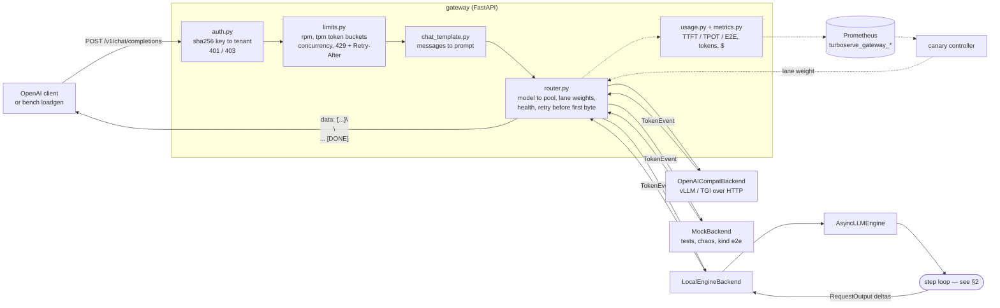
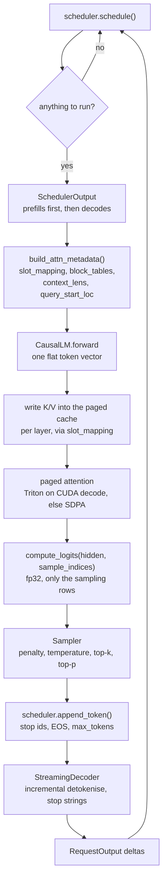
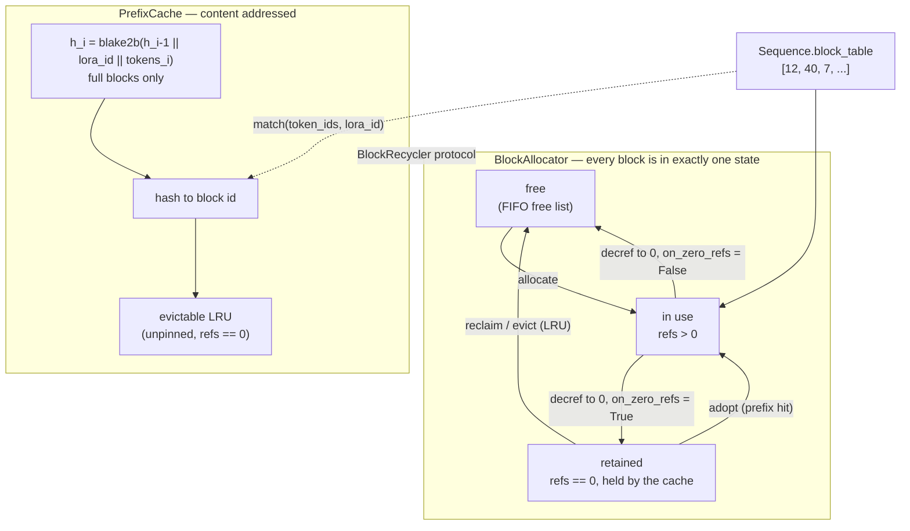
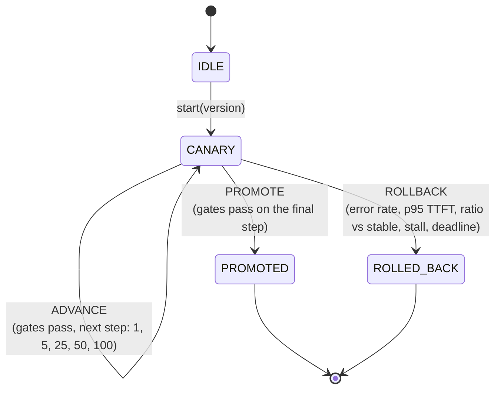
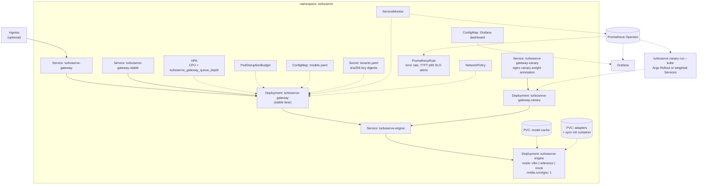
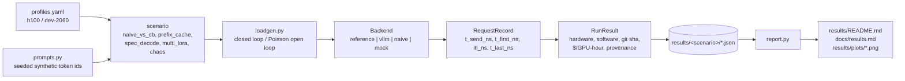

# Architecture

turboserve is one Python package with five layers. Each layer is useful on its own and
talks to the next through a small, typed contract, which is why the same gateway can front
a from-scratch engine and a production vLLM server, and why the same benchmark harness can
measure both.

| Layer | Package | What it owns |
| --- | --- | --- |
| Gateway | `turboserve.gateway` | OpenAI-compatible HTTP, API keys to tenants, quotas, routing, SSE, Prometheus metrics, cost attribution |
| Engine | `turboserve.engine` | Continuous batching, paged KV cache with prefix caching, Qwen2/Llama with paged attention, speculative decoding, batched multi-LoRA |
| Delivery | `turboserve.canary`, `turboserve.chaos` | SLO-gated progressive rollout; fault injection and the chaos harness |
| Measurement | `turboserve.bench` | Load generation, per-request records, the five scenarios, rendered result pages |
| Deployment | `deploy/` | Helm chart, kustomize overlays, kind end-to-end, Prometheus rules, Grafana dashboard, the production vLLM path |

The contracts between them are written down once, in
[`contracts.md`](contracts.md): `SamplingParams`, `AttnMetadata`, `LoRAContext`,
`GenerateRequest`/`TokenEvent`, `RunResult`. Every page below assumes them.

---

## 1. The request path

A request enters as OpenAI JSON and leaves as an SSE stream. Between those two points it
is authenticated, charged against a quota, routed to a lane and a replica, turned into
engine tokens, and accounted for. Solid arrows are the data path; dashed arrows are control
and instrumentation.

Two rules of the router are worth stating because everything else follows from them:

- A retry is only legal **before the first byte**. Once a token has been written to the
  socket the request cannot be moved to another replica, so a later failure is delivered as
  a terminating error event, not as an exception.
- The tenant's concurrency slot is taken **before** the backend is asked for anything, and
  released in a `finally`. A stream abandoned by the client therefore frees both the slot
  and the engine's KV blocks.

---

## 2. The engine step loop

One step produces at most one token per sampling sequence — but it can produce them for
sixty-four sequences at once, and it can spend the same step finishing someone else's
prompt. That is continuous batching: there is no notion of a batch that starts and ends.

The scheduler's order within a step is fixed and is what keeps the system live under
pressure:

1. **Running decodes** — one token each. If a sequence cannot get a block, the scheduler
   preempts a victim (recompute mode: its blocks are freed and its progress reset, its
   generated tokens kept) and retries.
2. **Preempted sequences**, at the front of the waiting queue.
3. **Waiting sequences**, admitted while the token budget and `max_num_seqs` allow, with
   prefill chunked to whatever budget is left and prefix-cache hits subtracted from the
   work.

Admission is head-of-line: if the queue head cannot be funded, admission stops for that
step. That is deliberate — it prevents a stream of small requests from starving a large
one — and it is the reason one oversized request slows admissions rather than being
skipped.

`engine.md` and `scheduler.md` carry the details; `speculative-decoding.md` describes the
variant step in which each sequence is fed `k+1` tokens and the extra ones are verified.

---

## 3. Blocks, slots and the prefix cache

KV memory is one flat pool of fixed-size blocks. A sequence owns a *block table* — a list
of block ids — and a token's KV lives at `block_id * block_size + offset`. Nothing is
contiguous, so nothing has to be moved when a sequence grows, and two sequences that begin
with the same tokens can point at the same blocks.

Three consequences fall out of this shape:

- **The allocator knows nothing about hashes.** The cache is plugged in as a
  `BlockRecycler` with two methods (`on_zero_refs`, `reclaim`); returning `False` from
  `on_zero_refs` everywhere turns the allocator back into a plain free list. That is the
  whole coupling.
- **`lora_id` is mixed into the hash chain**, so two tenants using different adapters can
  never share KV blocks even when their prompts are identical.
- **Preemption is recompute, not swap.** A preempted sequence's blocks go back to the pool
  and its prompt is recomputed later — usually cheaply, because the prefix cache still has
  most of it. The trade is written up in [ADR-0002](adr/ADR-0002-recompute-vs-swap-preemption.md).

---

## 4. The canary state machine

A rollout is a small state machine over a sliding window of request outcomes. It is pure:
no clock of its own, no I/O, and it accepts evidence from either the gateway's in-process
windows or a Prometheus query — both arrive as the same `LaneSummary`.

The gates, in the order they are evaluated: minimum sample size (or a stall rollback if the
canary is getting no traffic at all), absolute error rate, absolute p95 TTFT, p95 ratio
against the *stable* lane measured over the same window, then the hold time. Only after all
of them pass does the weight move. Thresholds live in `configs/canary.yaml`; the reasoning
behind the defaults is [ADR-0006](adr/ADR-0006-canary-slo-thresholds.md).

---

## 5. Kubernetes topology

The chart deploys the gateway and the engine as separate workloads, because they scale on
different things: the gateway is CPU- and connection-bound and scales horizontally, while
the engine owns a GPU and does not.

Two label facts matter when reading any dashboard or alert:

- A metric's `lane` label is the **backend's** lane from `models.yaml`, not the pod's. The
  ServiceMonitor therefore relabels the pod's `turboserve.io/lane` to `pod_lane`; a target
  label called `lane` would collide and Prometheus would rename the real one.
- The label sets are not uniform. `turboserve_gateway_rate_limited_total` is
  `(tenant, limit)` with no model or lane; `turboserve_gateway_queue_depth` is `(model)`
  with no lane. A query that assumes one label set returns nothing.

`kubernetes.md` has the values reference and the kind end-to-end run; `runbook.md` has the
operations.

---

## 6. How the pieces are measured

Every scenario drives load through the *same* `Backend` protocol the gateway uses, so the
reference engine, a naive `transformers.generate` baseline and a real vLLM server are
measured by identical client code and identical percentile definitions.

No number in this repository is typed by a human into a markdown file. `make results`
renders every table from the JSON, and each table carries a one-line provenance note saying
what hardware produced it and whether the run was measured or projected.
`benchmarking.md` defines the metrics; `scenarios.md` defines the experiments.
