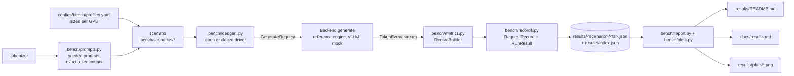

# Benchmarking

How turboserve is measured: the definition of every metric, the shape of the load, the five
scenarios, the profiles that size them for a given GPU, and the path from a run to a table
on a page.

The rule that governs this whole subsystem: **a number exists in this repository only as a
field of a JSON file under `results/`, and reaches a markdown page only by being rendered
out of one.** Every table is followed by a line saying where its numbers came from.

## Contents

- [The pipeline](#the-pipeline)
- [Metric definitions](#metric-definitions)
- [Percentiles](#percentiles)
- [Open and closed loop](#open-and-closed-loop)
- [Prompts](#prompts)
- [Profiles](#profiles)
- [Scenarios](#scenarios)
- [The result file](#the-result-file)
- [Rendering](#rendering)
- [Provenance](#provenance)
- [Running it](#running-it)
- [How this is tested](#how-this-is-tested)
- [Limitations](#limitations)

## The pipeline



Each box is one module, and each arrow is the only way data crosses between them. In
particular the load generator never computes a latency and the report renderer never sees a
token: the record produced by `RecordBuilder` is the single narrow waist of the system.

## Metric definitions

Four timestamps describe a request. The engine and the gateway use the names from
[`docs/contracts.md`](contracts.md) (`t_arrival`, `t_first_scheduled`, `t_first_token`,
`t_finish`); the load generator observes the same instants from the client side and stores
them on a `RequestRecord` as `t_send_ns`, `t_first_ns` and `t_last_ns`.

| Metric | Definition | Where it is computed |
| --- | --- | --- |
| **TTFT** — time to first token | `t_first_token - t_arrival` | `RequestRecord.ttft_ms` |
| **ITL** — inter-token latency | the series of gaps between successive output tokens | `RequestRecord.itl_ms` |
| **TPOT** — time per output token | `(t_finish - t_first_token) / (n_out - 1)` | `RequestRecord.tpot_ms` |
| **E2E** — end-to-end latency | `t_finish - t_arrival` | `RequestRecord.e2e_ms` |
| **Output tok/s** | output tokens of successful requests ÷ wall clock | `RunResult.summarize()` |
| **Total tok/s** | prompt + output tokens of successful requests ÷ wall clock | `RunResult.summarize()` |
| **Req/s** | successful requests ÷ wall clock | `RunResult.summarize()` |
| **Error rate** | failed requests ÷ all requests | `RunResult.summarize()` |
| **Goodput** | requests per second that met *every* asserted objective of an `SLO` | `RunResult.goodput()` |
| **USD / 1M output tokens** | `gpu_price_per_hour × wall_hours ÷ output_tokens × 10⁶` | `RunResult.summarize()` |

Details that change the numbers, and are therefore fixed in one place each:

- **TPOT excludes the first token.** That token's cost is TTFT, reported separately; below
  two output tokens TPOT is `None` rather than zero, because the decode phase has no
  measurable slope yet. It is `None` for the same reason when the last token was observed at
  the same instant as the first — what a blocking backend produces, since
  `transformers.generate` returns the whole completion at once — where a literal `0.0 ms`
  per token would render as the fastest decoder ever measured.
- **The wall clock is derived from the records**, from the first send to the last token
  received — not from process start to process exit. Model loading, tokenizer warm-up and
  writing the result file do not depress throughput.
- **Latency distributions use successful requests only**; the error rate counts all of
  them. A request that failed after three milliseconds would otherwise flatter the median.
- **Timestamps are `time.monotonic_ns()` read by the client.** A `TokenEvent` also carries
  the producing backend's own stamp, and the load generator deliberately ignores it: for an
  HTTP backend the producer's stamp excludes serialisation and the network, and a benchmark
  that quietly excluded them would flatter every remote engine it measured.
- **A chunk carrying several tokens** (speculative decoding accepts several per step)
  contributes one ITL sample per token, each equal to the interval since the previous chunk
  divided by the number of tokens in it. Tokens in the *first* chunk contribute no sample at
  all — nothing was observed to elapse for them — so the series is `output_tokens - k` long
  for a first chunk of `k` tokens, and the usual `output_tokens - 1` for one-token chunks.
  Padding with zeros was the alternative and would have pulled every percentile down towards
  a number nothing measured.
- **Token counts come from the backend's `usage` block when it sends one**, otherwise from
  the token ids observed; a backend that streams only text is counted one token per
  non-empty chunk.

## Percentiles

`p50/p90/p95/p99` everywhere, by **linear interpolation between ranks** — the definition
numpy calls `method="linear"`. With `n` sorted samples and rank `r = q/100 × (n-1)`, the
result interpolates between `sorted[floor(r)]` and `sorted[ceil(r)]`. One implementation
(`turboserve.bench.records.percentile`) serves the load generator, the canary controller and
the report renderer, so a p95 quoted in one place cannot disagree with a p95 quoted in
another. A percentile of an empty sample is `None`, never zero.

## Open and closed loop

Two drivers, answering different questions.

**Closed loop** (`LoadSpec(mode="closed", concurrency=N)`) keeps `N` requests in flight and
sends the next only when one finishes. It measures capacity at a fixed load level; latency
cannot run away, because the client slows down with the server. Used by the batching,
prefix-cache, speculative and adapter scenarios, where the question is "same load, which
configuration serves it better".

**Open loop** (`LoadSpec(mode="open", rate_rps=R)`) sends at an average rate of `R` with
**Poisson** inter-arrival times, whatever the server is doing. If the server cannot keep up,
queueing latency grows without bound and the tail explodes — the failure a closed-loop test
structurally cannot observe. Used by the chaos scenario and by any goodput question.

Arrivals are Poisson rather than periodic because real arrivals are memoryless: the bursts a
Poisson process produces are what fill a queue, and a metronome systematically under-reports
tail latency. `poisson_offsets(rate, count, seed=...)` computes the schedule as absolute
offsets from the start of the run, and the driver sleeps to those offsets rather than
sleeping one gap after each launch, so launch overhead cannot make a long run drift to a
lower effective rate than its result file claims.

Both drivers record `max_in_flight_observed`, because an intended concurrency and an
achieved one differ whenever the client is the bottleneck.

Warm-up requests are driven separately, closed-loop, and their records are kept out of the
measured set: they exist to pay for lazy CUDA context creation, kernel autotuning and the
first tokenizer call, and including them would put a one-off multi-second outlier into the
tail.

Failure is data, not a crash. A backend error, a timeout, an in-band error event or a stream
that ends without a terminating event each becomes one failed record; the run continues and
the error rate is a headline metric. On timeout the stream's iterator is closed, which under
the `Backend` contract aborts the work behind it — a load generator that abandoned streams
would leave the engine decoding for a client that stopped listening and corrupt every
subsequent measurement.

## Prompts

Three sources, all in `bench/prompts.py`.

**`synthetic`** — seeded, with exact token counts. Sub-word tokenizers make exact counts
awkward: decoding ids to text and re-encoding is not the identity. The builder samples token
ids, then drives them to a re-tokenisation fixpoint, trimming or topping up to keep the
length exact, and records per prompt whether the fixpoint was reached (`round_trip_exact`).
The ids are always exactly the requested length; the text is the decoding of those ids.

`shared_prefix_tokens` prepends one prefix, generated once, to every prompt — identical at
the token level, which is the level at which the prefix cache hashes blocks. Prefix-cache
experiments must send **token ids**, not text: re-tokenising the text can merge tokens across
the boundary between the shared prefix and the unique suffix and destroy the sharing being
measured. `build_requests(..., send_text=False)` is the default for that reason.

**`sharegpt`** — a loader for a locally downloaded ShareGPT-format JSON sample (not bundled;
it is large and not ours to redistribute). The first human turn becomes the prompt and the
length of the reply that followed it becomes `max_tokens`. Worth the trouble because its
joint distribution of input and output lengths is far more skewed than uniform sampling, and
tail latency lives in that skew.

**`file`** — `.txt` (one prompt per line), `.jsonl` or `.json`, for prompts captured from
real traffic or written by hand.

Requests built from prompts default to **greedy sampling with `ignore_eos`**, so two engines
given the same prompt do the same amount of work and every request produces exactly the
number of output tokens the profile asked for. A run that stopped early on an end-of-sequence
token would report throughput over a workload nobody specified.

## Profiles

`configs/bench/profiles.yaml` sizes every scenario for a machine. Two profiles ship:

| Profile | Machine | Notes |
| --- | --- | --- |
| `h100` | 1× NVIDIA H100 80GB SXM, bf16 | the published measurement target |
| `dev-2060` | a small consumer GPU, about 6 GB | fp16 only — pre-Ampere cards have no bf16 tensor cores; smoke runs, never published |

A profile names the models, request counts, input and output token ranges, concurrencies and
the scenario-specific knobs (shared prefix length, speculative `k`, adapter count and rank,
chaos worker count and fault interval). It is validated strictly: an unknown key is an error
before a GPU-hour is spent, not a silently ignored typo.

A profile deliberately carries **no latency or throughput objective**. Goodput needs a
service-level objective, but an objective shipped in the repository reads as a claim about
what the system achieves; objectives are passed at run time and recorded in the result file,
so a goodput figure can always be traced to the objective it was scored against. The schema
has a place for one (`SLOSpec`) for teams who want it pinned in their own fleet's YAML.

## Scenarios

Each scenario is a CLI subcommand under `src/turboserve/bench/scenarios/`, takes
`--profile h100|dev-2060`, writes `results/<scenario>/<timestamp>.json` and appends a row to
`results/index.json`. The five experiments and what each one compares:

| Scenario | Arms | What it isolates |
| --- | --- | --- |
| `naive_vs_cb` | sequential HF generate, static batching, the reference engine's continuous batching, and vLLM through the gateway — same prompts, same sampling | what continuous batching is worth, at three concurrencies |
| `prefix_cache` | prefix cache off vs on, on the reference engine and on vLLM, with a long shared system prompt | TTFT and the cache hit rate when requests share a prefix |
| `spec_decode` | target/draft model pairs and an n-gram drafter, swept over `k`, at three concurrencies | tokens/s and acceptance rate against target-only decoding |
| `multi_lora` | several adapter counts at rank 16, plus a base-only arm | adapter memory against merged copies, and the p95 cost of serving many adapters at equal concurrency |
| `chaos` | steady open-loop load while the chaos harness kills engine workers | error rate and tail latency under fault injection |

Every arm writes its own result file. Arms identify themselves through three optional keys
in `RunResult.config`, which is the whole contract between a scenario and the renderer:

- `config["label"]` — the arm's human name (`"continuous batching"`, `"cache on"`);
- `config["backend"]` — which engine served it, used as the label when there is none;
- `config["baseline_label"]` — the label of the arm this one is measured against. Arms that
  declare different baselines are rendered as different families: each speculative pair is
  compared against its own target-only arm, and a scenario measured on two engines against
  that engine's own control;
- `config["compare_to"]` — further arms to also be measured against, as a label or a list of
  them. `naive-vs-cb` uses it to put continuous batching against the *padded static batch*
  as well as against sequential decoding, because that ratio is the one the scenario exists
  to show and dividing two other ratios is not a rendered number;
- `config["load"]` — the load-generator settings, including `concurrency`;
- `summary["derived"]` — scenario-specific figures the generic summariser cannot compute
  (cache hit rate, acceptance rate, adapter memory), added after `finish()`.

## The result file

Written by `bench/records.py` and described in [`docs/contracts.md`](contracts.md). It
carries the **raw per-request records**, not only their percentiles, plus the hardware block
(`hwinfo.collect()`: GPU, driver, CUDA, torch, host, git sha), the software versions, the
configuration, the timestamps, and the GPU price per hour with its source. A reviewer can
recompute any aggregate from the file, which is the point: percentiles that cannot be
recomputed are assertions, not measurements.

`schema_version` is bumped only when a field is removed or changes meaning; the reader
refuses a file it would misread rather than guessing.

## Rendering

`turboserve results render` (`bench/report.py`) reads every JSON under `results/`, keeps the
newest run of each (scenario, profile, arm, concurrency), and writes:

- `results/README.md` and `docs/results.md` — identical content, differing only in the
  relative links they use to reach the plots and the result files;
- `results/plots/*.png` — per scenario: an output-tokens/s bar chart, a TTFT
  median-and-tail chart, and a p95-end-to-end-latency-against-concurrency curve. Each is
  skipped when the runs cannot support it; an axis drawn through a single point suggests a
  trend that was not measured.

- the project `README.md`, between its `<!-- results:start -->` and `<!-- results:end -->`
  markers, if it has them: the headline scenario's tables, so the front page cannot drift
  from the JSON. `--project-readme` points at a different file.

Each scenario section contains an absolute table of every arm, then one table of ratios and
percentage deltas per declared baseline **grouped by concurrency** (arms are only comparable
at the same offered load, and only against a control of their own kind), then any derived
figures — a sub-block such as the adapter scenario's `vram` report becomes a table of its
own rather than a dictionary crushed into one cell — then the list of result files the
section was built from, each linked so a reader can open the raw records behind a row.

Both pages open with a hardware line naming the GPU, the driver and CUDA versions, the torch
and vLLM versions and the $/GPU-hour with its source, all read out of the result files.

An absent number renders as an em dash (`—`), never as a zero: a zero in a latency column
reads as "instant" and would be the most misleading character on the page. A ratio with a
zero or missing baseline is also an em dash rather than an infinity.

Re-running one arm updates its row; the superseded file stays on disk and in
`results/index.json`, so history is kept even though the page shows the latest.

## Provenance

Every result file carries two honesty fields, and the renderer prints them under **every**
table it draws:

- `provenance` is `"measured"` for a real run, or `"projected"` for a reference table
  written from first principles before the hardware was rented.
- `provenance_note` says, in one line, how a projected file is replaced by a measured one.

A table whose runs disagree is reported as `measured + projected` rather than as the
majority, because a table whose rows have different standing is exactly the case a reader
must be warned about. A projected file with no note is called out as such.

The files under `results/` are projected today, written by `scripts/project_h100_results.py`
from the hardware model documented in that script's header: it builds `RequestRecord` and
`RunResult` objects and saves them through the same code path a run uses, so the summaries
are computed by `summarize()` from per-request records rather than written by hand. It is
idempotent, takes its timestamps and seeds as inputs, and re-running it rewrites its own
files. `make bench-h100` replaces them with measured runs of the same arms; the renderer
keeps the newest run of each arm, so the measured ones take over the tables as they arrive.

## Running it

```bash
# List the profiles and what they size
python -c "from turboserve.bench.profiles import available_profiles; print(available_profiles())"

# Run one scenario (writes results/<scenario>/<timestamp>.json and updates results/index.json)
uv run turboserve bench <scenario> --profile h100

# Regenerate results/README.md, docs/results.md and results/plots/*.png from the JSON
uv run turboserve results render

# Inspect one result file without writing anything
uv run turboserve results show results/naive_vs_cb/<timestamp>.json
```

`TURBOSERVE_BENCH_PROFILES` overrides the search for `configs/bench/profiles.yaml` when the
repository is not the working directory.

### Running the whole suite

`scripts/run_all_benchmarks.sh` is the ordered sequence of the commands above, and it is
what `make bench` calls:

```bash
make bench PROFILE=h100                    # every scenario here, then render
make bench-one SCENARIO=prefix-cache       # one of them
VLLM_URL=http://127.0.0.1:8000/v1 make bench PROFILE=h100   # adds every vLLM arm
```

On a rented GPU the same thing is driven from a laptop by `make bench-h100`, which chains
`scripts/vastai/{provision,sync,run_remote,pull_results}.sh`: it rents the instance, ships
this working tree to it, runs `make bench PROFILE=h100` there, and pulls `results/` back.
`run_remote.sh` exports the instance's `$/GPU-hour` into the run, which is how every result
file ends up with a `gpu_price_per_hour` it did not invent. See
[`vastai.md`](vastai.md).

## How this is tested

All on CPU, in seconds, with no network and no model:

| File | What it pins |
| --- | --- |
| `tests/unit/test_loadgen.py` | Poisson arrival statistics against the exponential distribution (mean, standard deviation, the 63.2% below-mean mass); the open driver following the planned schedule; the closed driver's concurrency bound; `max_in_flight`; request repetition with unique ids; backend errors, timeouts, truncated streams and in-band error events each becoming one failed record; a timeout closing the iterator, observed through the generator's `finally` |
| `tests/unit/test_bench_metrics.py` | TTFT/ITL/TPOT/E2E arithmetic from replayed timestamps; multi-token chunks splitting their interval; first-chunk tokens contributing no sample; `usage` overriding counted tokens; grouping and per-group summaries; ratios and deltas returning `None` instead of infinity; SLO parsing |
| `tests/unit/test_bench_report.py` | markdown escaping; the provenance line for measured, projected, mixed and note-less runs; the hardware line, including what it omits when a run recorded nothing; both pages written with the same numbers and different link depths; the relative table's signed deltas; one relative table per declared baseline and per `compare_to` arm, and a declared baseline nobody measured being skipped; derived sub-blocks rendered as their own tables with counts kept as counts; natural ordering of arm labels; the README section and the marker rewrite (including a README without markers being left alone); deduplication by arm and concurrency; PNG plots actually written; plots skipped when the data cannot support them; the `render` and `show` commands |
| `tests/unit/test_bench_prompts.py` | exact token counts at several lengths; an identical shared prefix with differing suffixes; seeded reproducibility; round-robin tenants; the ShareGPT and file loaders including their error paths; the length guarantee against a real cached Qwen2 tokenizer |
| `tests/unit/test_bench_profiles.py` | the shipped profiles matching the specified sizes; no profile stating an objective; strict validation rejecting unknown keys, an over-long prefix, a mis-specified drafter pair, duplicate names, zeros in a sweep and a future schema version |

Streams in the tests are small async generators standing in for a backend, so the
`Backend` contract is exercised without a model, a GPU or a socket.

## Limitations

- **The load generator is one process.** At very high request rates the client's own event
  loop becomes the bottleneck before the server does; `max_in_flight_observed` is recorded
  so that a run which never reached its configured concurrency is visible rather than
  silently wrong. Multi-process load generation is not implemented.
- **ITL for multi-token chunks is an attribution, not an observation.** The tokens genuinely
  arrived together; dividing the interval among them is the least misleading treatment
  available, but it is a model of what happened, not a measurement of each token.
- **Only the `h100` profile is published.** The `dev-2060` profile exists to prove the
  pipeline works end to end on a small consumer GPU; its output is never published.
  Published results come from the `h100` profile on rented hardware, and until that run
  happens the `h100` tables are the projected reference documents described under
  [Provenance](#provenance), labelled as such under every table.
- **`sharegpt` needs a local copy of the dataset**; nothing in this repository downloads it.
