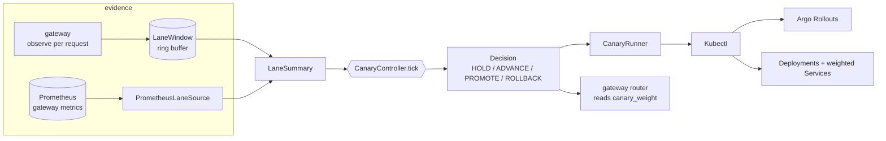
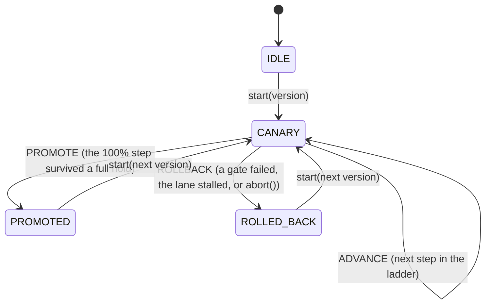
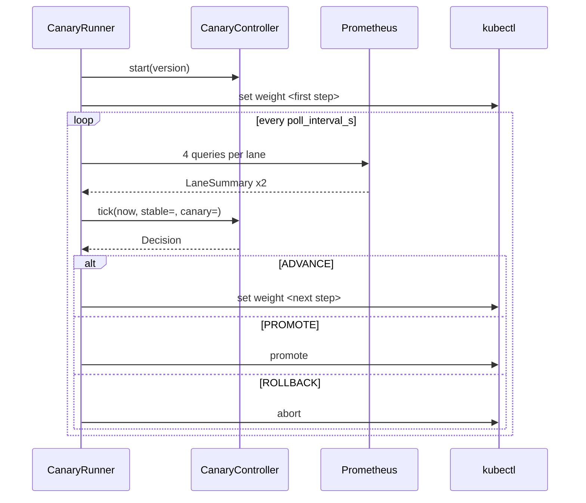
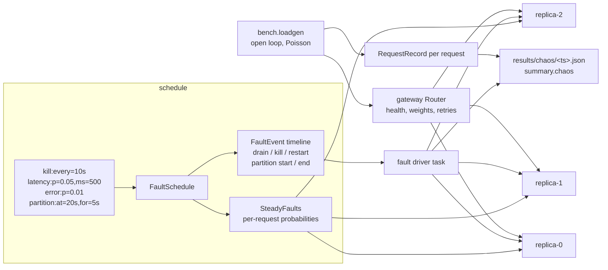
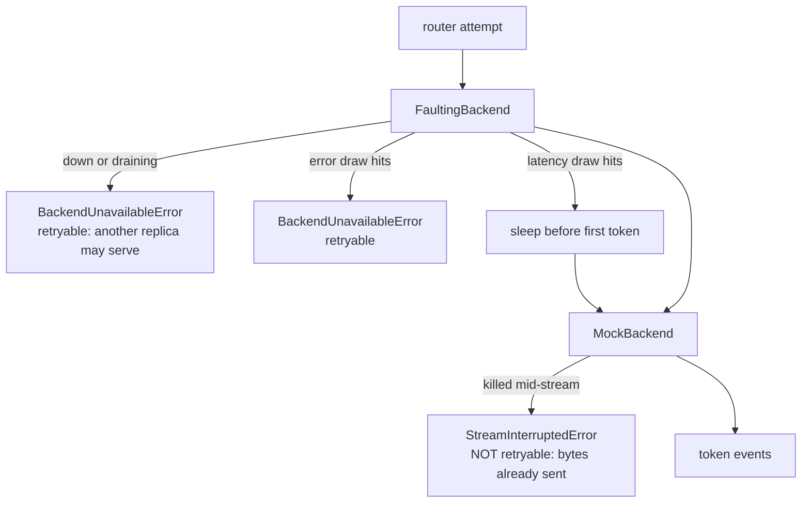

# Canary and chaos

Two halves of the same question: *is this build allowed to keep the traffic it has?*

The **canary** half answers it for a new version. It gives the candidate one percent of the
traffic, watches a sliding window of its own requests, and at each step decides — from
numbers, on a clock, with no human awake — whether to advance, hold or roll back.

The **chaos** half answers it for the fleet that is already serving. It kills replicas on a
written-down schedule while steady load runs through the real router, and records what the
client saw, so "the retry path works" becomes a measurement rather than a claim.

They meet in the middle: a chaos run produces exactly the per-request outcomes
(`ok`, `ttft_ms`, `e2e_ms`, `lane`) that the canary gate consumes, so a fault injected under
a canary is a rollback the controller decides on its own.

- [Part I — Canary](#part-i--canary): the state machine, the gates, the Kubernetes drivers.
- [Part II — Chaos](#part-ii--chaos): the fault grammar, the breakable replica, the harness.

---

## Part I — Canary

A new gateway or engine build is not shipped by replacing the old one. It is given one
percent of the traffic, watched, given five percent, watched again, and so on to a hundred
— and at every stop a gate asks whether it is still allowed to keep what it has. That gate
is what this module is. It is what turns "we deployed and then looked at Grafana" into a
decision a machine makes from the same numbers, on a schedule, with a rollback that does
not need anyone to be awake.

| File | Contents |
| --- | --- |
| `src/turboserve/canary/controller.py` | The state machine, the sliding windows, the gates. Pure: no I/O, no sleeping, injectable clock. |
| `src/turboserve/canary/prometheus.py` | Four PromQL queries over the gateway's metrics, turned into the same summary type the windows produce. |
| `src/turboserve/canary/k8s.py` | `kubectl` drivers (Argo Rollouts, or Deployments behind weighted Services), the control loop, and the `turboserve canary` CLI. |
| `configs/canary.yaml` | The policy: steps, hold, window, gates, metric names, cluster object names. |

Tests: `tests/unit/test_canary_controller.py`, `tests/unit/test_canary_k8s.py`. Both run on
CPU in well under a second and touch neither a cluster nor a network.

---

### 1. The shape of it



Two sources of evidence, one summary type, one gate. The in-process path exists so the
gateway can run a canary with nothing else installed, and so the gate is testable without a
metrics backend. The Prometheus path exists because in Kubernetes the canary is a set of
pods and no single process knows how all of them are doing. Both funnel into `LaneSummary`,
so `CanaryController.tick` runs the same code in a unit test and in production — a rollout
judged by one rule in CI and another in the cluster would be worse than no gate at all.

---

### 2. State machine



`canary_weight` is derived from the state, never stored separately: `0` when idle or rolled
back, `steps[step_index]` while running, `100` once promoted. It is a **percentage**,
because that is the unit Argo Rollouts, the ingress canary annotation and the operator all
use; `canary_fraction` gives the same thing in `[0, 1]` for code that weights a random draw,
and `lane_weights()` returns both lanes summing to 100.

Each `tick` returns a `Decision` recording the verdict, the reason in words, the time, the
state and weight *after* the decision, and the two `LaneSummary` objects the gate looked at.
The decisions are kept in `history`, which means a finished rollout explains itself: the CLI
prints it as a table, and `--out` writes it as JSON.

`start()` refuses to restart a running rollout (that would lose the audit trail of why the
first one was abandoned) and clears both windows, so a previous build's samples can neither
promote nor sink the new one. `tick()` outside a rollout is a no-op `HOLD` that is *not*
appended to the history, so a control loop may poll as often as it likes.

---

### 3. The gates

A step is judged only once the canary lane has at least `min_requests` samples in the
window. Below that the controller holds: a handful of requests cannot separate a bad build
from noise, and a gate that fires on three samples will roll back healthy builds until
somebody switches it off. Once there is enough evidence, three things can fail a canary.

**Error rate.** The failed fraction of the canary's requests in the window exceeds
`max_error_rate`. Failures count in the error rate but are excluded from the latency
percentiles — a request that failed in three milliseconds must not *improve* p95. What is
counted is *attempts*, not client-visible outcomes: when the router retries a pre-first-byte
failure onto another replica the client still gets a clean completion, but the attempt is
reported as a canary-lane failure anyway. Otherwise a canary that is hard-down would be
retried away, produce no samples at all, and sit under `min_requests` on HOLD until the
stall timeout instead of rolling back on a 100% error rate. Requests a replica *rejects* --
an unknown adapter, a sampling parameter it will not take -- count as well, deliberately: a
build that refuses what the stable lane accepts is the kind of regression this gate exists
for. The cost is that a client sending malformed requests raises both lanes' error rates,
so `max_error_rate` is a threshold on the deployment's traffic, not on the build alone.

**Absolute latency.** The canary's p95 TTFT exceeds `max_p95_ttft_ms`. Opt-in, and unset by
default: an absolute millisecond budget is a property of a particular model on particular
hardware, so each deployment sets its own or leaves it off.

**Relative latency.** The canary's p95 — time to first token, or end to end — is more than
`max_p95_ratio_vs_stable` times the stable lane's p95 *in the same window*. This is the gate
that survives a traffic spike: when the whole fleet slows down, both lanes slow together,
the ratio does not move, and a healthy canary is not blamed for someone else's load. It is
also the gate that needs no tuning per model, which is why it is the one that is on by
default. It is skipped while the stable lane itself has fewer than `min_requests` samples,
since there is then nothing to compare against.

A fourth rule is not a latency gate but a liveness one. `stall_timeout_s` rolls the canary
back if a step never reaches `min_requests` within that long. Without it, a canary that
takes *no* traffic — a crash loop, a failing readiness probe, a router that never picked it
— holds for ever while looking perfectly healthy.

Percentiles come from `turboserve.bench.records.percentile`, the same linear-interpolation
definition the load generator and the report renderer use. If the gate and the benchmark
disagreed by a rank, a canary could be rolled back against a threshold it actually met.

The design follows Argo Rollouts' step/analysis/promote structure and Flagger's progressive
delivery loop; the rule of comparing the canary against a baseline carrying the same load,
rather than against a fixed threshold, is the central idea of Netflix's automated canary
analysis (Kayenta).

#### Sliding windows

Each lane keeps a `LaneWindow`: a `deque` used as a ring buffer of `Sample(t, ok, ttft_ms,
e2e_ms)`. Expiry is lazy — on observation and on summary — so an idle window costs nothing,
and `max_samples_per_lane` bounds memory when a burst arrives. Expiry is measured from the
latest timestamp the window has seen rather than from the caller's `now`, so an out-of-order
sample from a concurrent caller can never un-expire something already dropped.

---

### 4. Reading the fleet from Prometheus

`PrometheusLaneSource` builds four queries per lane against the gateway's metrics. Every
selector also carries the exact-match labels from `prometheus.extra_labels` (the shipped
config adds `service="turboserve-gateway"`), and labels are emitted in sorted order so that
two equal selectors are the same string:

```promql
sum(increase(turboserve_requests_total{lane="canary",service="turboserve-gateway"}[300s]))
sum(increase(turboserve_requests_total{lane="canary",status=~"error|timeout|5xx"}[300s]))
histogram_quantile(0.95, sum by (le) (rate(turboserve_ttft_seconds_bucket{lane="canary"}[300s])))
histogram_quantile(0.95, sum by (le) (rate(turboserve_e2e_seconds_bucket{lane="canary"}[300s])))
```

Three choices worth stating:

- `increase` over a range rather than the raw counter, because a pod restart resets the
  counter and `increase` is the function that accounts for it.
- `sum by (le)` *inside* `histogram_quantile`, because the quantile has to be taken over the
  merged bucket counts of every replica. Taking it per pod and averaging is the classic way
  to produce a p95 that is not a p95.
- Histograms are in seconds and the gates are in milliseconds, so the conversion happens in
  one place.

A `NaN` quantile (no observations in the range) and an absent series both become `None`, not
zero: a missing latency must not read as a fast one. `increase` extrapolates at the range
boundaries, so counts are rounded and the error count is clamped to the request count —
otherwise extrapolation alone could manufacture an error rate above one. Metric names, the
lane and status label names, the failing status values and any extra selector labels are all
configurable, because the same controller should be able to gate a deployment whose metrics
an operator relabelled with recording rules.

A query that cannot be answered raises `PrometheusError` rather than returning "no data". A
gate that cannot read its metrics must fail loudly; silently reading zero traffic would make
the controller hold for ever on a broken monitoring stack.

---

### 5. Driving a cluster



Two drivers implement the same three verbs.

**`ArgoRolloutsDriver`** shells out to the Argo Rollouts plugin: `kubectl argo rollouts set
weight <rollout> <pct>`, `… promote <rollout> --full`, `… abort <rollout>`. The plugin
rather than a direct patch of the CR, because the weight lives in the Rollout's status
machinery and patching it means fighting the Argo controller for ownership of the object.
`--full` skips Argo's own remaining analysis steps: this controller has already decided, and
gating the rollout twice would double every hold.

**`WeightedServiceDriver`** needs no CRDs: two Deployments, two Services, and a weight
annotation the ingress splits on. `set_weight` patches the canary Service with
`nginx.ingress.kubernetes.io/canary-weight` (what an NGINX ingress understands out of the
box) and both Services with a vendor-neutral `turboserve.io/lane-weight`, so a gateway or a
mesh controller can read the split without depending on the ingress vendor. Promotion is not
just "weight = 100": at 100 % the canary serves everything but the stable Deployment is
still on the old image, and the next rollout would compare against it. So `promote()` reads
the canary Deployment's image, sets it on the stable Deployment, waits for
`kubectl rollout status`, then takes the canary out of the split and scales it to zero —
the same end state Argo reaches. `abort()` is the last two steps alone.

Every command goes through `Kubectl`, which logs the full argv before running it and keeps
it in `Kubectl.commands`, so the rollout report contains the exact sequence that was
executed.

#### `--dry-run`

`dry_run` does **not** pass `--dry-run=client` to kubectl: that still contacts the API
server, and it does not exist for the `argo rollouts` subcommands or for `scale`. Instead
each command is classified. Reads still execute, because the plan has to be computed from
the real cluster (promotion has to know which image the canary is running). Anything that
changes cluster state, or blocks waiting for a change, is logged and skipped, and appears in
the report with `"skipped": true` — a rehearsal that shows the operator the exact argv a
real run would execute.

#### Failure handling in the loop

Prometheus failures are tolerated for up to `max_metric_failures` consecutive polls and then
roll the canary back; holding for ever because the monitoring stack is down leaves a
half-shifted rollout unattended, which is worse than returning to a known-good state.
`deadline_s` bounds the whole rollout. Sleep and clock are injected, so the tests drive
rollouts that would take an hour of wall-clock in under a second.

---

### 6. Running it

```bash
# What the policy actually says (steps, hold, window, every gate):
turboserve canary plan --config configs/canary.yaml

# Replay a recorded stream of request outcomes through the gate. No cluster, no metrics
# backend, fully deterministic: the same file and config always produce the same decisions.
turboserve canary run \
  --config configs/canary.yaml \
  --outcomes outcomes.jsonl \
  --tick-interval 10 \
  --version 2026.03.1 \
  --out canary-rehearsal.json

# Rehearse a real rollout: reads the cluster, refuses to change it.
turboserve canary run --kube --dry-run --config configs/canary.yaml --version 2026.03.1

# Do it for real.
turboserve canary run --kube --config configs/canary.yaml --version 2026.03.1
```

The command exits non-zero when the rollout did not promote, so a pipeline step fails when
the gate rejected the candidate.

The outcome stream is `.json` (a list, or `{"events": [...]}`), `.jsonl`, or `.csv`, with
the five columns the gate cares about:

```json
{"t": 12.5, "lane": "canary", "ok": true, "ttft_ms": 88.4, "e2e_ms": 940.2}
```

`t` is seconds on any monotone origin; `lane` is `stable` or `canary`; `ttft_ms`/`e2e_ms`
may be omitted for a request that never produced a token. This is exactly a gateway request
log projected onto the fields the gate reads, which is what makes a replay a meaningful
rehearsal of a rollout rather than a toy — and what makes a gate change reviewable: re-run
last week's traffic through the new policy and read the decisions.

#### Embedding it in the gateway

```python
controller = CanaryController(CanaryConfig.from_yaml("configs/canary.yaml"))
controller.start("2026.03.1")
...
# per request, as it finishes:
controller.observe(lane, ok, ttft_ms=ttft, e2e_ms=e2e)
# in the router, per request, as it starts:
weight = controller.canary_weight  # 0..100
# on a timer:
controller.tick()
```

The controller is not thread-safe; the gateway owns one and mutates it from its event loop.

---

### 7. Configuration

`configs/canary.yaml` holds three independently validated sections — `canary:` (the gate),
`prometheus:` (where evidence comes from) and `kubernetes:` (what the rollout touches) —
each loaded by `CanaryConfig.from_yaml`, `PrometheusSettings.from_yaml` and
`KubeSettings.from_yaml`. All three models are frozen and reject unknown keys, so a typo
fails the run at load time instead of silently disabling a gate. The step ladder is
validated too: strictly increasing, every value in `[1, 100]`, and ending at 100.

The shipped file leaves `max_p95_ttft_ms` unset and `prometheus.lookback_s` null, which
means the query range follows `canary.window_s` so the cluster-side gate and the in-process
gate look at the same amount of history.

---

### 8. How it is tested

94 unit tests across the two files, all on CPU, all deterministic:

- **Controller** — step ladders that are not monotone or do not end at 100 are rejected;
  windows expire, stay bounded, and never un-expire a late sample; failures count as errors
  but not as latency samples; the injected clock is used when `now` is omitted; a healthy
  rollout produces non-decreasing weights and promotes only from the final step; a step is
  held until its hold time elapses; the gate holds while `min_requests` is unmet, even long
  past the hold; an error rate over the limit rolls back and one exactly at the limit does
  not; the p95 ratio gate fires on TTFT and on end-to-end, does *not* fire when both lanes
  slow together, and waits for a baseline; the absolute TTFT gate is off unless configured;
  a breach at a later step returns the weight to zero; `start`/`abort`/`reset` lifecycle
  errors; decisions and snapshots round-trip through JSON.
- **Cluster and CLI** — a fake `kubectl` asserts the exact argv of every Argo and Service
  command, including that promotion moves the image, waits, and drains the canary; dry-run
  executes reads and skips every mutation while still recording their argv; a fake
  Prometheus built on `httpx.MockTransport` covers query shape, second-to-millisecond
  conversion, count rounding and clamping, `NaN` and empty results, HTTP errors, rejected
  queries, transport failures, matrix results and missing aggregations; the runner promotes a
  healthy canary, aborts a breaching one, rolls back when Prometheus keeps failing, gives up
  at its deadline, reports dry-run, and works with no metrics source at all; outcome streams
  load identically from JSON, JSON-lines and CSV; and the CLI is exercised end to end,
  including `run --kube --dry-run` against the fakes.

Run them:

```bash
uv run pytest tests/unit/test_canary_controller.py tests/unit/test_canary_k8s.py
```

### 9. Limitations

- **Not run against a live cluster from a checkout.** The `kubectl` argv and the PromQL
  responses are exercised against fakes rather than against a real Kubernetes cluster,
  Argo Rollouts installation or Prometheus server. The kind e2e job in CI is where those
  run for real.
- The controller gates on error rate and on TTFT/E2E p95. It does not do statistical
  significance testing, Mann-Whitney comparison or multi-metric scoring the way Kayenta
  does; the ratio gate is a threshold on a ratio, not a hypothesis test.
- Traffic is split by weight, not by user. Sticky sessions, per-tenant canaries and shadow
  (mirrored) traffic are not implemented.
- `WeightedServiceDriver` promotion assumes the canary and stable Deployments differ only in
  their image. A change that also needs new env vars or volumes must be promoted by the
  normal deployment mechanism, with the canary used only as the gate.
- The controller is single-process and not thread-safe; a multi-replica gateway should gate
  from Prometheus (`--kube`) rather than from each replica's own window.
- A rollout with no `deadline_s` and no `stall_timeout_s` can hold indefinitely on a healthy
  but low-traffic canary. The shipped config sets `stall_timeout_s`.

---

## Part II — Chaos

A gateway that has never lost a replica has not been shown to survive losing one. This
module makes replicas fail on a written-down schedule, drives steady traffic through the
real router while they do, and records what the client saw — so "the retry path works" stops
being a claim about the code and becomes a number produced by running it.

| File | Contents |
| --- | --- |
| `src/turboserve/chaos/faults.py` | The schedule grammar (`kill:every=10s`, …) and the timeline it expands into. Pure data: no clock, no I/O, standard library only. |
| `src/turboserve/chaos/worker.py` | The breakable replica: a fault-injecting wrapper around the mock backend, in this process or served over HTTP by a child process that can be `SIGKILL`ed. |
| `src/turboserve/chaos/harness.py` | The experiment: start the fleet, put the router in front of it, drive open-loop load, apply the timeline, write the result file. Ships the `turboserve chaos` CLI. |
| `src/turboserve/chaos/k8s/podchaos.yaml` | The same three experiments expressed as Chaos Mesh objects, for a cluster that already runs it. Optional; nothing in CI applies them. |

Tests: `tests/unit/test_chaos_faults.py` and `tests/unit/test_chaos_harness.py`. They run on
CPU in about twenty seconds, load no model and touch the network only on one loopback port.

---

### 1. The shape of it



Two concurrent tasks over one monotonic clock: the load generator and the fault driver. They
share the clock so that a fault's timestamp and a request's send timestamp are directly
comparable, which is what makes "latency during faults" a definition rather than an
impression.

The replicas are mock servers ([`gateway/backends/mock.py`](gateway.md)), deliberately. The
subject of the experiment is the router — health caching, replica selection, retry before the
first token, abort after it — and putting a real engine behind it would add a GPU, a
checkpoint and several seconds of warm-up to a test whose answer does not depend on any of
them. What the replicas do provide is real *timing*: a configurable time to first token and
inter-token latency, because every interesting failure in a gateway is a timing failure.

---

### 2. The schedule grammar

A schedule is a list of strings. Each is `kind:key=value,key=value`; durations accept
`ms`/`s`/`m`/`h` (a bare number is seconds) and probabilities accept `0.05` or `5%`. An
unknown key is an error rather than something ignored — a silently dropped `ms=500` would
produce a run that measured nothing.

| Specification | Meaning |
| --- | --- |
| `kill:every=10s` | Every ten seconds, take a replica out and bring it back. |
| `kill:every=10s,grace=5s` | Mark it unready and let it finish what it has for five seconds, *then* kill it. |
| `kill:every=10s,restart=30s` | Wait thirty seconds after the kill before starting it again (default two). |
| `kill:every=10s,start=1s,target=replica-0` | Start the cadence at one second, and always hit the same replica. |
| `latency:p=0.05,ms=500` | Add 500 ms before the first token on 5 % of requests. |
| `error:p=0.01` | Fail 1 % of requests before the first token. |
| `partition:at=20s,for=5s` | Make one replica unreachable — every endpoint, health probe included — for five seconds. |

`kill` and `partition` become dated events; `latency` and `error` are simply *on* for the
whole run and are pushed into each replica's configuration once (and again after every
restart, because a replica that came back with its faults cleared would quietly make the
second half of a run easier than the first).

`FaultSchedule.events()` expands the schedule up front, before a single request is sent.
Expanding early buys three things: the timeline can be reviewed (`turboserve chaos plan`), it
is recorded in the result file so a run can be replayed, and a test can assert on it without
running anything. Victims are assigned round-robin from a seed-drawn offset — round-robin so
a repeated kill spreads over the fleet instead of landing on one replica by chance, and the
random offset so two seeds do not always start on the same one.

#### `grace` is the most important knob in the grammar

With `grace=0` — the default, because that is what the word *kill* means — the process dies
with streams in flight, and those streams are lost. They cannot be retried: the client
already holds part of a completion, and a second attempt on another replica would duplicate
or contradict it (`StreamInterruptedError`). So an ungraceful kill has a *floor* on its error
rate, and that floor is a property of the workload — how many requests are in flight at any
instant — not of the gateway.

With `grace>0` the replica is first marked unready and starts refusing new requests with a
retryable error, exactly as a Kubernetes pod does when a preStop hook runs and its readiness
probe starts failing. Requests aimed at it are retried onto a sibling; requests already
streaming finish. This is what a `kubectl delete pod` does, which is why the in-cluster
version of this experiment (`deploy/kind/e2e.sh`) and the graceful schedule here measure the
same thing.

The harness reports failures grouped by cause (`killed_mid_stream`, `no_healthy_replica`,
`injected_error`, `partitioned`, …) so a run that misses its threshold says *why*.

---

### 3. The breakable replica



`FaultingBackend` maps each fault onto the error class that tells the router what it is
allowed to do, which is the entire contract between the two modules. Both random draws are
made unconditionally and in a fixed order, so turning latency injection on does not change
which requests the error injection picks — two runs that differ in one fault stay comparable
in every other respect. The draws are seeded from the request id, so an in-process run is
reproducible request by request.

Two flavours, one interface (`ChaosWorker`):

**`InProcessWorker`** holds the backend in the harness's own event loop. No sockets, no
child processes, microseconds of overhead — which is what lets a five-second experiment with
kills in it be a unit test. Its kill is a flag: new requests are refused and in-flight
streams abort at their next token boundary.

**`SubprocessWorker`** runs `python -m turboserve.chaos.worker` and can send it a real
`SIGKILL`. The gateway then sees what it sees in production: a refused connection, a
half-written response, a health probe that fails. This is the default for `turboserve chaos
run`, because a fault that never crosses a socket cannot show that the HTTP client's error
handling is right.

The server the child process runs is the real gateway application with authentication off
(the same construction as `build_mock_app`), configured with `max_attempts=1` and no health
caching — a model server does not retry itself, and one that cached an opinion about its own
health would take itself out of its own rotation for the length of the TTL after a single
injected error. A fault therefore travels the production auth, routing, accounting and SSE
code on its way out.

Control endpoints on the child (`/chaos/state`, `/chaos/faults`, `/chaos/latency`,
`/chaos/error`, `/chaos/partition`, `/chaos/drain`, `/chaos/reset`) stay reachable during a
partition. They are the operator's out-of-band channel — the harness uses them to lift the
partition — and are never on the data path being measured.

---

### 4. What the run measures

Every run writes an ordinary `RunResult`
([`bench/records.py`](benchmarking.md)) so the report renderer, the results index and
`deploy/kind/assert_error_rate.py` read a chaos run with no special case. The chaos-specific
figures live under `summary.chaos`:

| Field | What it answers |
| --- | --- |
| `attempts`, `retries`, `retry_rate`, `attempts_per_replica` | Did the retry path actually run, and how often? Counted per request, one layer below the router, because "three attempts" is one retried request or three unretried ones and only the first says anything. |
| `requests_never_routed` | Requests that reached no replica at all — the fleet had nothing healthy to offer. |
| `disruptions[]` with `started_s`, `killed_s`, `restored_s`, `recovered_s`, `recovery_s` | How long from a replica going out to it serving successfully again. Recovery is the first *successful request served by that replica*, not the moment the process came back: the gap between the two is the health-cache TTL, which is the part an operator tunes. |
| `impaired_windows_s`, `requests_during_faults`, `during_faults`, `steady_state` | The same latency summaries computed over requests sent inside a disruption window and outside it. A gateway that hides every failure by retrying can still ruin the tail, and one aggregate p95 over the whole run would hide that. |
| `failures_by_cause` | Failures bucketed by kind of failure, not by message text. |
| `fleet_outage_windows_s` | Intervals where the schedule left *no* replica serving. |
| `workers[]` | Each replica's fault configuration and counters (requests, delayed, injected errors, aborted streams, refusals, kills, restarts). |

Requests are classified into windows by **send** time, not completion time: a request that
arrived while the fleet was whole and finished after a replica died was served by a healthy
system for the part that matters, and charging its latency to the fault would overstate the
damage.

The load is open-loop (Poisson arrivals at a fixed rate) for the reason
[`bench/loadgen.py`](benchmarking.md) gives: a closed loop slows down when the system does,
which is exactly the wrong instrument for a failure experiment because it hides queueing
behind client backpressure.

---

### 5. Fleet size, ejection and the health TTL

The router ejects a replica the moment a request fails on it with a transport-class error,
and believes that verdict for `health_ttl_s` without asking again. That is the right policy
for a replica that has actually died — one failure, then no more traffic — but it has a
consequence worth knowing before reading any chaos result:

*A uniform error rate spread over every replica can empty the fleet.* If each replica fails
one request in twenty, then within a second or so every member has failed one, every member
is ejected, and requests fail with `no_healthy_replica` until the cached verdicts expire.
A fleet with a spare absorbs the same injection without losing a request; a fleet of two does
not. `tests/unit/test_chaos_harness.py` pins both halves of this down:
`test_a_replica_is_ejected_on_its_first_failure_until_it_is_probed_again` demonstrates the
mechanism deterministically, and
`test_injected_errors_are_retried_away_across_a_fleet_of_three` shows the same injection
costing nothing when there is somewhere else to go.

Two levers follow from it, and both are run parameters rather than code changes:
`--replicas` (margin) and `--health-ttl` (how long a verdict is believed). The same two
levers exist in the Kubernetes deployment as replica count and readiness-probe period.

---

### 6. Running it

```bash
# See what a schedule would do, without running it.
turboserve chaos plan --replicas 3 --duration 60s --faults "kill:every=10s"

# The experiment: three replicas as real HTTP servers, one killed every ten seconds.
turboserve chaos run --replicas 3 --duration 60s --rps 20 --faults "kill:every=10s"

# A graceful rollout instead of an ungraceful death, plus a slow replica and a partition.
turboserve chaos run \
  --replicas 3 --duration 120s --rps 20 \
  --faults "kill:every=10s,grace=5s" \
  --faults "latency:p=0.05,ms=500" \
  --faults "partition:at=60s,for=10s" \
  --out results/chaos/graceful.json

# Everything in one process: no sockets, seconds instead of minutes, same router.
turboserve chaos run --mode inprocess --replicas 2 --duration 5s --rps 60 \
  --faults "kill:every=2s,grace=300ms,restart=400ms"
```

`--profile h100|dev-2060` takes the fleet size, rate, duration, request shape and kill
cadence from `configs/bench/profiles.yaml`; any flag given explicitly wins over it. The
profile's *model* is deliberately not used — the replicas are mock servers, and naming a
checkpoint in a run that never loaded one would misdescribe the result file, which records
`replica_engine: "mock"` instead.

Results go to `results/chaos/<utc timestamp>.json` unless `--out` says otherwise, and are
registered in `results/index.json` like every other run.

#### The in-cluster version

`deploy/kind/e2e.sh` runs the same experiment against a real cluster: it installs the chart,
runs a load-generator Job, deletes a gateway pod every few seconds (skipping the tick
whenever fewer than three are live, so the run never degrades into an outage test), and
asserts the error rate of the resulting run file with `deploy/kind/assert_error_rate.py`. `src/turboserve/chaos/k8s/podchaos.yaml`
expresses the same three experiments as Chaos Mesh objects for a cluster that already runs
that operator; nothing in the test suite or CI applies them, because installing a
cluster-wide operator is not a repository's business.

---

### 7. How it is tested

| Test | What it establishes |
| --- | --- |
| `test_chaos_faults.py` (57 tests) | Every accepted spelling parses to the right fault; typos, missing parameters and impossible windows are rejected; a schedule round-trips through `describe()`; the same seed gives the same timeline; recoveries are ordered before disruptions at a shared timestamp; a schedule that empties the fleet is detected. |
| `test_a_worker_serves_the_real_gateway_app_with_a_control_plane` | The replica is an OpenAI-compatible server, and its counters are readable over `/chaos/state`. |
| `test_a_partition_blocks_the_data_plane_but_leaves_the_control_plane_reachable` | A partition takes out completions *and* health probes, and can still be lifted. |
| `test_the_same_request_id_gets_the_same_fate_from_the_same_replica` | Injection is reproducible, so a chaos run is replayable. |
| `test_a_dead_replica_is_retried_away_before_the_first_token` | With the health cache frozen — the window a real kill happens in — every request routed at a corpse comes back from a sibling, and the corpse is tried once and then left alone. |
| `test_a_hard_kill_aborts_the_stream_it_had_in_flight_and_is_not_retried` | The one failure a correct gateway still reports: a terminating error event with `ABORT`, no retry. |
| `test_two_replicas_survive_repeated_kills_with_a_negligible_error_rate` | Five seconds of load through two replicas, one drained and killed every two seconds: the error rate stays under the threshold `deploy/kind/assert_error_rate.py` enforces, both disruptions are recovered from, and no request goes unrouted. |
| `test_a_partition_is_recorded_as_a_disruption_and_is_lifted_again` | A partition is measured end to end, including its downtime and recovery. |
| `test_a_run_writes_an_ordinary_result_file_with_a_chaos_block` | The result file reloads through `RunResult`, carries the schedule and the timeline, attributes every record to the replica that served it, and registers itself in the index. |
| `test_a_subprocess_replica_really_dies_and_really_comes_back` | The only test that crosses a socket: a real process start, a real `SIGKILL`, a real restart, and a router that notices all three. |

The five-second experiment is deterministic in everything that is under the harness's
control — arrivals, prompts, victims and the mock's own draws are all seeded — and its
schedule drains before each kill, so no request can be lost to a stream that happened to be
in flight. Wall-clock scheduling is the one thing it cannot pin down, which is why its
assertions are about what happened (no losses, both replicas used again, no unrouted
requests) and never about how long anything took.

---

### 8. Limitations

- **The replicas are mock servers.** The harness measures the gateway's fault tolerance, not
  a model server's. Nothing in a chaos result describes an engine's throughput or latency,
  and the `cost_per_1m_output_tokens_usd` a `RunResult` computes from a GPU price is
  meaningless for this scenario for the same reason — it is recorded only when the
  environment supplies a price, so that a run made on a rented instance still says what it
  ran on.
- **A restart blocks the fault driver.** Starting a child process takes a second or two
  (Python imports), and the driver waits for the replica to answer before moving on. A
  schedule whose kill period is shorter than a process start will therefore see its later
  events fire late. The scheduled timeline is recorded in `fault_events`; the moments things
  actually happened are recorded per disruption, and the two can be compared.
- **An in-process kill is not instantaneous.** A killed in-process replica aborts its
  in-flight streams at their next token boundary rather than the instant the flag flips. A
  subprocess kill has no such grace, which is the reason the subprocess mode is the default.
- **The control plane survives a partition.** A real partition would cut the operator's
  channel too. Keeping `/chaos/*` reachable is what lets the harness lift the partition at
  the scheduled moment; it changes nothing on the data path.
- **Quota state is per process.** The harness builds a router with no limiter registry, so a
  chaos run exercises routing, health and retries but not the gateway's per-tenant quotas.
  Those have their own tests in `tests/unit/test_gateway_limits.py`.
- **The Chaos Mesh manifests run only where Docker does.** They and the kind end-to-end
  script are exercised in `.github/workflows/kind-e2e.yml`; on a checkout without a Docker
  daemon the in-process and subprocess fault paths are what the test suite covers.

---

### 9. References

The vocabulary is standard, and these are the sources the design leans on:

- Basiri et al., *Chaos Engineering* (IEEE Software, 2016) — the Netflix formulation:
  hypothesis, steady-state metric, injected fault, blast radius. `summary.chaos` is that
  shape: a steady-state summary, an impaired summary, and the schedule that separates them.
- *Site Reliability Engineering* (Beyer et al., 2016), ch. 22 "Addressing Cascading Failures"
  — why retries need a budget and why health verdicts need to expire; §5 above is that
  chapter's failure mode reproduced in miniature.
- Kubernetes, [Pod lifecycle: termination](https://kubernetes.io/docs/concepts/workloads/pods/pod-lifecycle/#pod-termination)
  — the readiness-gate-then-preStop-then-SIGTERM-then-SIGKILL sequence that `grace` models.
- Chaos Mesh, [PodChaos and NetworkChaos](https://chaos-mesh.org/docs/simulate-pod-chaos-on-kubernetes/)
  — the object model `src/turboserve/chaos/k8s/podchaos.yaml` is written against.
