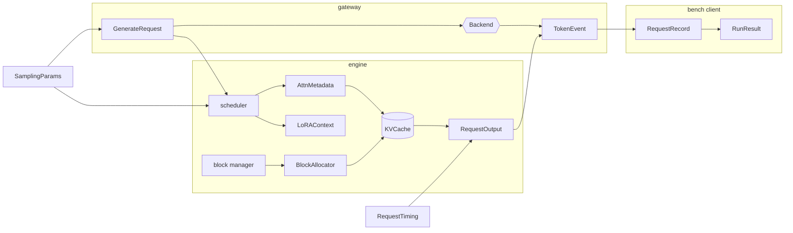
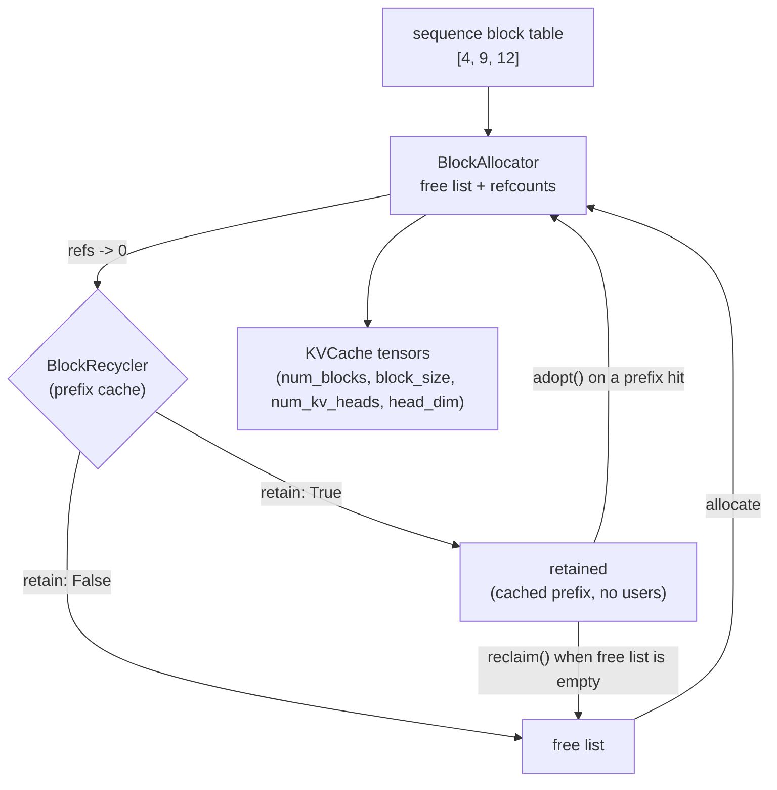

# Shared contracts

turboserve is written by several independent modules — a scheduler, a model, a runtime, a
gateway, a benchmark client — that have to agree on a small number of data structures. This
page is the reference for those structures: what each field means, which invariants hold,
and *why* each shape was chosen. Everything described here lives in four files:

| File | Contents |
| --- | --- |
| `src/turboserve/engine/core/types.py` | Sampling, timings, packed-batch metadata, LoRA routing, engine/scheduler configuration, engine output |
| `src/turboserve/engine/core/kv_cache.py` | The block allocator and the paged KV storage |
| `src/turboserve/gateway/backends/protocol.py` | The `Backend` protocol, its request/event types and its error hierarchy |
| `src/turboserve/bench/records.py` | The on-disk result schema: per-request records, percentiles, run files |

Tests: `tests/unit/test_core_types.py`, `tests/unit/test_kv_cache_storage.py`,
`tests/unit/test_backend_protocol.py`, `tests/unit/test_bench_records.py`. They run on CPU
in seconds and need no model.



---

## 1. Request-level types

### `SamplingParams`

A pydantic model, validated at construction: `max_tokens >= 1`, `temperature >= 0`,
`0 < top_p <= 1`, `top_k >= 0`, `repetition_penalty > 0`, and unknown fields rejected.
`temperature == 0` means greedy decoding and is exposed as `is_greedy`; `top_k == 0` means
"no top-k filter", matching the convention the OpenAI-compatible routes expose.

**Why validate here.** The sampler is a vectorised kernel over a whole batch. A negative
temperature or a zero top-p mass there produces `NaN` logits for *every* sequence in the
step, not just the offending one, and the failure surfaces as garbage output far from its
cause. Validating at the edge turns that into a 422 on one request.

`validate_assignment` is on, so mutating a field after construction is checked too — the
gateway clamps `max_tokens` against a tenant's quota by assignment.

### `FinishReason`

`StrEnum` with `stop`, `length`, `abort`. A string enum so it serialises to the plain value
the OpenAI API uses, with no custom encoder at the JSON, result-file and Prometheus-label
boundaries.

### `RequestTiming`

Four optional timestamps plus a counter:

| Field | Meaning |
| --- | --- |
| `t_arrival` | request accepted by the gateway or engine |
| `t_first_scheduled` | scheduler first gave it compute |
| `t_first_token` | first output token emitted |
| `t_finish` | last token emitted, or the request aborted |
| `num_cached_prompt_tokens` | prompt tokens whose KV came from the prefix cache |

Derived: `ttft()`, `queue()`, `e2e()`, `tpot(n_out)`. The definitions match the ones in
`docs/benchmarking.md` exactly — TPOT excludes the first token, because that token's cost is
prefill and is already reported as TTFT, and it is `None` below two output tokens because
the decode phase has no slope yet.

**Why monotonic float seconds.** Every one of these quantities is a difference. A wall clock
that steps backwards (NTP, a suspended laptop) makes a latency negative, and a negative
latency silently improves a percentile. `time.perf_counter()` cannot do that.

**Why `None` rather than `0.0`.** A request that failed before its first token has no TTFT.
Recording zero would be a measurement that never happened, and it would pull the p50 down.

`num_cached_prompt_tokens` travels with the timing because TTFT is not interpretable without
it: a request whose whole prompt hit the prefix cache did no prefill work at all.

### `RequestOutput`

What `LLMEngine.step()` returns per progressing request: `request_id`, `new_token_ids`,
`text_delta`, `finished`, `finish_reason`, `timing`, and the cumulative counters
`prompt_tokens`, `output_tokens`, `cached_prompt_tokens` (with `total_tokens` and `usage()`
derived).

**Why deltas for text but totals for counts.** The gateway forwards each delta as one SSE
chunk and the benchmark client timestamps it to build the inter-token-latency series;
re-sending the accumulated text every step would be wasteful and would make ITL
unmeasurable. Token counts are the opposite: a `usage` block must report totals, and a
consumer that joins the stream late still needs them.

---

## 2. The packed batch

### `AttnMetadata`

One instance describes an entire scheduler step. All scheduled tokens from all sequences are
concatenated into a single flat vector; `AttnMetadata` says who owns which slice of it and
where each sequence's KV lives.

| Field | Shape | Meaning |
| --- | --- | --- |
| `slot_mapping` | `[num_tokens]` int64 | KV slot `block_id * block_size + offset` for each token |
| `block_tables` | `[num_seqs, max_blocks]` int64 | each sequence's block ids, padded with `-1` |
| `context_lens` | `[num_seqs]` int64 | total tokens each sequence attends to *after* this step |
| `query_start_loc` | `[num_seqs + 1]` int64 | cumulative token offsets (`cu_seqlens_q`) |
| `max_query_len`, `max_context_len` | scalars | for kernel launch sizing |
| `num_prefill_seqs`, `num_decode_seqs` | scalars | batch composition; prefill sequences come first |

Helpers: `num_seqs`, `num_tokens`, `is_prefill_only`, `is_decode_only`, `query_lens()`,
`to(device)`, `validate(block_size=None)`.

#### Why packed varlen batches instead of `[batch, seq]`

Continuous batching mixes, in one step, a sequence doing its first 512-token prefill chunk
with fifty sequences each contributing a single decode token. Padding those to a rectangle
would mean every decode sequence carries 511 padding tokens through every matmul and every
attention call. The compute and the memory traffic for that padding are pure waste, and the
waste grows with exactly the diversity that makes continuous batching worth doing.

The packed layout removes it: one flat token vector, one `query_start_loc` to slice it, and
attention that iterates sequences rather than a batch dimension. It is the layout
FlashAttention's varlen entry points already take, so a varlen attention kernel needs no
repacking. `block_tables` is the only rectangular tensor left, and it is small: one `int64`
per block, not per token.

#### Why `-1`-padded block tables

`block_tables` must be rectangular, so short rows need a filler. `-1` is chosen because it is
not a valid block id: a kernel or reference implementation that reads past `context_lens`
hits an out-of-range index and fails loudly. Padding with `0` would alias block 0 — a real
block, owned by some other sequence, quite possibly another tenant — and the bug would show
up as subtly wrong logits rather than an error. In a multi-tenant serving system that is a
correctness bug and an isolation bug at once, so the padding value is chosen to make it
impossible.

#### `context_lens` includes this step's tokens

The causal mask offset for sequence `i` is `context_lens[i] - query_len[i]`: query position
`j` attends to keys `< context_lens[i] - query_len[i] + j`. Defining `context_lens` as the
post-step length keeps prefill, chunked prefill, decode and speculative verification
(`k + 1` query tokens) on one formula instead of four.

#### Why `validate()` is not automatic

Checking `query_start_loc` means reading a device tensor, which forces a GPU synchronisation.
Doing that once per layer per step would serialise the pipeline. So the constructor performs
no checks, and `validate()` is called by tests, by the runtime under debug logging, and by
anything building metadata by hand.

Helpers `build_query_start_loc(query_lens)` and `pad_block_tables(rows, max_blocks=...)`
build the two awkward tensors correctly; `pad_block_tables` accepts a `max_blocks` wider than
the data so the runtime can reuse one staging buffer across steps.

### `LoRAContext` and `NO_LORA`

`token_lora_slot` is `[num_tokens]` int64, one GPU adapter slot per token; `active_slots` is
the sorted, de-duplicated set of non-zero slots in the batch. `NO_LORA = 0` means "base model
weights".

**Why per token rather than per batch.** Grouping a batch by adapter would defeat continuous
batching: a step could then serve only one tenant's adapter, and the other tenants would
queue behind it. Carrying the slot per token lets one step mix adapters freely; the LoRA
layers sort the batch by slot and run one grouped matmul pair per active slot (SGMV-style),
skipping slot 0.

**Why slot 0 is reserved.** A zero-filled vector is then already a valid base-model batch, and
the grouped kernel skips slot 0 by construction rather than by a special case.

**Why `active_slots` is precomputed on the host.** Deriving it on the device means a unique
plus a synchronisation, once per LoRA-wrapped linear per layer. The scheduler already knows
the answer, so it passes it along.

---

## 3. Configuration

### `SchedulerConfig`

`max_num_seqs` (default 64), `max_num_batched_tokens` (2048), `block_size` (16),
`num_blocks` (`None`), `enable_chunked_prefill`, `enable_prefix_caching`, `policy`
(`fcfs` | `tenant_fair`), `tenant_weights`.

Validation: `block_size` must be a power of two — a slot is `block * block_size + offset`,
and the paged attention path assumes a power-of-two stride; `max_num_batched_tokens` must be at least one block,
otherwise no prefill chunk could ever fill a block and the prefix cache (which hashes full
blocks only) could never record a hit; tenant weights must be positive.

`num_blocks is None` means "profile the device at startup and size the KV pool from
`gpu_memory_utilization`". An explicit value is how tests force preemption with a
deliberately tiny pool.

### `EngineConfig`

`model`, `tokenizer`, `dtype`, `device`, `gpu_memory_utilization` (0.9), `max_model_len`,
`seed`, a nested `SchedulerConfig`, and two loosely typed dicts: `speculative` and `lora`.

**Why the sub-configs are dicts.** Speculative decoding and multi-LoRA are owned by other
modules with their own validated models. Typing them here would make this shared file change
every time one of those subsystems grows an option, and every module would have to be
rebuilt in lock-step. The engine passes the dict through and the owning module validates it.

`resolved_device()` and `resolved_dtype()` turn `"auto"` into concrete values: CUDA when
torch reports a device, fp16 on CUDA and fp32 on CPU. bf16 is never selected automatically —
the development GPU is Turing (sm_75) and has no bf16 tensor cores, so an H100 run asks for
`dtype="bfloat16"` explicitly. `EngineConfig.from_settings(Settings)` bridges the
`TURBOSERVE_*` environment settings into an engine config.

---

## 4. Paged KV cache



### `BlockAllocator`

A reference-counted free list over a fixed pool. Every operation is O(1): the free list is a
deque of ids, the reference counts are a flat list indexed by block id.

A block is always in exactly one of three states, and `check_invariants()` proves it:

* **free** — count 0, on the free list, contents meaningless;
* **in use** — count > 0, off the free list, owned by one or more sequences;
* **retained** — count 0, off the free list, held by the recycler because its contents are a
  cached prefix.

API: `allocate()`, `allocate_many(n)` (all-or-nothing), `incref`/`incref_many`,
`decref`/`decref_many`, `adopt(block)`, `release_retained(ids)`, `reset()`, plus
`num_total`, `num_free`, `num_retained`, `num_in_use`, `num_allocatable`, `ref_count`,
`is_free`, `is_retained`, `stats()`.

**Why reference counts.** Prefix caching means two sequences legitimately share the blocks
holding their common prompt prefix. Freeing one sequence must not invalidate the other's KV,
so a block is reclaimed only when its last user is gone.

**Why a double free raises.** Pushing a block onto the free list twice hands the same KV
memory to two sequences — different tenants, in general — and the resulting corruption
appears as strange generations somewhere else entirely. `InvalidBlockError` is raised at the
point of the mistake instead.

**Why `OutOfBlocksError` is an ordinary condition.** Exhausting the pool is expected under
load: the scheduler catches it and preempts a running sequence (recompute mode) rather than
failing the request. It is a distinct exception type precisely so the scheduler can catch it
without swallowing a real bug.

**Why the free list is FIFO.** Without a recycler, reusing the *least* recently freed block
gives any caching layer above the longest possible window in which to adopt a block before
its contents are overwritten.

**`BlockRecycler`** is the one hook into the policy layer, a two-method protocol:
`on_zero_refs(block) -> bool` (offer a just-freed block; `True` keeps it out of the free
list) and `reclaim(n) -> Sequence[int]` (give blocks back when the allocator runs dry). The
prefix cache in `engine/core/prefix_cache.py` is its intended implementer. This keeps hashing, LRU and eviction policy entirely outside the
allocator, which knows only about ownership.

### `KVCache`

Per-layer key and value tensors of shape `(num_blocks, block_size, num_kv_heads, head_dim)`.

`write(layer, slot_mapping, k, v)` scatters one step's new K/V, with `k`/`v` shaped
`[num_tokens, num_kv_heads, head_dim]` — exactly what the attention layer holds after its
projections, so no transpose is needed. The implementation keeps a flat
`(num_blocks * block_size, num_kv_heads, head_dim)` view over the same storage and does a
single `index_copy_`: no gather, no Python loop over sequences, no synchronisation.
`read(layer, slot_mapping)` is its inverse, used by the reference attention path and the
round-trip tests; `block(layer, block_id)` returns one block's views.

**Why slots rather than `(block, offset)` pairs.** Collapsing the first two dimensions makes
the scatter one indexing operation. The scheduler computes the slots once per step and both
the reference and Triton paths consume the same vector.

**Why allocation is lazy.** Constructing a `KVCache` is cheap and side-effect free; the
tensors appear on the first access or on an explicit `allocate()`. The engine needs to ask
`bytes_per_block` *before* it knows how many blocks fit, and tests need the sizing arithmetic
without touching a device.

Sizing: `bytes_per_block_per_layer` = `2 * block_size * num_kv_heads * head_dim * itemsize`;
`bytes_per_block` multiplies that by `num_layers`, because block ids are shared across layers
— a sequence has one block table, not one per layer — so the unit of capacity planning is a
block's total footprint. `blocks_for_memory(available_bytes, ...)` divides and rounds **down**:
one block too many is an out-of-memory error under load, at the worst possible moment.

---

## 5. Gateway backend contract

### `GenerateRequest`

`request_id`, `tenant_id`, `model`, `prompt` (`str` or `list[int]`), `sampling`, `lora`,
`priority`, `stream`, `arrival_ts`. Non-empty ids and a non-empty prompt are enforced.

**Why the prompt is either text or ids.** The chat route applies the tokenizer's chat
template and has ids already; the completions route may pass text straight through to an
HTTP backend that will tokenise it itself. Forcing one representation would mean either
re-tokenising what we already have, or tokenising on behalf of a remote server whose
tokenizer we may not match.

**Why `tenant_id` is mandatory.** Authentication resolves it before this object exists, so
every metric, log line and result record downstream is attributable to a tenant with no
optional-field handling anywhere.

### `TokenEvent`

`request_id`, `token_ids`, `text`, `t_ns`, `finished`, `finish_reason`, `usage`, `error`.
Constructors `TokenEvent.delta(...)`, `.final(...)`, `.failure(...)` build the three legal
shapes: a progress delta, a terminator (`finished`, with `finish_reason` and `usage`), or a
failure (`error` set, `finished` true). A terminator may carry the final delta, so a backend
never has to emit an empty event just to say it is done.

**Why events carry `t_ns`, stamped by the producer.** TTFT and ITL are the two numbers the
gateway exists to keep low, and both are differences between event times. If the timestamp
were taken when the *client* deserialised the chunk, it would fold in queueing in the HTTP
stack, the event loop and the JSON parser — measuring the harness rather than the server.
Stamping at the backend, at the moment it had the token, keeps the measurement about the
engine.

**Why nanosecond integers.** `time.monotonic_ns()` is monotonic (see `RequestTiming` above)
and integral. Under batching, consecutive-token gaps are small enough that float-second
arithmetic starts losing digits to the magnitude of the epoch, and integers survive a JSON
round-trip into the result files exactly.

**Why failures can travel in-band.** Once the response body has started, an exception cannot
become an HTTP status code. `TokenEvent.failure` lets the backend end the stream with a
reason the gateway can record and the client can see.

### `Backend`

A `runtime_checkable` protocol:

```python
name: str
supports_lora: bool


def generate(self, req: GenerateRequest) -> AsyncIterator[TokenEvent]: ...
async def health(self) -> bool: ...
async def models(self) -> list[str]: ...
async def close(self) -> None: ...
```

`generate` is declared as a plain method returning an async iterator, not as `async def`:
implementations are async *generator* functions (`async def` with `yield`), which return the
iterator directly and are not awaitable. Callers write `async for event in
backend.generate(req):`. The other three are coroutines.

Obligations on an implementation: yield at least one event; make the last event
`finished=True`; abort the underlying work when the iterator is closed (the client
disconnected); never raise from `health()`.

**Why streaming is the only mode.** The in-process engine, a remote vLLM server and the mock
used by the chaos harness all have to be interchangeable for routing, canary weighting and
fault injection. A backend that buffered internally to serve a non-streaming request would
have no meaningful TTFT or ITL, and the canary SLO gates are specified against exactly those.
A non-streaming client request must therefore be assembled from the same stream by the
route that serves it.

### Errors

`BackendError` carries `message`, `backend`, `status_code` and a class-level `retryable`
flag. Two branches: `RetryableBackendError` (`BackendUnavailableError`,
`BackendTimeoutError`, `BackendOverloadedError`) and `NonRetryableBackendError`
(`BackendRequestError`, `ModelNotFoundError`, `AdapterNotFoundError`,
`StreamInterruptedError`).

**Why retryability is a property of the type.** The router asks one question — may this go to
another replica? — and the answer should not be a judgement call at each `raise` site, where
it would drift. `StreamInterruptedError` is the interesting case: the failure is transient,
but the client already holds part of a completion, so retrying elsewhere would duplicate or
contradict it. It is non-retryable by construction, which encodes the rule "never retry after
the first byte" in the type system rather than in a comment.

### Registry

`register_backend(name, override=False)` is a class decorator; `get_backend_cls(name)` looks
one up; `BACKENDS` is the underlying dict and `available_backends()` lists it.
`unregister_backend(name)` exists for tests.

**Why a registry rather than imports.** Backends are chosen by name from `configs/models.yaml`,
a CLI flag or a Helm value, so a string has to reach a class somehow.

**Why nothing concrete is imported at package import time.** The backends differ enormously in
weight: the local engine backend pulls in torch and the whole reference engine, while the mock
pulls in nothing. A gateway fronting a remote vLLM server, or the kind end-to-end job running
the mock, must not pay for torch. `get_backend_cls` therefore imports the built-in modules
(`local`, `openai_compat`, `mock`) lazily on a miss, and each registers itself. A module that
is genuinely absent is skipped and logged; any *other* import error propagates, because a
backend that exists but fails to import is a real fault.

Registration checks that the class has all four contract methods, so a typo in a method name
is a `TypeError` at import time rather than an `AttributeError` mid-stream. Re-registering a
name with a *different* class raises unless `override=True`: two backends under one name is a
configuration bug whose outcome would otherwise depend on import order.

---

## 6. Benchmark result schema

Every scenario writes one JSON file, and every table, plot and README figure in this
repository is rendered from those files by `bench/report.py`. Nothing downstream re-derives a
number from prose.

### `RequestRecord`

`request_id`, `tenant`, `prompt_tokens`, `output_tokens`, `t_send_ns`, `t_first_ns`,
`t_last_ns`, `itl_ns`, `ok`, `error`, `backend`, `lane`. Properties `ttft_ms`, `e2e_ms`,
`tpot_ms`, `itl_ms`, `total_tokens`.

**Why raw timestamps are kept, not just latencies.** The aggregate a reader wants later is
rarely the one the scenario chose to compute. Storing the timestamps and the full inter-token
series lets the report code re-derive any percentile, lets a reviewer check the arithmetic,
and lets a future question be answered without re-running the GPU.

**Why `lane`.** During a progressive rollout, `stable` and `canary` requests are interleaved
under identical load. Keeping the lane per record is what makes the two comparable — which is what a
canary's ratio gate is specified to compare.

### `Percentiles` and `percentile`

`p50/p90/p95/p99` by **linear interpolation between ranks**: with `n` sorted samples, rank
`r = q/100 * (n - 1)`, interpolating between `sorted[floor(r)]` and `sorted[ceil(r)]`. This
is what numpy calls `method="linear"`.

**Why one definition in one place.** Nearest-rank would be equally defensible, but the load
generator, the canary controller and the report renderer all quote p95. If they disagreed by
a rank, a canary could be rolled back against a threshold it actually met. So the definition
lives here and everything calls it.

**Why an empty sample yields `None`.** A percentile of nothing is not a number. Returning
zero would silently improve a table.

### `SLO` and goodput

`SLO(ttft_ms, tpot_ms, e2e_ms)`, each optional; `is_met_by(record)` requires the request to
have succeeded *and* to satisfy every objective that was set. Goodput — throughput restricted
to requests that met the objective — is reported as a count, a ratio and a rate.

**Why goodput at all.** Raw throughput can always be raised by letting tail latency grow.
Goodput is the number that does not reward that: it falls as soon as the extra load pushes
requests outside the objective.

### `RunResult`

`schema_version`, `scenario`, `profile`, `config`, `hardware` (from `turboserve.hwinfo`),
`software` (package versions), `git_sha`, `started_at`/`finished_at`, `gpu_price_per_hour`,
`price_source`, `provenance`, `provenance_note`, `requests`, `summary`.

Lifecycle: `RunResult.start(scenario, profile, ...)` captures the machine and the software
stack up front — so a run that crashes half way still says what it was running on — then
`add(record)` per request, then `finish(slo=...)` and `save(path)`.

`summarize()` produces `num_requests`, `num_ok`, `num_failed`, `error_rate`, `wall_s`,
`prompt_tokens`, `output_tokens`, the four latency distributions (`ttft_ms`, `itl_ms`,
`tpot_ms`, `e2e_ms`), `output_tok_s`, `total_tok_s`, `req_s`,
`cost_per_1m_output_tokens_usd` and `goodput`. Latency distributions use successful requests
only — a request that errored immediately would otherwise flatter the p50 — while
`error_rate` counts every request, so the two together describe the run.

`wall_s` runs from the first request sent to the last token received, derived from the
records rather than from `started_at`/`finished_at`, so process start-up, model loading and
result writing do not depress the throughput figures.

**Why `provenance` and `provenance_note` exist.** A results table is only as honest as its
label. `provenance` is `"measured"` or `"projected"`, and `provenance_note` says in one line
how a projected file is replaced by a real one. The report renderer prints that line under
every table it draws, so a reader never has to guess which kind they are looking at.

**Why the GPU price is recorded per run.** Cost per million tokens is a headline number in
cross-engine comparisons and it is meaningless without the price and its source; both are
captured at run time from the rented instance rather than typed into a document later.

**Why `schema_version` is a hard gate.** `from_dict` refuses a file whose version it does not
know, rather than reading it with today's field meanings and rendering a plausible, wrong
table.

### Writing results

`save(path)` writes the run file and appends a compact entry to `results/index.json`. Both
writes go to a sibling temporary file and are `os.replace`d into place, and the index's
read-modify-write is done under an exclusive `flock`.

**Why that much care for an index.** Scenarios run in parallel on the measurement host, and
each run represents real GPU time on a rented instance. A torn or clobbered index loses runs
that cannot be cheaply repeated. Paths in the index are stored relative to the index itself,
so a results directory survives being cloned somewhere else.

---

## Limitations

- `AttnMetadata.validate()` and `BlockAllocator.check_invariants()` are linear in the batch
  or the pool and synchronise with the device; they are for tests and debugging, not the
  step loop.
- `KVCache.write` requires every slot to be valid. There is no "skip this token" sentinel,
  because the scheduler assigns a slot to every token it schedules; a `-1` here would mean
  the batch and the block tables disagree, which is a bug rather than a case to handle.
- `append_to_index` uses `fcntl.flock`, so the atomic-index guarantee holds on Linux (the
  only platform this project targets) and on network filesystems only as far as their lock
  support goes.
- These modules contain no model, no scheduler and no I/O beyond result files; their tests
  are correspondingly narrow. The behaviour of the structures *in* an engine step is covered
  by the engine's own tests.
