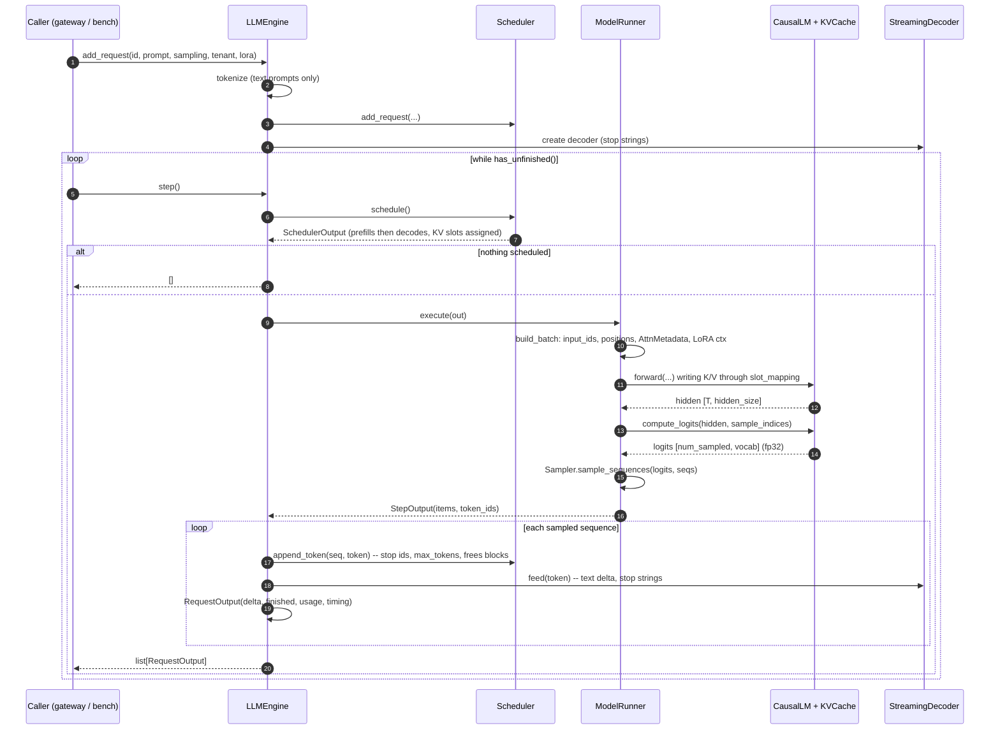

# Engine runtime

`src/turboserve/engine/runtime/` — `engine.py`, `async_engine.py`, `worker.py`,
`memory.py`, `streaming.py`, `naive.py`, plus the gateway's in-process backend
`src/turboserve/gateway/backends/local_engine.py`.

This page is about the layer that *runs* the engine. The decisions are made in
[`scheduler.md`](scheduler.md) and the arithmetic is done in [`model.md`](model.md); the
runtime is what turns a queue of requests into forward passes and forward passes back into
tokens, text and usage records.

## What the runtime owns

| Module | Responsibility |
| --- | --- |
| `worker.py` | `ModelRunner`: `SchedulerOutput` → packed tensors → decoder → logits → sampled tokens |
| `engine.py` | `LLMEngine`: the step loop, the tokenizer, stop conditions, per-request deltas, `stats()` |
| `async_engine.py` | `AsyncLLMEngine`: a background step loop and one `asyncio.Queue` per request |
| `memory.py` | Sizing the KV block pool from the memory the device actually has |
| `streaming.py` | Incremental detokenization and stop-string matching |
| `naive.py` | `NaiveHFEngine` and `StaticBatchHFEngine`: the baselines the engine is compared against |
| `backends/local_engine.py` | `LocalEngineBackend`: the gateway talking to `AsyncLLMEngine` in-process |

## The step loop

One call to `LLMEngine.step()` advances every scheduled request by at most one token.



Five things about that loop are worth stating explicitly, because each of them is a place
where an engine can quietly be wrong.

1. **`schedule()` already advanced `num_computed_tokens`.** The runtime never advances it
   again. The forward pass is going to run over exactly the tokens the scheduler picked, so
   there is one source of truth for progress, not two.
2. **Only sequences whose prefill *completes* this step sample a token.** A chunked prefill
   that stops in the middle of a prompt contributes hidden states to the KV cache and
   nothing to the sampler; `SchedulerOutput.sample_indices()` is aligned one-to-one with
   `SchedulerOutput.sampled()` and skips those rows. A step made entirely of such chunks
   returns an empty list of deltas — which is normal, and why callers test
   `has_unfinished()` rather than the length of the returned list.
3. **`context_lens` is the post-step length.** The causal offset is
   `context_len - query_len`, which is what makes one attention implementation serve
   prefill, chunked prefill, decode and `k+1` speculative verification without a branch.
4. **The engine's EOS set is not the scheduler's.** `Sequence.check_stop` knows the ids the
   client put in `SamplingParams.stop_token_ids`; the ids that end a generation because the
   *checkpoint* says so come from `ModelConfig.eos_token_ids` and the tokenizer, and are
   applied in `LLMEngine._process`. Both are honoured, and `ignore_eos` suppresses only the
   second.
5. **Stop strings resolve one step later, at worst.** They are defined on text, and text
   only exists once the detokenizer decides the bytes are complete (below). This matches
   every other server's behaviour and is why `stop` lives in the runtime rather than in the
   engine core.

## Batching: what the runner builds

The batch is a single flat token vector. There is no padding and no `[batch, seq]` shape
anywhere: a prefill chunk of 300 tokens and eleven decode steps of 1 token are 311
contiguous rows, sliced by `query_start_loc`.

```
scheduled:   [ prefill A (chunk, 64 tok) ][ prefill B (40 tok) ][ decode C ][ decode D ]
input_ids:   |<---------- 64 ---------->||<------ 40 ------>||<- 1 ->||<- 1 ->|   T = 106
query_start_loc: [0, 64, 104, 105, 106]
context_lens:    [ 64, 40, 512, 97 ]          (post-step; causal offset = ctx - query_len)
sample_indices:  [ 103, 104, 105 ]            (A is an unfinished chunk: no row)
```

`ModelRunner.build_batch` creates `input_ids` and `positions` directly on the target device
and calls `SchedulerOutput.build_attn_metadata`, which is also where the one invariant that
cannot be recovered later is checked: every sequence's block table must cover its claimed
context length. The four phases (`build_batch`, `forward`, `logits`, `sample`) are separate
methods so that speculative decoding can reuse three of them and replace one.

`LoRAContext` is skipped entirely when every scheduled sequence runs on the base model,
which is every step of a deployment without adapters. When adapters are in play, the engine
hook `lora_ctx_builder` supplies the per-token slots — see *Extension points* below.

## Memory: how `num_blocks` is chosen

The block count is the engine's most consequential number: it bounds how many sequences can
be resident, which bounds the batch size. `memory.py` decides it, in this order:

1. an **explicit** `num_blocks` (from `TURBOSERVE_NUM_BLOCKS`, an `EngineConfig`, or a
   benchmark profile) always wins — this is what makes a preemption test reproducible;
2. otherwise the **memory budget**
   `utilization x total - already_used - activation_headroom`, divided by the bytes one
   block costs across all layers;
3. capped at what `max_model_len x max_num_seqs` could actually use, so a small-context
   configuration does not reserve a pool it can never fill.

`utilization x total - used` is vLLM's convention and deliberately not `utilization x free`:
it treats `gpu_memory_utilization` as a ceiling on this engine's share of the *whole*
device, so another process already holding memory shrinks this engine's pool instead of
being quietly overcommitted. CUDA numbers come from `torch.cuda.mem_get_info` (the driver's
view, including other processes); host numbers come from `/proc/meminfo`'s `MemAvailable`,
which is the kernel's estimate of what a new allocation can get without swapping.

The activation headroom is *analytic*, not profiled: `ACTIVATION_ELEMENTS_PER_TOKEN` copies
of the widest hidden dimension per batched token, plus the QKV staging, plus one fp32
vocabulary row per sampling sequence. The last term is the one people forget and is the
largest at small batch sizes for a 150k-token vocabulary. vLLM instead runs a synthetic
worst-case batch and watches the allocator's high-water mark; the closed form was chosen
here because it is a pure function of numbers the config already carries, so every branch is
testable on CPU and engine construction does not depend on a forward pass that may itself
fail. Fragmentation inside the caching allocator is what the utilization fraction absorbs.

If the budget cannot pay for a single block, `MemoryProfileError` is raised with every term
in the message, because the fix is always to change one of them.

You can ask the question without loading a checkpoint:

```console
$ turboserve engine kv-size --model Qwen/Qwen2.5-7B-Instruct --dtype bfloat16 \
      --block-size 16 --max-num-seqs 64 --gpu-memory-utilization 0.9
```

which reads only `config.json` and prints the same decision the engine makes at startup,
including the probe it was based on.

## Preemption, from the runtime's side

The runtime does nothing special when a sequence is preempted: `SchedulerOutput.preempted`
lists the victims, their blocks are already back in the pool, and their
`num_computed_tokens` is zero again. Their output tokens are kept, so when they are resumed
the recomputed prefill covers prompt *and* the tokens generated so far, and the prefix cache
usually turns most of that back into a cache hit. The property that matters is tested end to
end: with a pool far too small for the working set, eight concurrent requests still produce
exactly the tokens `transformers` greedy decoding produces
(`tests/unit/test_engine_e2e.py::test_preemption_under_a_tiny_pool_preserves_outputs`).

## Streaming: detokenization and stop strings

Two problems separate "the sampler produced token 12345" from "the client should see these
characters now".

**Multi-byte tokens.** A byte-level BPE vocabulary contains tokens that are fragments of a
UTF-8 character — an emoji is commonly three or four tokens — and decoding one in isolation
yields `U+FFFD`. `IncrementalDetokenizer` keeps two offsets into the token list, decodes
`tokens[prefix_offset:read_offset]` and `tokens[prefix_offset:]`, and emits the difference;
decoding both from the *same* start is what makes the comparison valid for tokenizers that
add or strip a leading space. A window that ends in `U+FFFD` is withheld until the tokens
completing the character arrive. The window is bounded, so the cost per token is constant
rather than linear in the output length — it runs once per sequence per step.

**Stop strings.** `StopStringMatcher` withholds the shortest suffix of the emitted text that
could still grow into a stop string, so `"</s"` does not reach the client a step before
`">"` completes `"</s>"`. When a stop string does appear, the text is cut immediately before
it and never emitted. With no stop strings configured the buffer is bypassed entirely.

`StreamingDecoder` combines the two and is what `LLMEngine` holds per in-flight request;
aborting a request is a dictionary deletion.

## The async surface

Accepting HTTP requests and writing SSE frames is I/O bound; a scheduler step is a dense GPU
call. Running the step on the event loop would stall every open stream for the duration of
every forward pass, which is exactly the tail-latency pathology a serving engine exists to
avoid. So:

- one background `asyncio.Task` owns the engine and is the only thing that touches it;
- `generate()` registers an `asyncio.Queue` and appends a request description to a `deque`
  that the loop drains before its next step — no lock is taken and no caller can observe the
  engine mid-step;
- the step runs in `asyncio.to_thread`, releasing the loop for the whole forward pass (torch
  drops the GIL inside its kernels, so the loop really does make progress).

Cancellation is the other half of the contract. Closing the async generator — a client
disconnecting, a timeout, a `break` in the consumer — aborts the request, and its KV blocks
come back on the next step. Note that Python finalises an *abandoned* async generator through
the event loop's asyncgen hooks at an unspecified later point, so a server that wants the
blocks back promptly closes the stream explicitly; `LocalEngineBackend` does exactly that.

If a step raises, the loop does not restart: it fails every open stream with
`AsyncEngineDeadError` and stops. A step that raised has left the KV pool in a state nobody
has reasoned about, and serving on top of that would turn one bad request into silently
wrong tokens for everybody.

## The gateway's in-process backend

`LocalEngineBackend` registers itself as `local` and is what `configs/models.yaml` selects
with `backend: local`. Its `options` block is forwarded verbatim to the constructor:

```yaml
- name: Qwen/Qwen2.5-0.5B-Instruct
  backends:
    - name: reference
      backend: local
      lane: stable
      options:
        model: Qwen/Qwen2.5-0.5B-Instruct        # or: config: {model: ..., scheduler: {...}}
        served_models: [Qwen/Qwen2.5-0.5B-Instruct]
        adapters: {acme-support-r16: 1}          # adapter name -> engine LoRA slot
        local_files_only: false
```

Three behaviours are worth knowing:

- **Nothing loads at construction.** A backend built from a config file must be cheap — the
  gateway's `config-check` builds a router without loading weights. The engine is built on
  first use, once, behind an `asyncio.Lock`, in a worker thread.
- **`supports_lora` is `True` only when adapters are configured.** Reporting `True` with an
  empty mapping would make the router offer the backend traffic it would then reject. An
  unknown adapter name is a non-retryable `AdapterNotFoundError` (403); an unserved model is
  a `ModelNotFoundError` (404).
- **Failures follow the retry rule the backend protocol encodes.** Anything that goes wrong
  before the first token is raised, so the router can try another replica; anything after it
  becomes a terminating `TokenEvent.failure`, because bytes have already reached the client
  and a retry would duplicate them.

## The baselines

`naive.py` exists so the engine has something honest to be compared against. Both baselines
are built on `transformers.generate` with its own KV cache and expose the same
`add_request` / `step` / `abort` / `has_unfinished` / `stats` surface, so the benchmark
driver cannot accidentally treat them differently.

- **`NaiveHFEngine`** — one request at a time, to completion, in arrival order. The GPU is
  idle between the end of one request's decode and the start of the next one's prefill.
- **`StaticBatchHFEngine`** — collect `batch_size` requests, left-pad them to the longest
  prompt, generate for all of them, return when the longest finishes. A short request is
  billed the long one's latency, and a request arriving one microsecond after the batch
  started waits for the whole batch.

Neither is a straw man: both use the real KV cache, real sampling parameters and the same
stop conditions, and both are tested to reproduce `transformers.generate` token for token —
which is a precondition of any comparison between them and the reference engine, not a
nicety. What they do not do is admit a request into a batch that has already started, which
is precisely the thing continuous batching adds.

Two deliberate interface differences are documented in the code and repeated here: `step()`
returns whole completions rather than single-token deltas (these engines have no notion of a
step, and a fabricated per-token trickle would misreport TTFT — the first-token timestamp is
instead captured by a `StoppingCriteria` that `generate` calls after each new token), and a
batch with non-uniform `SamplingParams` is refused rather than silently served with the first
request's settings, because `generate` has no per-row sampling.

## Extension points

Two hooks exist so that speculative decoding and multi-LoRA can be layered on without
editing this package.

| Hook | Where | Contract |
| --- | --- | --- |
| `decode_step_hook` | `LLMEngine(decode_step_hook=...)` | `(engine, SchedulerOutput) -> StepOutput \| None`. Replaces the forward/sample phases. Returning `None` means "not handled" and the engine runs its own path — which is how a speculative engine opts out of a step containing no decoding sequences. |
| `lora_ctx_builder` | `LLMEngine(lora_ctx_builder=...)`, also settable as a property | `(SchedulerOutput, torch.device) -> LoRAContext \| None`. Owns adapter placement: which slot a request's adapter currently occupies, and how that changes as adapters are evicted. |

Everything else is injectable through the constructor — `model`, `tokenizer`, `kv_cache`,
`scheduler`, `runner` — which is how the tests build a deterministic four-block pool and how
a speculative engine gives two models one tokenizer.

## Configuration

`EngineConfig` (see [`contracts.md`](contracts.md)) is the whole surface;
`EngineConfig.from_settings(Settings)` bridges the `TURBOSERVE_*` environment variables.
The knobs this layer reads directly:

| Field | Effect here |
| --- | --- |
| `model`, `tokenizer` | What `CausalLM.from_pretrained` and the tokenizer load |
| `device`, `dtype` | Resolved once at construction; `auto` is fp16 on CUDA, fp32 on CPU, never bf16 |
| `gpu_memory_utilization`, `max_model_len` | Inputs to the block-count decision above |
| `scheduler.num_blocks` | Skips the decision entirely |
| `scheduler.block_size`, `max_num_seqs`, `max_num_batched_tokens` | Pool geometry and the activation headroom |
| `speculative`, `lora` | Untyped dicts, validated by the modules that own those subsystems |

## How to run it

```console
# smoke: complete some prompts with the reference engine
$ turboserve engine generate "Write a haiku about caches" --model Qwen/Qwen2.5-0.5B-Instruct \
      --max-tokens 64 --stats

# capacity planning, no checkpoint loaded
$ turboserve engine kv-size --model Qwen/Qwen2.5-7B-Instruct --dtype bfloat16

# the same engine behind the OpenAI-compatible gateway, in one process
$ turboserve gateway serve --engine config --models configs/models.yaml
```

In Python:

```python
from turboserve.engine.core.types import EngineConfig, SamplingParams
from turboserve.engine.runtime import LLMEngine

with LLMEngine(EngineConfig(model="Qwen/Qwen2.5-0.5B-Instruct")) as engine:
    engine.add_request("r1", "Hello", SamplingParams(max_tokens=32), tenant_id="acme")
    while engine.has_unfinished():
        for out in engine.step():
            print(out.text_delta, end="", flush=True)
```

`turboserve.engine.runtime` resolves its exports lazily (PEP 562), so importing the package
name costs nothing until an attribute is touched.

## How it is tested

Everything below runs on CPU in seconds against cached tiny-random checkpoints; nothing
downloads and nothing needs a GPU.

| File | What it pins |
| --- | --- |
| `tests/unit/test_engine_e2e.py` | A batch of eight mixed-length prompts equals HF greedy; chunked prefill changes nothing; a pool too small forces preemption and the tokens still match; abort frees blocks mid-generation; prefix caching on and off give identical tokens with a non-zero hit rate; `tenant_fair` and `fcfs` agree; stop token ids, `max_tokens` and stop strings set the right finish reason; the memory-sizing branches; the detokenizer on real multi-byte tokens and the stop matcher across chunk boundaries |
| `tests/unit/test_async_engine.py` | Streaming order, concurrent streams not interleaving, duplicate ids refused, a rejected request failing only its own stream, `aclose()` and task cancellation both aborting, an out-of-band abort delivering an `ABORT` terminator, a dying step loop failing every stream, `close()` idempotent — plus one run against the real engine |
| `tests/unit/test_naive_engines.py` | Both baselines reproduce `transformers.generate` exactly and agree with the reference engine; one request per step for the naive engine, fixed groups for the static batcher; timing and usage fields; interface parity; heterogeneous batches refused |
| `tests/unit/test_local_backend.py` | Registration as `local`, structural conformance to the `Backend` protocol, lazy construction, options-from-YAML shapes, adapter and model name mapping, event shapes and usage, the raise-before-first-token / yield-after rule, health and idempotent close — plus one run against the real engine |

The correctness tests compare against `transformers` computed in the same process rather
than against stored expectations, so a change in the tiny checkpoint cannot silently
invalidate them.

## Limitations

- **CUDA graphs are out of scope.** Every decode step is eagerly dispatched. On a small
  model at low batch size this leaves launch overhead on the table; capturing graphs would
  require fixed batch shapes, which conflicts with continuous batching's variable ones.
- **No tensor, pipeline or data parallelism.** One process, one device. `deploy/` scales by
  running more gateway and engine replicas, and the production path for a model that does not
  fit on one GPU is vLLM, which is a first-class gateway backend.
- **The activation headroom is an estimate, not a profile.** See above for why. A
  configuration with an unusually large `max_num_batched_tokens` on a nearly full device
  should set `num_blocks` explicitly or lower `gpu_memory_utilization`.
- **`step()` is synchronous and single-threaded by design.** A step mutates the KV pool;
  overlapping two steps on one pool is not safe, and continuous batching already extracts the
  parallelism that matters.
- **The baselines cannot cancel a running `generate` call.** `transformers.generate` is a
  blocking call with no cancellation point, so `abort` only removes a request that has not
  started. This is a property of the baseline, and one of the concrete reasons a serving
  engine does not use `generate`.
- **No prompt logprobs.** `SamplingParams.logprobs` yields the sampled token's
  log-probability; per-position prompt logprobs are not computed.
- **No benchmark has been run on a GPU here.** Everything above was verified on CPU with
  tiny-random checkpoints, plus the `gpu`-marked kernel tests in `tests/gpu/`, which run in
  seconds on a small card. The remaining CUDA paths (`mem_get_info` probing, fp16 execution
  at production shapes) are first exercised by the measurement run on a rented H100; see
  CONTRIBUTING.md, ["What has never been executed here"](../CONTRIBUTING.md#what-has-never-been-executed-here).
