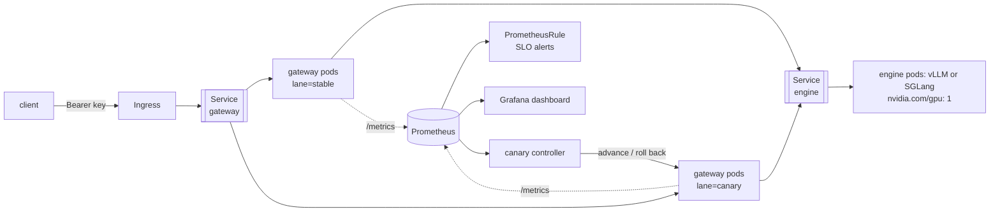
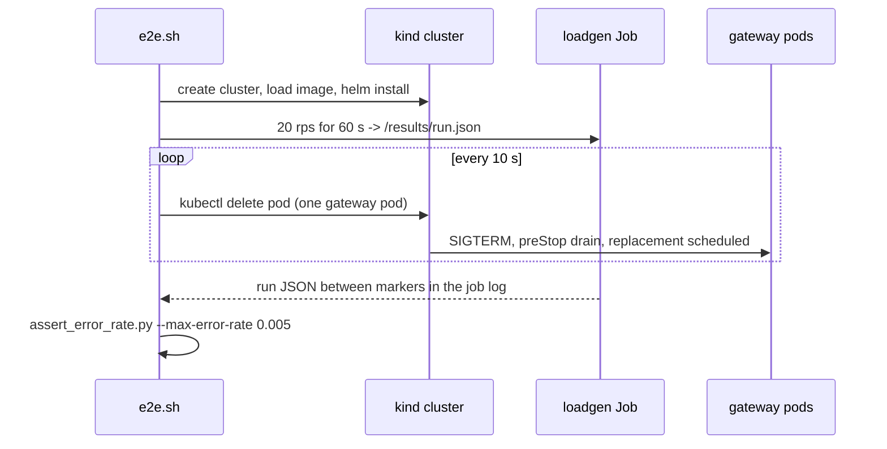

# Kubernetes

Everything under [`deploy/`](../deploy) plus the two GitHub Actions workflows that exercise
it. Three ways to run the same system, in increasing order of realism:

| Path | What it is | Where it is tested |
| --- | --- | --- |
| `docker-compose.yml` | One box: gateway, vLLM or SGLang, Prometheus, Grafana | by hand; the compose file is parsed in CI |
| `deploy/kustomize/` | Plain manifests, no Helm | `kubectl kustomize` + kubeconform in CI |
| `deploy/helm/turboserve/` | The full chart: lanes, HPA, monitoring, a vLLM or SGLang engine, adapters | `helm lint`, kubeconform, and a kind cluster in CI |



## Engine modes

`engine.mode` is the one value that changes the shape of the deployment.

| Mode | Workloads | GPU | Use |
| --- | --- | --- | --- |
| `mock` | gateway only | none | Exercising the Kubernetes objects, routing, quotas, canary and chaos paths on a cluster with no accelerators. This is what the kind job uses. |
| `reference` | gateway only, holding the from-scratch engine in-process | on the gateway pods | Reading and debugging the engine inside a cluster. |
| `vllm` | gateway + a separate vLLM Deployment and Service | on the engine pods | Production. See [`deploy/vllm/README.md`](../deploy/vllm/README.md). |
| `sglang` | gateway + a separate SGLang Deployment and Service | on the engine pods | Production. The same objects with a different image and argv. See [`deploy/sglang/README.md`](../deploy/sglang/README.md). |

`engine.mode` maps onto the one flag `turboserve gateway serve` actually takes:
`mock` renders `--engine mock`, `reference` renders `--engine config` (the pools come from
`models.yaml`, where a `local` backend is the from-scratch engine in this pod), and the two
production modes render `--engine http://<release>-engine:<port>/v1` — the *same* flag with
the same kind of value, because the gateway reaches either engine over the same
OpenAI-compatible API. Host, port, tenants and models are passed as flags, not as
`TURBOSERVE_*` environment variables, because `serve` constructs its `Settings` with those
four values explicitly and would override the environment.

`vllm` and `sglang` render the same Deployment, Service, PVC and NetworkPolicy; only the
container's image and argv differ, and both come from `engine.<mode>` in values. Everything
that has to know whether a separate engine workload exists asks one helper
(`turboserve.engine.standalone`), which is why the second production engine changed no
template but the engine container's own argument list. The image follows `engine.mode`
unless `engine.image.repository` overrides it, so a vLLM image cannot be started with
SGLang's flags by forgetting a value.

In `mock` and `reference` the gateway pod *is* the engine pod, which is why the chaos loop
in `deploy/kind/e2e.sh` selects `app.kubernetes.io/component=gateway`; in either production
mode the same loop is pointed at `component=engine`.

Splitting the gateway from the engine in production buys three things: the GPU tier scales
independently of the request-handling tier, a gateway rollout does not restart a process
holding tens of gigabytes of KV cache, and the engine image is an upstream release —
`vllm/vllm-openai` or `lmsysorg/sglang`, both pinned — rather than anything built here, so
its version is a value, not a rebuild.

## FP8 on Hopper

`engine.quantization` is the second value that changes what the engine container is asked to
do, and unlike `engine.mode` it changes only its argv:

| Value | vLLM renders | SGLang renders |
| --- | --- | --- |
| `none` (default) | nothing; the checkpoint is served at `engine.vllm.dtype` | nothing; served at `engine.sglang.dtype` |
| `fp8` | `--quantization fp8 --kv-cache-dtype fp8` | `--quantization fp8 --kv-cache-dtype fp8_e5m2` |

One value for both engines, because it is one capacity decision. FP8 halves two quantities
that `deploy/*/values-h100.yaml` does its sizing arithmetic in: the 7B checkpoint's weights
go from about 15 GiB to about 7.6, and a KV token from 57344 bytes to 28672. The same
`gpuMemoryUtilization`/`memFractionStatic` of 0.90 therefore covers roughly twice the tokens,
which is why `maxNumSeqs`/`maxRunningRequests` — not the block allocator — stays the thing
that limits concurrency.

The KV dtype is the one place the two argv genuinely differ. vLLM's `fp8` means E4M3 with
per-tensor scales; SGLang names the format outright and this chart asks for `fp8_e5m2`, which
spends a bit of mantissa on exponent range and needs no calibration pass. The chart hides
neither behind a shared word: each mode renders the flag its own server accepts.

Three rules the chart enforces at render time rather than in the cluster:

- `engine.quantization` must be `none` or `fp8`; anything else fails `helm template`.
- `fp8` requires a production mode. In `reference` mode the from-scratch engine runs
  bf16/fp16 only ([`engine.md`](engine.md#limitations)) and in `mock` mode there are no
  weights at all, so asking for it there is a refusal, not a silently ignored value.
- `engine.quantizedCheckpoint: true` requires `fp8`. It says `engine.model` is *already* an
  FP8 repository — such a checkpoint declares its scheme in its own `config.json`, and both
  servers refuse a `--quantization` flag that disagrees with it, so only the KV-cache dtype
  is rendered in that case.

```bash
helm upgrade --install turboserve deploy/helm/turboserve \
  -f deploy/vllm/values-h100.yaml --set engine.quantization=fp8 \
  --namespace turboserve
```

Both fp8 shapes are rendered and validated by `make k8s-lint`, and outside Kubernetes the
same option is `QUANT=fp8` in `deploy/vllm/launch.sh` and `deploy/sglang/launch.sh` (see
[`vastai.md`](vastai.md#fp8-arms)). What FP8 is worth on this hardware is a rendered row —
the `vLLM (fp8)` and `SGLang (fp8)` arms of `naive_vs_cb` in [`results.md`](results.md) —
and accuracy is not measured anywhere in this repository, so nothing here claims it is
unchanged.

## Lanes and progressive delivery

Every gateway pod carries a `turboserve.io/lane` label (`stable` or `canary`), the gateway
puts the same value on every metric it exports, and the canary controller compares the two
lanes under identical load. The chart renders one Deployment per lane plus three Services:

- `<name>-gateway` selects both lanes — the client-facing address and the scrape target;
- `<name>-gateway-stable` and `<name>-gateway-canary` select one lane each.

Two Deployments behind one ClusterIP Service split traffic by **replica share**, not by an
exact weight: `canary.weight: 25` with `gateway.replicaCount: 4` renders one canary pod and
three stable ones. That is enough to judge a canary and it needs nothing installed in the
cluster. For exact weights, set `canary.argoRollouts.enabled=true`, which replaces both
Deployments with an `argoproj.io/v1alpha1` Rollout that manipulates the two Services'
selectors directly. The chart refuses both at once — they would fight over the same lane
labels — and says so at render time.

Rolling back is `helm upgrade --set canary.enabled=false`: the canary Deployment goes away
and the stable lane keeps serving.

## Metrics contract

The alerts, the dashboard and the HPA all read the series the gateway exports on
`/metrics`. These names come from `src/turboserve/gateway/metrics.py` (namespace
`turboserve`, subsystem `gateway`) and are the interface between that module and everything
under `deploy/`; changing one means changing the dashboard and the rules with it.

| Series | Type | Labels |
| --- | --- | --- |
| `turboserve_gateway_requests_total` | counter | `tenant`, `model`, `backend`, `lane`, `status` |
| `turboserve_gateway_ttft_seconds` | histogram | `tenant`, `model`, `backend`, `lane` |
| `turboserve_gateway_tpot_seconds` | histogram | `tenant`, `model`, `backend`, `lane` |
| `turboserve_gateway_e2e_seconds` | histogram | `tenant`, `model`, `backend`, `lane` |
| `turboserve_gateway_tokens_total` | counter | `tenant`, `model`, `backend`, `lane`, `kind` (`prompt` \| `completion`) |
| `turboserve_gateway_rate_limited_total` | counter | `tenant`, `limit` |
| `turboserve_gateway_cost_usd_total` | counter | `tenant`, `model` |
| `turboserve_gateway_queue_depth` | gauge | `model` |
| `turboserve_gateway_inflight_requests` | gauge | `tenant`, `model` |
| `turboserve_gateway_backend_up` | gauge | `backend`, `model`, `lane` |
| `turboserve_gateway_canary_weight` | gauge | `model` |

The label sets are not uniform, and the differences matter when writing a query:
`rate_limited_total` carries the *quota* that refused the request rather than the model, and
`queue_depth` is per model rather than per lane, because queueing is a property of the pool
a request is waiting on.

`status` is the terminal state of a request: `ok`, `error`, `rate_limited`, `unauthorized`,
`forbidden`, `bad_request`, `cancelled`. The error ratio the alerts and the dashboard gate
on counts `status="error"` only — a 429 or a 401 is the system working as configured, not a
failure of it.

`lane` is a property of the **backend** a request was routed to, taken from the pool
definition in `models.yaml`, not of the pod that did the routing. That is why the
ServiceMonitor relabels the pod's `turboserve.io/lane` label into `pod_lane`: a target label
called `lane` would collide with the real one, and Prometheus would rename the metric's own
label to `exported_lane` and silently break every per-lane query.

A histogram exposes `_bucket`, `_sum` and `_count`; the dashboard and the recording rules use
`histogram_quantile` over `_bucket`, so the bucket boundaries chosen in the gateway are what
determines the resolution of every p95 shown.

`turboserve_gateway_cost_usd_total` is attribution from the configured prices in the model
pool file. It is useful for chargeback ratios and for spotting a tenant whose traffic changed
shape; it is not a bill, and no number in `results.md` derives from it.

The ServiceMonitor sets `jobLabel: app.kubernetes.io/name`, which pins the `job` label to
`turboserve` — the availability alerts match on it, and the docker-compose Prometheus uses
the same job name, so one set of rules works in both places.

## Alerts

[`deploy/prometheus/rules.yaml`](../deploy/prometheus/rules.yaml) has two consumers: a
standalone Prometheus loads it through `rule_files`, and the chart embeds it verbatim in a
`PrometheusRule`. Helm's `.Files.Get` cannot read outside the chart directory, so
`deploy/helm/turboserve/files/prometheus-rules.yaml` is a copy, regenerated by `make
sync-chart-files` and asserted byte-identical by the unit tests. The alerts in a cluster
and the alerts in docker-compose therefore cannot drift apart.

Recording rules first — `turboserve:request_error_ratio:rate5m`,
`turboserve:ttft_seconds:p95_5m`, `turboserve:canary_ttft_p95_ratio` and friends — then the
alerts on top of them:

| Alert | Fires when | Severity |
| --- | --- | --- |
| `TurboserveGatewayDown` | a scrape target has been down for 2 minutes | critical |
| `TurboserveNoGatewayTargets` | the job has no targets at all for 5 minutes | critical |
| `TurboserveHighErrorRate` | the stable lane's error ratio exceeds the objective, with real traffic | critical |
| `TurboserveCanaryHighErrorRate` | the same on the canary lane, on a shorter fuse | warning |
| `TurboserveTTFTSLOBreach` | stable p95 TTFT above the objective for 10 minutes | warning |
| `TurboserveCanaryLatencyRegression` | canary p95 TTFT exceeds the allowed ratio to stable | warning |
| `TurboserveQueueDepthHigh` | admitted requests queueing on a model pool for 10 minutes | warning |
| `TurboserveTenantRateLimited` | one tenant hitting one quota continuously for 15 minutes | info |

The error-ratio and canary-ratio thresholds are the same values the canary controller gates
on (`CanaryConfig.max_error_rate`, `max_p95_ratio_vs_stable`), so a rollout that the
controller rolls back and a rollout that pages a human are the same event rather than two
different opinions. Each alert carries a `runbook_url` pointing at
[`runbook.md`](runbook.md). Replace the whole set with
`monitoring.prometheusRule.groups`.

## Dashboard

[`deploy/grafana/dashboards/turboserve.json`](../deploy/grafana/dashboards/turboserve.json)
(uid `turboserve-gateway`) is provisioned by docker-compose from
`deploy/grafana/provisioning/`, and in a cluster by
`monitoring.grafanaDashboard.enabled=true`, which renders it as a ConfigMap labelled
`grafana_dashboard: "1"` for the kube-prometheus-stack sidecar. It is the same file in both
places, reached through the same symlink mechanism as the rules.

Five rows, all built on the gateway metrics above — it is a view of what tenants experience,
not of what the engine is doing internally:

1. **Service level** — request rate, error ratio (thresholded at the canary gate), TTFT p95,
   TPOT p95, output tokens/s, attributed spend per hour.
2. **Traffic and latency** — request rate by status; TTFT, TPOT and E2E quantiles.
3. **Rollout lanes** — TTFT p95 per lane, the canary/stable p95 ratio against its threshold
   line, error ratio per lane, and queue depth per model pool.
4. **Tenants** — requests/s, 429s/s (split by which quota refused them), tokens/s and
   attributed spend, top ten by tenant.
5. **Backends** — request rate by backend, prompt versus completion token rate, per-backend
   health, and the canary weight the router is currently applying.

Template variables for datasource, tenant, model and lane are applied to every query.

## Autoscaling

`gateway.autoscaling` renders an `autoscaling/v2` HPA for the stable lane only — the canary
lane's replica count *is* the rollout weight, and an HPA changing it would move the traffic
split under the controller's feet.

CPU utilisation is the default metric and a poor one for a process that spends its time
waiting on backend sockets; the useful signal is
`turboserve_gateway_queue_depth`, exposed as a Pods metric by
`gateway.autoscaling.queueDepth.enabled`. That requires an adapter
(prometheus-adapter or KEDA) that serves the series to the custom-metrics API. It is off by
default because an HPA with one unavailable metric stops acting on its other metrics too,
which is a worse failure than not autoscaling at all.

Scale-down uses a five-minute stabilisation window: LLM traffic is bursty and a gateway that
has just scaled in has cold connection pools to every backend.

## Security defaults

- Pods run as uid 10001, non-root, with `RuntimeDefault` seccomp, all capabilities dropped
  and no privilege escalation. The gateway's root filesystem is read-only, with an in-memory
  `emptyDir` at `/tmp`; the engine's is not, because both production engines write a
  compile cache at startup.
- `automountServiceAccountToken: false` everywhere. Nothing in this chart calls the
  Kubernetes API, so there is no Role and no RoleBinding either.
- Tenant data is a Secret (quotas and sha256 key hashes), model data a ConfigMap (routing
  and prices). Both are mounted read-only, and both are hashed into a pod annotation so that
  editing a quota rolls the pods instead of leaving them on a file that no longer exists.
- `networkPolicy.enabled=true` default-denies both components and then allows exactly:
  clients to the gateway, the monitoring namespace to the metrics port, gateway to engine,
  and DNS. The engine policy is the one that matters — neither vLLM nor SGLang has any
  notion of a tenant, so anything that can reach one directly bypasses authentication,
  quotas and accounting.

The chart's default tenants Secret follows the schema
`src/turboserve/gateway/tenants.py` reads (`version`, then tenants with `keys_sha256`
digests) and contains demo keys whose plaintext is `turboserve-demo-key` and
`turboserve-batch-key`. They are published here because they protect nothing; `NOTES.txt`
warns whenever they are installed. Set `tenants.create=false` and `tenants.existingSecret`
for anything real, and rotate a key by adding the new digest beside the old one and removing
the old one once clients have moved.

`gateway.requireAuth=false` renders `--no-require-auth`, which serves every request as the
`default` tenant with no credential at all. It exists for the kind job; `NOTES.txt` warns
about that too.

## The kind end-to-end job

[`deploy/kind/e2e.sh`](../deploy/kind/e2e.sh) is the only place where the resilience claim
is tested rather than asserted. It creates a three-node kind cluster, builds and side-loads
the gateway image, installs the chart with `engine.mode=mock`, `gateway.requireAuth=false` and
three replicas, smoke-tests `/healthz`, `/readyz` and `/v1/models` through the Service, then runs a loadgen Job at 20 rps for 60 seconds while deleting
one gateway pod every 10 seconds, and asserts the failed-request rate stayed under 0.5 %.



Three details carry the result:

- **Three replicas on two workers.** Deleting one pod has to leave the others serving, and
  the chaos loop skips a tick rather than taking the population below three.
- **`maxUnavailable: 0` and a readiness gate.** A replacement pod joins the Service only
  once `/readyz` passes, so capacity never dips during the replacement.
- **A five-second `preStop` sleep.** Endpoint removal is asynchronous: a pod can still
  receive connections after its container has begun shutting down. Sleeping first keeps the
  socket accepting until every kube-proxy has caught up. This is the difference between a
  pod deletion costing zero failed requests and costing a handful.

The Job writes its result to an `emptyDir` and then prints it between two markers, because a
completed pod's filesystem is gone before anything could copy it out; `e2e.sh` extracts the
JSON from the job log with `awk` and feeds it to
[`deploy/kind/assert_error_rate.py`](../deploy/kind/assert_error_rate.py). That script
checks two things, not one: the error rate, and that enough requests were recorded to mean
anything — a run that never reached the gateway has an error rate of 0.0 and would otherwise
turn a completely broken deployment into a green build.

The load generator contract is exactly:

```bash
turboserve bench loadgen --url <base url> --rps <n> --duration <seconds> --out <path>
```

writing a `RunResult` JSON (see [`contracts.md`](contracts.md)). The job needs no
credential: the chart is installed with `gateway.requireAuth=false`, so every request is
served as the `default` tenant. Authentication is exercised by the gateway's own tests; what
this job exercises is pod lifecycle, and a bearer token would only add an unrelated way for
it to fail.

Run it locally with Docker available:

```bash
deploy/kind/e2e.sh                 # create, run, tear down
KEEP_CLUSTER=1 deploy/kind/e2e.sh  # leave the cluster up to poke at it
```

In CI it is [`.github/workflows/kind-e2e.yml`](../.github/workflows/kind-e2e.yml), which
builds the image with a cached buildx layer and then calls the same script — there is no
CI-only copy of the logic to drift out of step.

## Chaos Mesh (optional)

[`src/turboserve/chaos/k8s/podchaos.yaml`](../src/turboserve/chaos/k8s/podchaos.yaml)
expresses the same experiments as Chaos Mesh objects: a `Schedule` that kills one gateway
pod every 10 seconds, a `NetworkChaos` that adds 500 ms to 5 % of gateway→engine packets,
and a 30-second partition. Nothing in CI applies them — installing the Chaos Mesh controller
and its CRDs is a cluster-wide change a repository's CI has no business making — but they
are there for a cluster that already runs it and wants experiments recorded as objects with
a history rather than as a loop in a shell script.

The partition experiment is the one whose expected outcome is *not* "no errors": requests
that have not produced a first byte can be retried onto another backend, but a stream
already in flight cannot be retried without duplicating tokens. What it checks is that the
failures stay confined to in-flight streams and that the gateway recovers without a restart.

## kustomize

For clusters that do not run Helm. `deploy/kustomize/base` is deliberately the smaller
thing — a gateway Deployment, its Service, its fleet data and a PodDisruptionBudget — with
two overlays:

- `overlays/kind-cpu`: namespace, three replicas, NodePort 30080, `imagePullPolicy: Never`
  for a side-loaded image, mock engine.
- `overlays/gpu`: adds a vLLM engine Deployment and Service and repoints the gateway at it.

`tenants.yaml` and `models.yaml` go through `secretGenerator`/`configMapGenerator`, so their
contents are hashed into the object names and kustomize rewrites every reference: editing a
quota rolls the pods, instead of leaving them mounting a file that no longer exists.

```bash
kubectl kustomize deploy/kustomize/overlays/kind-cpu
kubectl apply -k deploy/kustomize/overlays/kind-cpu
```

## Validating locally

```bash
helm lint deploy/helm/turboserve
helm template deploy/helm/turboserve | kubeconform -strict -summary -ignore-missing-schemas
kubectl kustomize deploy/kustomize/overlays/kind-cpu | kubeconform -strict -summary
```

`-strict` rejects unknown fields, which is what catches a misspelt key that Kubernetes would
silently ignore. `-ignore-missing-schemas` is needed for exactly three kinds, and for
nothing else: `ServiceMonitor` and `PrometheusRule` (Prometheus Operator CRDs) and `Rollout`
(Argo Rollouts CRD). kubeconform reports them as *skipped*, not valid, so the summary line
in CI shows how many objects were genuinely checked — if the skipped count ever exceeds
three, something that should have a built-in schema stopped matching one.

The `k8s` job in [`ci.yml`](../.github/workflows/ci.yml) runs all of the above on every push,
across three value combinations (defaults, the full production shape, and the Argo Rollouts
variant), because a template that is never rendered is never validated. It also asserts that
the chart *rejects* two impossible value combinations, syntax-checks every shell script,
parses every YAML asset, and checks that the dashboard is valid JSON in which every panel
carries a query.

## Limitations, and what has actually been run

- **Nothing here has been applied to a cluster from a development checkout.** The manifests
  are validated statically with `helm lint` and kubeconform by `make k8s-lint`, and
  end-to-end on GitHub's runners by the kind workflow.
- The kind job runs `engine.mode=mock`. The `vllm`, `sglang` and `reference` modes are
  validated as rendered manifests only; there is no GPU in hosted CI. `make k8s-lint`
  renders both production modes from the values file each ships with.
- Exact canary weights need Argo Rollouts. Without it the split is replica-proportional,
  which is stated wherever `canary.weight` appears.
- The queue-depth HPA needs a custom-metrics adapter that this chart does not install.
- The adapter-sync init container defaults to `aws s3 sync`. Other object stores work by
  replacing `engine.adapters.sync.image`/`command`/`args`; nothing about the volume changes.
- `docker-compose.yml`'s `gpu` and `sglang` profiles need an NVIDIA GPU and the container
  toolkit, and they are two profiles rather than two services because one GPU fits one of
  them at a time. The default profile (mock engine) needs neither and is the one to reach
  for first.
