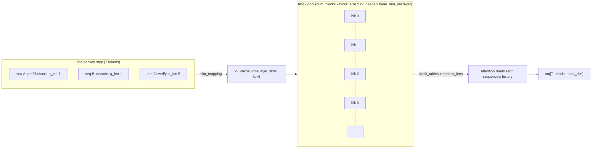
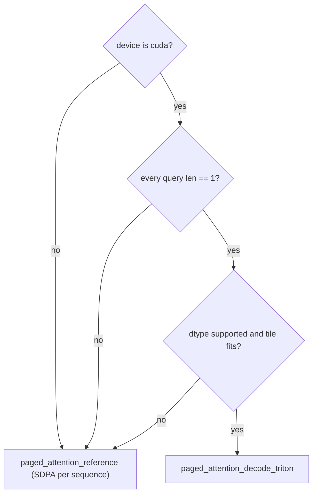

# The model: Qwen2/Llama over a paged KV cache

`src/turboserve/engine/model/` is the transformer the reference engine runs. It is a
from-scratch implementation of the Qwen2 and Llama decoder architectures whose only
substantive difference from the Hugging Face one is *where the keys and values live*:
instead of a rectangular `past_key_values` tensor per request, every attention layer reads
and writes a shared pool of fixed-size blocks through a per-sequence block table.

That single change is what makes the rest of the engine possible. Continuous batching,
chunked prefill, prefix sharing between tenants, preemption-by-recompute and speculative
verification all need a batch in which different sequences contribute different numbers of
tokens and read different amounts of history. None of those can be expressed as a
`[batch, seq]` KV tensor.

Everything else is deliberately identical to `transformers`, and that identity is a tested
property rather than an aspiration — see [Testing](#testing).

## Files

| File | Contents |
| --- | --- |
| `model_config.py` | `ModelConfig`: the normalised architecture description read from `config.json` |
| `weights.py` | Safetensors streaming loader and the checkpoint→engine name map |
| `layers.py` | `LinearBase`, `RMSNorm`, `RotaryEmbedding`, `Attention`, `MLP`, `DecoderLayer` |
| `attention.py` | `BatchPlan`, `paged_attention_reference`, the `PagedAttention` dispatcher |
| `triton_attention.py` | Triton flash-decoding kernel for one-query-token-per-sequence steps |
| `model.py` | `Decoder` and `CausalLM` (`forward`, `compute_logits`, `from_pretrained`) |

## The batch layout

A scheduler step produces one **packed varlen batch**: a flat vector of `T` tokens, the
concatenation of every scheduled sequence's new tokens, with no padding. A single step
legitimately mixes a long prefill chunk, several decode tokens and a speculative
verification of `k+1` tokens. `AttnMetadata` (owned by `engine/core/types.py`) describes it:

- `slot_mapping[T]` — the flat KV slot (`block_id * block_size + offset`) each token's new
  K/V is written to.
- `block_tables[num_seqs, max_blocks]` — each sequence's blocks, padded with `-1`.
- `context_lens[num_seqs]` — each sequence's attended length **after** this step.
- `query_start_loc[num_seqs + 1]` — cumulative token offsets (`cu_seqlens_q`).



### The causal offset, stated once

`context_lens[i]` is the length **after** this step, so sequence `i`'s `q_len` query tokens
occupy absolute positions `[ctx - q_len, ctx)`. Query `j` may attend to key indices
`0 .. ctx - q_len + j`. That one expression covers every case the engine produces:

| Case | `q_len` vs `ctx` | Resulting mask |
| --- | --- | --- |
| Whole-prompt prefill | `q_len == ctx` | lower triangle |
| Chunked prefill / prefix-cache hit | `0 < q_len < ctx` | rectangle plus triangle |
| Decode | `q_len == 1` | attend to everything |
| Speculative verify | `q_len == k + 1 < ctx` | rectangle plus triangle |

`causal_block_mask(query_len, context_len)` builds it, and
`tests/unit/test_paged_attention.py` checks each row of it explicitly.

## Attention backends

`PagedAttention.forward(q, k, v, kv_cache, layer_idx, meta, *, plan=None)` does two things,
in this order:

1. **Write.** `kv_cache.write(layer_idx, meta.slot_mapping, k, v)` — a single `index_copy_`
   into a cached flat view of the layer's block tensor.
2. **Read and attend**, through the block table.

Writing before reading is what lets a query attend to its own key, and it means prefill and
decode reach their context through exactly the same indirection — a block-table bug cannot
hide in one path and not the other.

`select_backend` then chooses:



### Reference path

`paged_attention_reference` walks the batch one sequence at a time. For each it gathers the
sequence's blocks with a single `index_select` (`gather_sequence_kv`), reshapes them to
`[context_len, kv_heads, head_dim]`, expands KV heads for GQA with `repeat_interleave`,
builds the offset causal mask and calls
`torch.nn.functional.scaled_dot_product_attention`. It is correctness-first: it handles
every batch shape, runs on CPU and CUDA, and is the oracle the Triton kernel is tested
against. It never materialises a padded `[num_seqs, max_context]` KV tensor, which for a
batch of long prefills would be larger than the attention itself.

### Triton decode kernel

`triton_attention.py` implements flash decoding (Dao et al., 2023) over the block table: one
program per `(sequence, kv_head)`, looping over that sequence's blocks and combining them
with the FlashAttention-2 online softmax (Dao, 2023) — a running maximum `m`, a running
denominator `l` and a rescaled accumulator, so the `[heads, context_len]` score matrix never
exists in memory.

Two choices are worth stating because they are unusual:

- **No tensor cores.** Scores and the value accumulation use broadcast multiply-and-reduce
  rather than `tl.dot`. Decode attention reads the whole KV context to multiply it against
  one query vector per head: it is bandwidth bound, with an arithmetic intensity around one
  FLOP per byte, so the matrix units have nothing to contribute. `tl.dot` would additionally
  force the GQA group dimension to be padded to 16, more than doubling the work for the
  4- to 8-wide groups the target models have. Keeping one formulation also means the kernel
  that ships is the kernel the GPU test exercises.
- **The kernel is a fast path, never a requirement.** `can_use_triton_decode` is
  conservative and everything it declines falls back to the reference: CPU tensors, any
  batch containing a prefill or a verify step, unsupported dtypes, and shapes whose
  per-program tile would exceed `MAX_TILE_ELEMENTS` (a 32-wide GQA group, for instance,
  where letting cuBLAS tile the problem is better than spilling registers).

Autotuning is limited to three `num_warps` settings, keyed on the group width, head
dimension and block size, so the tuning space stays small enough to explore at the first
call of a run rather than becoming a startup cost.

### One host read per step, not one per layer

Every field the reference path needs is a device tensor, and reading one synchronises. Doing
that inside the attention layer would cost `num_layers` stalls per step. `BatchPlan.from_metadata`
reads `query_start_loc`, `context_lens` and `block_tables` onto the host once, validates the
block tables against the context lengths, and `CausalLM.forward` threads the result down to
every layer. A CUDA decode step that the Triton kernel will serve skips building the plan
entirely, because the kernel consumes the device tensors directly.

## Numerics, and why they match `transformers`

- **RMSNorm** (Zhang & Sennrich, 2019) accumulates the variance in fp32 even for an fp16
  model. At `hidden_size` 4096 a sum of squares of fp16 activations overflows the fp16 range
  for ordinary activation magnitudes, and the resulting `inf` turns the hidden state into
  `nan`.
- **RoPE** (Su et al., 2021) uses the GPT-NeoX half-split layout (`rotate_half`), the layout
  Qwen2 and Llama checkpoints are trained with. Tables are precomputed in fp32 and cast at
  use; they are indexed by the step's arbitrary position vector, because a packed batch has
  no contiguous position range. `RotaryEmbedding.ensure_capacity` grows them by doubling,
  driven by `AttnMetadata.max_context_len` — a host-side int, so growth never synchronises.
- **SwiGLU MLP** (Shazeer, 2020) uses the activation named in `config.hidden_act` rather
  than assuming SiLU. Several tiny test checkpoints are built with GELU, and substituting
  SiLU turns a parity failure into a mystery.
- **Bias placement** is architectural, not configurable: Qwen2 always has a bias on
  `q_proj`/`k_proj`/`v_proj` and never on `o_proj`; Llama drives both from `attention_bias`
  and the MLP from `mlp_bias`. `ModelConfig` encodes exactly this.
- **Logits are computed in fp32** by `compute_logits`, which keeps the softmax of an fp16
  model stable at the cost of one cast of a vector that is about to be reduced anyway.

`forward` and `compute_logits` are separate calls on purpose. The vocabulary projection is
the single largest matmul in a step (`hidden_size x vocab_size`, over 150k columns for
Qwen2) and only the last token of each sequence needs it; fusing the two would multiply that
cost by the prefill chunk length for nothing.

## Configuration and weights

`ModelConfig.from_hf(path_or_id)` reads `config.json` and normalises it. It accepts both the
pre-5.0 `transformers` spelling (`rope_theta`/`rope_scaling`/`torch_dtype` at the top level)
and the 5.x one (nested `rope_parameters`, `dtype`), because checkpoints of both vintages are
in circulation.

It **rejects** rather than approximates: an unknown architecture, an activation with no exact
equivalent, sliding-window attention, or a RoPE variant other than `default`/`linear` raises
`UnsupportedModelError` at load time. Each of those would otherwise produce finite,
plausible-looking logits that are quietly wrong, and the only symptom would be degraded
generation quality noticed much later.

`weights.py` loads safetensors only. A pickle-only checkpoint raises: loading one means
`torch.load` on a pickle from an arbitrary repository, and every model this engine targets
publishes safetensors. Sharded checkpoints are enumerated from
`model.safetensors.index.json` rather than from a glob, so a shard named in the index but
absent on disk is a loud error instead of a set of missing parameters.

Loading streams one tensor at a time and copies it straight into the already-allocated
parameter, casting dtype in the same `copy_`, so peak host memory is one tensor rather than a
second copy of the checkpoint. Copying into existing storage (rather than replacing parameter
objects) is what keeps weight tying and any LoRA wrapper that captured a reference to a base
linear valid after loading. `LoadReport` distinguishes *missing*, *unexpected* and *tied*
parameters, and `load_weights` raises by default when anything is missing or unexpected — a
silently unloaded `o_proj.weight` leaves a randomly initialised layer in the middle of the
stack, which no shape check would find.

Engine parameter names mirror Hugging Face names (`model.layers.0.self_attn.q_proj.weight`),
so the name map is close to the identity and easy to audit; it exists to rewrite legacy
prefixes and to *skip* derived buffers such as `rotary_emb.inv_freq`.

## The hook multi-LoRA builds on

Every projection in the model is created through `LinearBase.create`, which consults a
class-level factory:

```python
from turboserve.engine.model import CausalLM, LinearBase, use_linear_factory


def factory(in_features, out_features, *, bias, dtype, device, name):
    return MyLoRALinear(in_features, out_features, bias=bias, dtype=dtype, device=device, name=name)


with use_linear_factory(factory):
    model = CausalLM(config, dtype=dtype, device=device)
```

`name` is the dotted module path the projection will have
(`model.layers.3.self_attn.q_proj`), so a factory can decide per target module and per layer
whether to wrap. `LORA_TARGET_MODULES` lists the default set and `named_linears(model)`
enumerates what was actually built.

The forward signature is `forward(x, lora_ctx=None)` throughout, and the decoder threads the
`LoRAContext` down to every projection unconditionally; the base class ignores it, so a model
with no adapters still runs exactly one `F.linear` per projection. The scope is a context
manager rather than a global because model construction is the only moment the hook may be
active — leaving it set would silently wrap the next model built in the same process (a
speculative draft model, say) with another model's adapters.

## Using it

```python
import torch
from turboserve.engine.core.kv_cache import KVCache
from turboserve.engine.model import CausalLM

model = CausalLM.from_pretrained("Qwen/Qwen2.5-0.5B-Instruct", dtype=torch.float16, device="cuda")
cache = KVCache(
    num_layers=model.num_layers,
    num_blocks=num_blocks,
    block_size=16,
    num_kv_heads=model.config.num_key_value_heads,
    head_dim=model.config.head_dim,
    dtype=model.dtype,
    device=model.device,
)

hidden = model(input_ids, positions, cache, meta)  # [T, hidden_size]
logits = model.compute_logits(hidden, last_token_indices)  # [num_seqs, vocab_size]
```

`input_ids`, `positions` and `meta` are built by the runtime's model runner from a scheduler
step; `ModelConfig.kv_bytes_per_token(dtype)` is what the engine multiplies by `block_size`
to size the pool, and it agrees with `KVCache.bytes_per_block` by test.

`CausalLM.init_weights(seed=...)` fills a model with deterministic random weights, for tests
that need a working model without a checkpoint. Parameters are otherwise allocated
uninitialised, because loading a checkpoint overwrites every one of them.

## Testing

| Test | What it pins down |
| --- | --- |
| `tests/unit/test_model_parity.py` | Prefill logits equal `AutoModelForCausalLM` within 1e-4 (fp32, both architectures); 20 greedy decode steps equal `generate` token for token; chunked prefill (chunk 3 and chunk 8) equals whole prefill; a prefix-cached prefill whose prefix was computed by another sequence into scrambled blocks equals an uncached one; tied embeddings share storage; the linear-factory hook substitutes every projection and receives the `LoRAContext` |
| `tests/unit/test_paged_attention.py` | Paged attention equals dense attention for query lengths 1, 3 and 7, with and without a cached prefix, for mixed prefill/decode batches and under GQA; the causal mask; block gathering; `BatchPlan` trimming and its rejection of a short block table |
| `tests/unit/test_model_config.py` | Bias placement per architecture, both RoPE spellings, linear scaling, and rejection of unknown architectures, activations, RoPE variants and sliding windows; the shard index, the pickle refusal, and missing/unexpected/shape-mismatch/tied weight handling |
| `tests/gpu/test_triton_attention.py` | The Triton kernel equals the reference within 1e-2 in fp16 (and in fp32) for MHA, GQA, a single cached token and a long scrambled block table; dispatch picks Triton only for CUDA decode steps and declines oversized tiles |

Unit tests run on CPU in seconds against tiny random checkpoints resolved from the local
Hugging Face cache (`tiny_qwen2_path`, `tiny_llama_path` in `tests/conftest.py`) with
`local_files_only=True`; they never download.

```bash
uv run pytest tests/unit/test_model_parity.py tests/unit/test_paged_attention.py \
              tests/unit/test_model_config.py
uv run pytest -m gpu tests/gpu/test_triton_attention.py   # needs a CUDA device
```

Block ids in these tests are deliberately scrambled, reversed and interleaved between
sequences. A bug that assumes blocks are contiguous, ascending, or that sequence `i` owns
blocks starting at `i * n` passes a test that allocates them in order and fails here.

## Limitations

- **Two architectures.** `Qwen2ForCausalLM` and `LlamaForCausalLM`. Mixture-of-experts,
  multi-modal and state-space models are out of scope; anything else raises
  `UnsupportedModelError`.
- **No sliding-window attention.** The paged cache keeps a sequence's whole context. A
  windowed checkpoint is rejected rather than run with the wrong attention span.
- **RoPE variants.** `default` and `linear` scaling only. `dynamic`, `llama3` and `yarn`
  change the frequency schedule and are rejected.
- **No quantisation.** Weights are loaded in fp16, bf16 or fp32; there is no int8/int4 or
  FP8 path.
- **No tensor or pipeline parallelism.** One model, one device.
- **No CUDA graphs.** Each step is eager. Capturing decode steps is a known optimisation for
  this shape of engine and is not implemented here.
- **The Triton kernel covers decode only.** Prefill and speculative verification use the
  reference path on every device. A prefill-specialised kernel (varlen FlashAttention over
  block tables) is not implemented.
- **Attention is not head-parallel on CPU.** The reference path loops over sequences in
  Python; it is written for clarity and for use as the correctness oracle.

## References

- Kwon et al., *Efficient Memory Management for Large Language Model Serving with
  PagedAttention*, SOSP 2023 — the block table and slot-mapping design.
- Dao, *FlashAttention-2: Faster Attention with Better Parallelism and Work Partitioning*,
  2023 — the online-softmax formulation the Triton kernel uses per block.
- Dao et al., *Flash-Decoding for long-context inference*, 2023 — splitting decode attention
  across the KV length, which the one-program-per-`(sequence, kv_head)` grid follows.
- Su et al., *RoFormer: Enhanced Transformer with Rotary Position Embedding*, 2021.
- Zhang & Sennrich, *Root Mean Square Layer Normalization*, NeurIPS 2019.
- Shazeer, *GLU Variants Improve Transformer*, 2020 — the SwiGLU MLP.
- Ainslie et al., *GQA: Training Generalized Multi-Query Transformer Models from Multi-Head
  Checkpoints*, EMNLP 2023.
