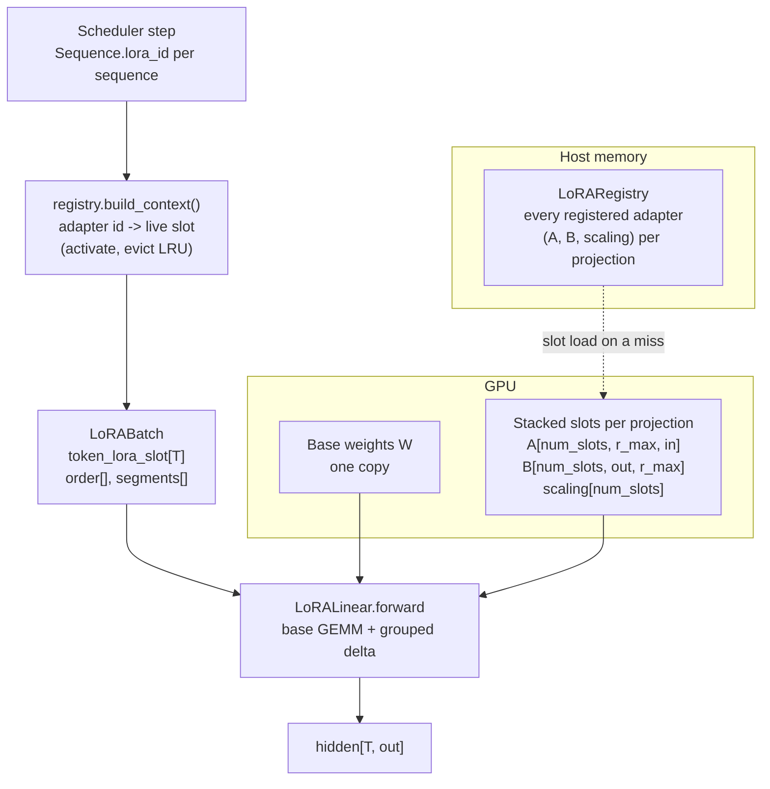

# Multi-tenant LoRA

Serve many fine-tuned variants of one model from one copy of its weights, with different
tenants' adapters active on different rows of the *same* batch.

Code: `src/turboserve/engine/lora/` (`adapter.py`, `layers.py`, `triton_bgmv.py`,
`registry.py`). Adapter training: `make_adapters.py`, exposed as `turboserve lora
make-adapters`. Benchmark:
`src/turboserve/bench/scenarios/multi_lora.py`.

---

## 1. Why this module exists

A LoRA adapter (Hu et al., 2021, [*LoRA: Low-Rank Adaptation of Large Language
Models*](https://arxiv.org/abs/2106.09685)) expresses a fine-tune as a low-rank update to
selected projections:

```
W' = W + (alpha / r) * B @ A          A: [r, in]    B: [out, r]
```

The obvious way to serve a fine-tune is to compute `W'` once and load it — a *merged* copy.
That is correct and fast, and it costs one full copy of the model per tenant. Thirty tenants
means thirty copies; the base weights, which are identical in all of them, are paid for
thirty times.

The alternative is to keep `W` once and apply each tenant's `(A, B)` at request time. The
arithmetic is cheap (rank is 8–64 against hidden sizes in the thousands) but it changes the
shape of the problem: the projection now has to apply *different* factors to different rows
of one batch, because a scheduler that could only put one tenant's requests in a step would
reintroduce exactly the head-of-line queueing that continuous batching exists to remove.

So this module solves one problem — **per-token adapter selection inside a dense GEMM** —
and one policy problem — **which adapters get to be on the GPU right now**.

---

## 2. The shape of the thing



Two identifiers, kept deliberately apart:

| | meaning | lifetime |
|---|---|---|
| **adapter id** | stable integer handed out by `LoRARegistry.register`, carried in `Sequence.lora_id` | the process |
| **slot** | which row of the stacked GPU buffers holds it *right now*; `0` is the base model | until it is evicted |

The engine's default context builder equates the two. That is only correct if residency
never changes, so installing LoRA replaces it: `install_lora` points
`LLMEngine.lora_ctx_builder` at `LoRARegistry.build_context`, which resolves ids to live
slots and makes sure they are resident before the step runs.

---

## 3. Data structures

### `adapter.py`

| Type | What it is |
|---|---|
| `LoRAWeights` | one projection's `A[r, in]`, `B[out, r]` and its folded `scaling` |
| `LoRAAdapter` | a whole adapter: `{module path: LoRAWeights}`, plus rank, alpha and provenance |
| `AdapterError` | unreadable directory, or a PEFT variant the engine does not implement |

`load_peft_adapter(dir)` reads an ordinary PEFT directory (`adapter_config.json` +
`adapter_model.safetensors`) and maps PEFT's key names
(`base_model.model.model.layers.0.self_attn.q_proj.lora_A.weight`) onto the engine's module
paths (`model.layers.0.self_attn.q_proj`).

Three refusals are deliberate:

* **`adapter_model.bin` is rejected.** It is a pickle; a serving process that loads
  tenant-supplied pickles executes tenant-supplied code. The error tells the operator to
  re-save with `safe_serialization=True`.
* **DoRA, `modules_to_save`, biased adapters, embedding LoRA and `fan_in_fan_out` are
  rejected**, rather than ignored. Silently dropping `modules_to_save` would serve a tenant
  something that is not the adapter they trained.
* **Shapes are validated at registration**, against the actual projections of the loaded
  model. An adapter for another architecture is a deployment error, and finding it when a
  tenant's request is already in flight turns it into an outage.

`rank_pattern` / `alpha_pattern` / `use_rslora` (Kalajdzievski, 2023,
[rank-stabilised LoRA](https://arxiv.org/abs/2312.03732)) are folded into a per-module
`scaling` on load, so nothing downstream has to know PEFT's option matrix.

### `layers.py`

`LoRALinear` subclasses `LinearBase` and holds, per wrapped projection:

```
lora_a      [num_slots, max_rank, in_features]
lora_b      [num_slots, out_features, max_rank]
lora_scaling[num_slots]                            (fp32)
```

all preallocated and registered as **non-persistent buffers** — they are runtime slot
storage, not checkpoint content, and a persistent buffer would make
`load_weights(strict=True)` report them missing from every checkpoint.

Slot `s` lives in row `s - 1`, because slot `0` is the base model and never needs storage.
Reserving a dead row would waste `1/num_slots` of the adapter pool, which is real VRAM in
exactly the configuration this module exists to make cheap.

The wrapper **adopts** the base projection's `weight`/`bias` `Parameter` objects instead of
nesting the base linear as a child module. If it nested it, the parameter's name would
change from `model.layers.0.self_attn.q_proj.weight` to `...q_proj.base.weight` and the
checkpoint loader would stop finding it — and adapters must be installable both before the
weights are loaded (the `use_linear_factory` path) and after (`install_lora` on a running
engine).

### `registry.py`

`LoRARegistry(max_gpu_adapters, model, max_lora_rank=..., target_modules=...)` holds every
registered adapter in host memory and treats the GPU slots as a small fixed cache: filled on
demand, evicted least-recently-used, with pinning for adapters that should always be warm.
This is the design S-LoRA (Sheng et al., 2023,
[*S-LoRA: Serving Thousands of Concurrent LoRA Adapters*](https://arxiv.org/abs/2311.03285))
calls unified paging for adapters, reduced to its essential part: adapters are small and
uniform, so a slot array beats a paged allocator and keeps the kernels' indexing trivial.

`LoRAOptions` validates `EngineConfig.lora` (which the core types deliberately leave
untyped so this module can own its own schema), and `setup_lora(engine, options)` is the
single call that builds the pool, wraps the projections, registers the adapters and pins
what should stay resident — in that order, which is the order that produces useful errors.

---

## 4. The grouped (SGMV) forward

For a packed batch of `T` tokens with slot vector `token_lora_slot[T]`:

```
out = W @ x                                    # one dense GEMM, every token
for each active slot s:                        # tokens grouped by slot
    idx  = positions of the tokens using s
    xs   = x[idx]                              # [n_s, in]
    d    = (xs @ A[s].T) @ B[s].T              # [n_s, r] then [n_s, out]
    out[idx] += scaling[s] * d
```

Two GEMM pairs per **active adapter** — not per token, and not per registered adapter. This
is the Segmented Gather Matrix-Vector pattern of Punica (Chen et al., 2023,
[*Punica: Multi-Tenant LoRA Serving*](https://arxiv.org/abs/2310.18547)) and S-LoRA.

### Where the grouping is computed, and why it matters

`LoRABatch` (a `LoRAContext` with two extra fields) carries the grouping:

* `order[num_adapter_tokens]` — token positions sorted by slot, base-model tokens omitted
  entirely, so a batch that is mostly base traffic costs the LoRA layers nothing beyond the
  base GEMM;
* `segments` — `(slot, start, end)` half-open ranges into `order`.

It is built **once per step, on the host**, from the Python list of adapter ids the
scheduler already has. That is the detail that decides whether multi-LoRA is usable at all:
a 28-layer model has 196 wrapped projections, and deriving the segments inside each of them
from the device-side slot tensor would be 196 device-to-host synchronisations *per decoded
token*. The list sort costs microseconds and the upload is one `H2D` copy.

`lora_segments()` will derive the grouping from a plain `LoRAContext` if it has to — the
fallback keeps a hand-built context working, synchronises once, and logs at debug level. It
is not on the serving path.

### The BGMV kernel

During decode every sequence contributes one token, so the per-slot GEMMs degenerate into
matrix-*vector* products and the launch overhead dominates. `triton_bgmv.py` then does the
whole batch in two Triton kernels — *Batched Gather Matrix-Vector*, Punica's name for the
pattern:

* **shrink**: one program per token computes `tmp[t, :r] = A[slot_t] @ x[t]`, accumulating
  in fp32 over tiles of `in_features`. The fp32 accumulator is not optional: `in_features`
  is thousands of elements and an fp16 running sum loses the small contributions that make
  up most of a LoRA delta.
* **expand**: one program per `(token, output tile)` computes
  `y[t, n] += scaling * B[slot_t][n, :r] @ tmp[t, :r]`, reading the base output and writing
  the sum. No atomics: each `(t, n)` pair belongs to exactly one program.

Tokens whose slot is `NO_LORA` exit immediately, which is what lets a batch mixing base and
adapter traffic go through a single launch. Rank is padded to a power of two and masked, so
a rank-16 and a rank-12 adapter share one compiled kernel.

`can_use_bgmv()` gates on device, dtype, rank and batch size. The batch-size cutoff
(`DEFAULT_BGMV_MAX_TOKENS`) is the "should", not the "can": above it a long prefill chunk
has enough work per adapter to amortise real GEMMs, and the grouped path wins.

---

## 5. Residency, and the one way to misconfigure it

`activate(ids)` makes every requested adapter resident, evicting the least recently used
adapter that is neither pinned nor part of the same request. Adapters requested together are
never each other's victims, so a step whose working set fits in the pool always succeeds
regardless of the order the ids arrive in.

A step contains at most one adapter per sequence. Therefore:

```
max_gpu_adapters >= scheduler.max_num_seqs   =>   LoRACapacityError is unreachable
```

`install_lora` logs a warning when a configuration does not have that property, and a step
that does overflow raises `LoRACapacityError` rather than quietly serving some tenant the
base model. Running with a smaller pool is a legitimate memory trade — adapters are usually
shared across sequences — but it should be made knowingly.

Unknown adapter ids raise `UnknownAdapterError`. They cannot arrive through the gateway,
which rejects unknown adapter *names* at admission with a 403 (`AdapterNotFoundError`);
reaching the registry with an unregistered id means an id was fabricated between the gateway
and the scheduler, which is a bug and not a request to serve.

---

## 6. VRAM arithmetic

Everything below is arithmetic over declared tensor shapes. It is computed by
`LoRARegistry.vram_report()` from the tensors that exist in the process; no measurement and
no benchmark is involved, and the repository's measured figures live only in
`results/**/*.json`.

Per wrapped projection, one slot costs

```
bytes_per_slot(projection) = (r_max * in_features + out_features * r_max) * itemsize
```

and the pool for the whole model is the sum over wrapped projections times `num_slots`
(plus a `num_slots`-long fp32 scaling vector per projection). Serving `N` adapters then
costs

```
lora_bytes   = base_bytes + num_slots * sum_over_projections(bytes_per_slot)
merged_bytes = N * base_bytes
saved_pct    = 100 * (merged_bytes - lora_bytes) / merged_bytes
```

The asymmetry is the point: `merged_bytes` grows linearly in `N`, while `lora_bytes` grows
only in `num_slots` — and a slot is a rank-sized pair of factors, not a copy of the model.
For the seven projections this module wraps, one slot is

```
2 * r_max * (4 * hidden * head_ratio_terms + 3 * intermediate) * itemsize
```

in the shape the model's own config gives; `vram_report()` does the sum for the model
actually loaded rather than from a formula, which is why the benchmark reports it from the
registry instead of from a spreadsheet.

Getting the numbers for your own deployment:

```python
from turboserve.engine.lora import LoRARegistry, install_lora

registry = LoRARegistry(max_gpu_adapters=32, max_lora_rank=16)
install_lora(engine, registry)
registry.register_directory("adapters/")
print(registry.vram_report())  # base_bytes, adapter_pool_bytes, merged_bytes, saved_pct
```

The host-side store (`bytes_host`) is separate and is host RAM, not VRAM: it is what lets
the 100th adapter exist at all while only `num_slots` of them are on the device.

---

## 7. How to run it

### Train adapters

```bash
turboserve lora make-adapters \
    --model Qwen/Qwen2.5-0.5B-Instruct --n 16 --rank 8 --steps 30 --out adapters/
```

(`python scripts/make_lora_adapters.py` is the same command for a checkout with nothing
installed; the trainer lives in `turboserve.engine.lora.make_adapters`.)

N distinct synthetic tasks (per-tenant marker plus a trivial string transformation), one
PEFT directory each, plus a `manifest.json` describing the set so a benchmark result can say
exactly which adapters it used. The tasks are trivial on purpose: what a serving benchmark
needs is that each adapter moves the logits in *its own* direction, so that a batch mixing
adapters does genuinely different work per row and a wrong-slot bug is visible.

Training is fp32 even on a GPU. LoRA's `B` factors start at zero, and a handful of fp16
steps without a gradient scaler routinely produce zero gradients — adapters that load fine
and do nothing.

### Serve them

```python
from turboserve.engine.core.types import EngineConfig
from turboserve.engine.lora import LoRAOptions, setup_lora
from turboserve.engine.runtime.engine import LLMEngine

engine = LLMEngine(EngineConfig(model="Qwen/Qwen2.5-0.5B-Instruct"))
registry = setup_lora(engine, LoRAOptions(max_loras=16, max_lora_rank=8, adapters_dir="adapters/"))
engine.add_request("r1", "hello", lora_id=registry.id_for("tenant-3"))
```

Through the gateway, `configs/models.yaml` gives the backend an `adapters` mapping of
adapter name to id (`registry.name_to_id()`), a tenant addresses one by name in
`GenerateRequest.lora`, and an unknown name is a 403.

### Benchmark

```bash
turboserve bench multi-lora --profile h100 --adapters-dir adapters/ --out results/
turboserve bench multi-lora --profile h100 --adapters-dir adapters/ \
    --backend vllm --url http://127.0.0.1:8000/v1
```

Arms: a control with no adapters, then one arm per `adapter_counts` entry from
`configs/bench/profiles.yaml`, round-robining requests over the adapters at the same
concurrency and the same prompts. Every arm records the control as its `baseline_label`, and
`summary["derived"]` carries the VRAM block and the p95 TTFT/TPOT/E2E deltas against it.
`--max-loras` caps the pool below the arm's adapter count, which is how the eviction path is
exercised deliberately.

The vLLM arm addresses adapters by name in the OpenAI `model` field (start the server with
`--enable-lora --max-loras N --max-lora-rank R`). It produces no VRAM block: a remote
server's tensor sizes are not something this process can measure, and this repository does
not print numbers it did not obtain.

---

## 8. How it is tested

| File | What it pins |
|---|---|
| `tests/unit/test_lora_adapter.py` | PEFT directories written by `make_adapters.py` load; key mapping; scaling; every unsupported variant is refused by name |
| `tests/unit/test_lora_layers.py` | grouping; slot storage; install/uninstall/factory; **mixed adapters in one packed batch equal PEFT's own `merge_and_unload()` model per sequence, within 1e-4** |
| `tests/unit/test_lora_registry.py` | LRU eviction order, joint activation, pinning, capacity errors, VRAM arithmetic, counters, `build_context` against a real `Scheduler` step |
| `tests/unit/test_lora_scenario.py` | the benchmark scenario end to end on CPU: arms, baseline labelling, derived block, result files and the index |
| `tests/gpu/test_lora_bgmv.py` | (`gpu`-marked) the Triton kernels compile and match the per-token definition in fp16 and fp32 |

The parity test is the one that matters. The adapters it uses are trained with a large
`alpha`, so their effect on the tiny model's logits is order 1 — a wrong-slot bug fails by
thousands of times the tolerance rather than sneaking under it.

Run them with:

```bash
uv run --frozen pytest -q tests/unit/test_lora_adapter.py tests/unit/test_lora_layers.py \
    tests/unit/test_lora_registry.py tests/unit/test_lora_scenario.py
uv run --frozen pytest -q -m gpu tests/gpu/test_lora_bgmv.py
```

Everything runs on cached tiny random checkpoints, on CPU, in seconds, with no network.

---

## 9. Limitations

* **One rank budget for the whole pool.** Slots are `r_max` wide, so a rank-8 adapter in a
  rank-64 pool pays for 64 and the BGMV kernel multiplies the padded columns (they are
  zeroed, so the result is right, only the traffic is wasted). Group adapters by rank into
  separate pools if that matters; the engine does not do it for you.
* **The seven projections, and no others.** `target_modules` is configurable, but adapters
  that touch embeddings, the LM head or normalisation layers are refused rather than
  partially applied.
* **`modules_to_save` is not supported.** An adapter that replaces whole modules cannot be
  expressed in a stacked-slot layout.
* **The BGMV kernel covers decode-sized batches only.** Prefill and speculative
  verification take the grouped path on every device; there is no fused varlen LoRA prefill
  kernel.
* **Slot loads are synchronous.** A miss copies the adapter's factors into the slot inside
  the step that needed it; there is no prefetch stream and no overlap with compute. Pinning
  is the mitigation for adapters that must never pay it.
* **No adapter-aware scheduling.** The scheduler does not prefer sequences whose adapters
  are already resident, so a pool much smaller than the working set can thrash. The
  `max_gpu_adapters >= max_num_seqs` rule in §5 is the configuration that avoids it.
* **Nothing here has been run on an H100.** Per `PLAN.md` §2a, everything was developed and
  verified on CPU with tiny random checkpoints plus one small `gpu`-marked kernel test on a
  Turing card. The fp16/bf16 serving paths and the kernel's behaviour at production shapes
  are first exercised in the measurement phase.
