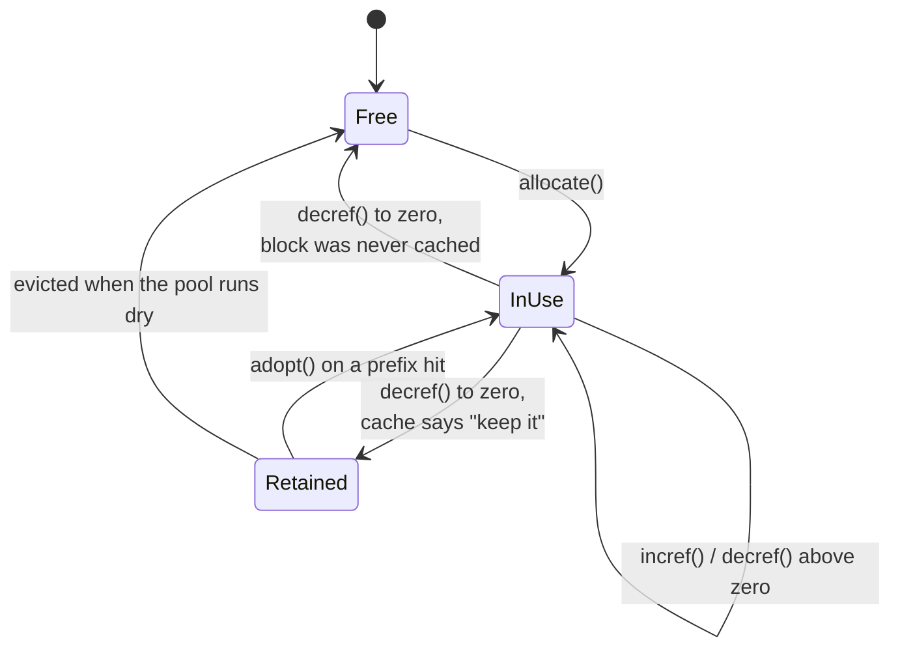
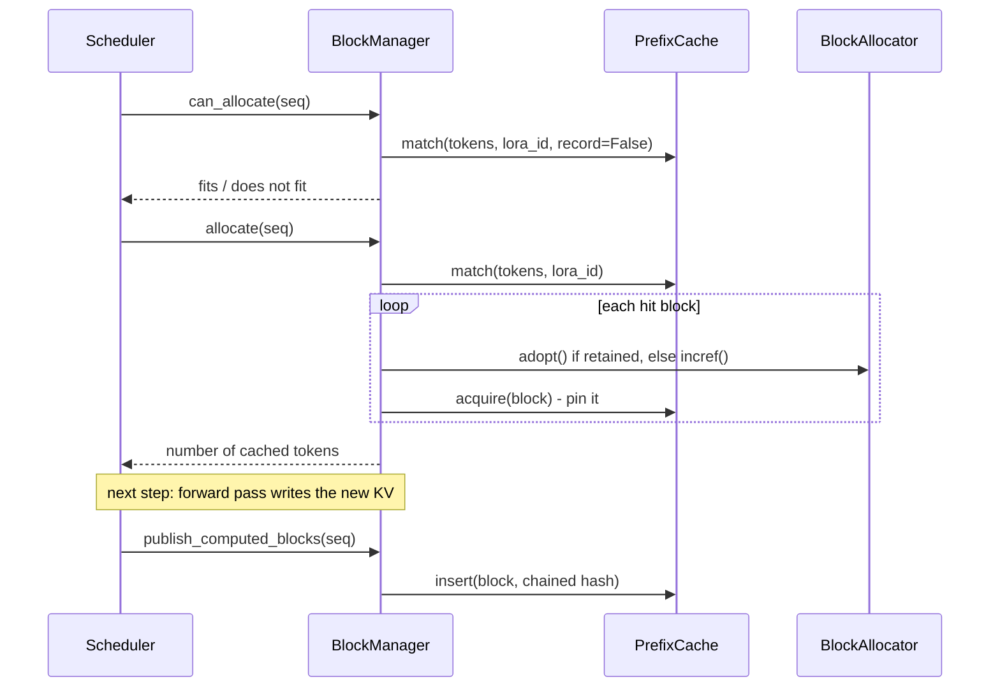

# Prefix caching

`src/turboserve/engine/core/prefix_cache.py`, with `block_manager.py` and `kv_cache.py`.

Two requests that begin with the same tokens produce, layer for layer, exactly the same keys
and values for that shared span: attention is causal, so a prefix's KV cannot depend on
anything that comes after it. The second request can therefore *adopt* the first request's
KV blocks instead of running prefill over them again. That is the whole idea. This page
describes the index that makes those blocks findable, and the rules that keep sharing safe.

It matters because shared prefixes are the common case in a multi-tenant deployment, not an
optimisation for a corner: a system prompt repeated on every request, a few-shot preamble, a
chat history that grows by one turn, a document re-queried several times. Prefill over a
prefix that is already in the cache is work the GPU does not have to do at all.

## Block hashing

A block is identified not by its own tokens but by the entire prefix ending at it:

```
h_-1 = ROOT_HASH                                     # domain-separated constant
h_i  = blake2b(h_{i-1} || lora_id || tokens_i)       # 128-bit digest
```

Chaining is what makes the identity sound. The tokens `["b", "c"]` as the *second* block of a
sequence are a different thing from the same tokens at the start of one, and only the chained
hash distinguishes them -- hashing a block's own tokens alone would let a sequence adopt KV
computed in a different context, which is silently wrong output rather than a crash.

The LoRA id is mixed in for the same reason: an adapter changes the projections, so the same
tokens under a different adapter produce different K and V. Two tenants running different
adapters over an identical prompt must not share blocks, and the hash chain is where that is
enforced.

Only **full** blocks are hashed. A partially filled block will still receive tokens, so
publishing it would advertise KV under a hash that does not describe the block's final
contents.

Collision risk is the usual content-addressing trade-off: a 128-bit blake2b digest is treated
as identity. Storing every cached block's token ids and comparing them on each lookup would
remove the risk at the cost of memory proportional to the cache and a comparison per lookup;
vLLM makes the same trade, and a 128-bit accidental collision is far less likely than a
silent hardware fault.

## Three states, one owner per block

The cache never allocates or frees memory. `BlockAllocator` owns the pool and keeps every
block in exactly one of three states:



`PrefixCache` is plugged in as the allocator's `BlockRecycler`, the single hook between the
two. When a block's reference count reaches zero the allocator asks `on_zero_refs` whether to
keep it; when the allocator runs out of blocks it asks `reclaim` for the least recently used
ones back. So a cached block is never also free, and the allocator's invariant survives
unchanged -- `BlockManager.check_invariants()` asserts exactly that correspondence: a cached
block is evictable in the cache if and only if it is retained by the allocator.

Inside the cache, a block that some sequence is still using is *pinned*: findable and
adoptable, but not evictable, because evicting live KV memory would hand it to somebody else.
A block whose last user is gone is *evictable*, and the LRU order covers only those.

## Lookup, adoption and publication



A lookup walks the chain from the root and **stops at the first miss**, even if a later block
happens to be in the index: attention needs an unbroken prefix, and a block whose ancestors
are gone is unreachable by construction.

The hit is capped so that at least one token of the sequence is left to compute. A sequence
whose entire content came from the cache would enter the step with nothing to run through the
model, and therefore no hidden state to take logits from.

### When a block becomes shareable

A block becomes full *during* a step, but its KV is written by the model **after** the
scheduler has produced that step's metadata. Publishing it inside the same step would let
another sequence in the *same batch* adopt a block whose contents do not exist yet -- a
subtle correctness bug that would surface as occasional nonsense output under load.

So blocks are published at the top of the *following* step: `Scheduler.schedule()` calls
`BlockManager.publish_computed_blocks()` for every running sequence before it schedules
anything, by which point the forward pass that filled them has certainly run. The cost is
that a block becomes shareable one step later than theoretically possible. The benefit is
that "cached" never means "about to be".

Two sequences that miss on the same prefix in the same step both compute it; the second
`insert` returns `False` and its block simply stays uncached. That is a duplicate, not a
corruption, and later requests share whichever block got there first.

## Eviction

`evict(n)` drops the `n` least recently released blocks from the index and returns their ids;
the allocator puts them back on the free list. Pinned blocks are never returned, so eviction
can come up short -- and that shortfall is precisely the signal that the pool is genuinely
full of live KV and the scheduler must preempt instead of waiting.

Evicting a block whose descendants are still cached leaves those descendants unreachable,
because a lookup stops at the first miss. They are not wrong, only wasted, and they age out
of the LRU on their own.

## Interaction with preemption

Preemption publishes before it frees. A sequence that loses its blocks leaves its computed
prefix in the cache, so when it is resumed it re-adopts what it just gave up instead of
recomputing it. That is what makes recompute preemption affordable, and it is why this engine
does not implement KV swapping: the cache already provides most of the benefit without a
pinned host buffer or a PCIe transfer.

## Accounting

`PrefixCache.stats()` reports `hits` and `misses` counted **per queried block** (not per
lookup), `hit_rate`, `tokens_saved` (`hits * block_size`), `inserts`, `evictions`,
`num_cached` and `num_evictable`. `BlockManager.stats()` merges them under a `prefix_` prefix
alongside the pool's occupancy, and `Scheduler.stats()` adds `num_cached_tokens`, the running
total of prompt tokens admissions skipped. An admission check uses `record=False` so that
asking whether a request would fit does not move the hit rate.

`RequestTiming.num_cached_prompt_tokens` carries the per-request figure all the way out to
`RequestOutput.usage()["cached_prompt_tokens"]`, because a time-to-first-token is only
interpretable next to it: a request whose prompt hit the cache did no prefill work at all.

## How it is tested

`tests/unit/test_prefix_cache.py` (15 tests) and `tests/unit/test_block_manager.py`
(17 tests):

* changing any token changes that block's hash **and every later block's hash**, tested by
  perturbing each position of a twelve-token sequence in turn;
* the same tokens at a different offset hash differently, and so do two different LoRA ids;
* a partial trailing block is never hashed;
* `lookup` returns the longest *unbroken* prefix, and skips a cached block behind a gap;
* statistics count queried blocks, and `record=False` leaves them untouched;
* `insert` is idempotent, refuses to reinterpret a block under a second hash, and yields to
  whichever block cached an identical prefix first;
* eviction is least-recently-released first, and `acquire` takes a block out of that order;
* the cache satisfies the `BlockRecycler` protocol, and driving an allocator with it leaves
  no block both free and cached -- verified by `check_invariants()` on both sides;
* in the block manager: hits are adopted (retained -> in use) or increfed (already live) with
  the right reference counts, a hit never consumes the whole sequence, a different adapter
  shares nothing, publication covers only blocks whose KV is computed and is idempotent,
  preemption publishes then frees, and a resumed sequence re-adopts its prefix.

`tests/unit/test_scheduler.py` covers the end-to-end effect: a second request with the same
prompt has its prefill shortened by exactly the cached tokens, and switching prefix caching
off restores the full prefill.

```bash
uv run pytest tests/unit/test_prefix_cache.py tests/unit/test_block_manager.py
```

## Limitations

* **Block granularity.** Sharing is rounded down to whole blocks: two prompts that agree on
  all but the last few tokens of a block share nothing in that block. A smaller `block_size`
  shares more but makes block tables longer.
* **No cross-block deduplication.** If two sequences compute the same prefix concurrently,
  the loser's block stays uncached rather than being swapped for the winner's and freed.
* **Eviction ignores the chain.** LRU does not prefer to evict leaves over interior blocks,
  so an eviction can strand still-cached descendants until they age out.
* **In-process only.** The cache lives in the engine process. There is no sharing between
  replicas and nothing is persisted across restarts.
* **Hash identity is trusted.** Token ids are not stored, so a digest collision would be
  silent. See the trade-off above.

## References

* Kwon et al., *Efficient Memory Management for Large Language Model Serving with
  PagedAttention*, SOSP 2023 -- paged KV blocks and block tables.
* vLLM, *Automatic Prefix Caching* design notes -- the hash-chain scheme this follows.
* Zheng et al., *SGLang: Efficient Execution of Structured Language Model Programs*, 2024 --
  RadixAttention, the prefix-tree alternative to hashed blocks.
* Saarinen and Aumasson, *The BLAKE2 Cryptographic Hash and Message Authentication Code*,
  RFC 7693.
