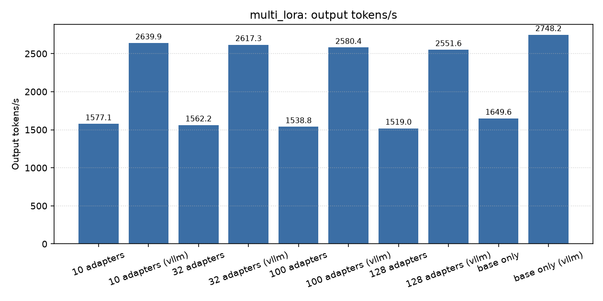
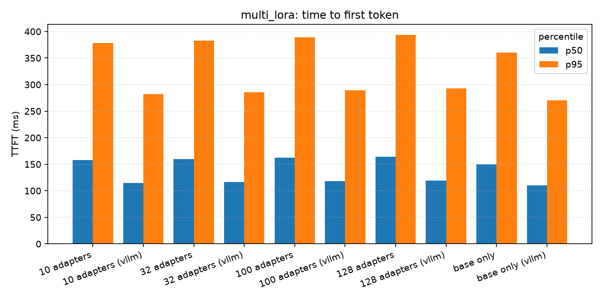
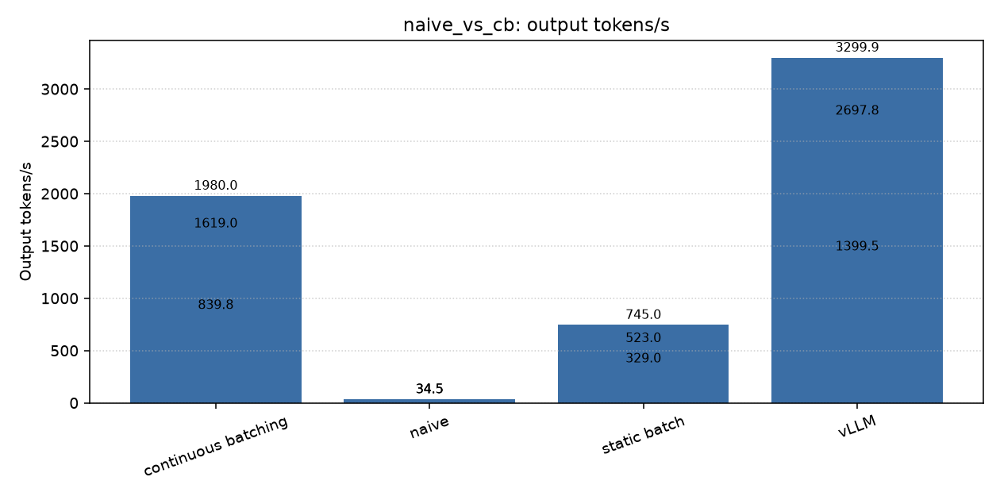
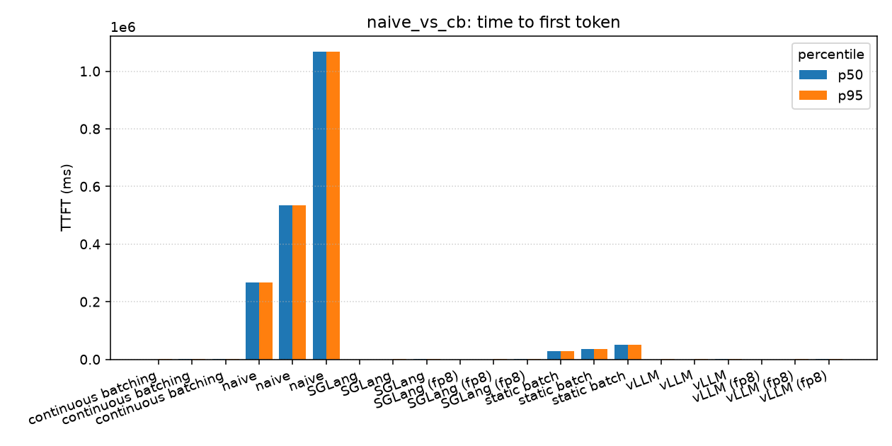
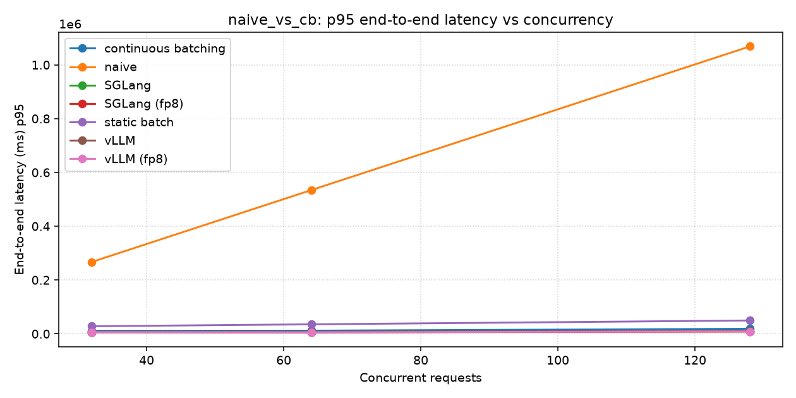
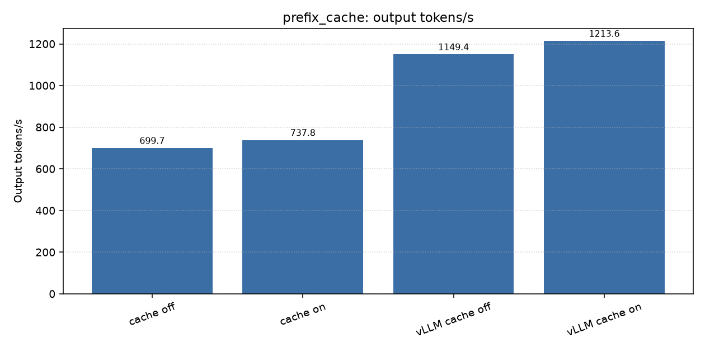
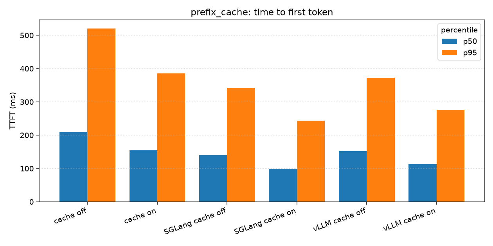
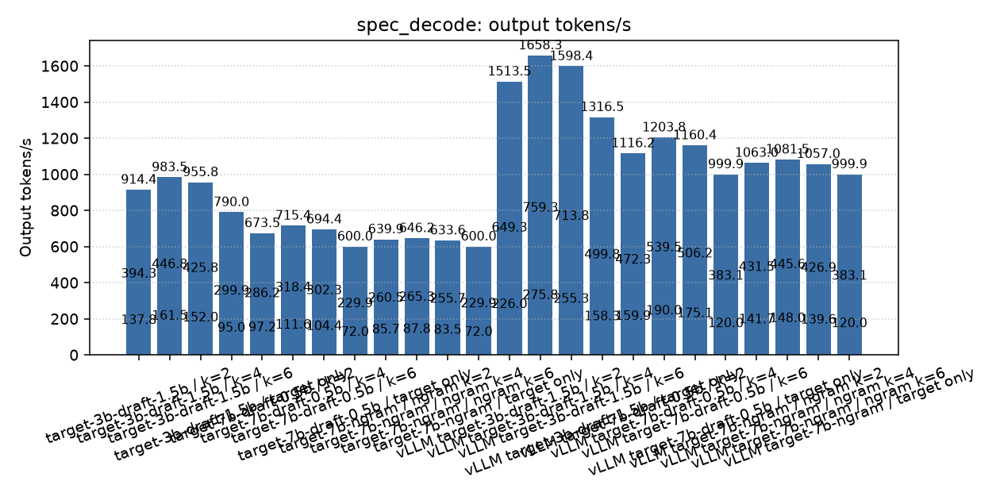
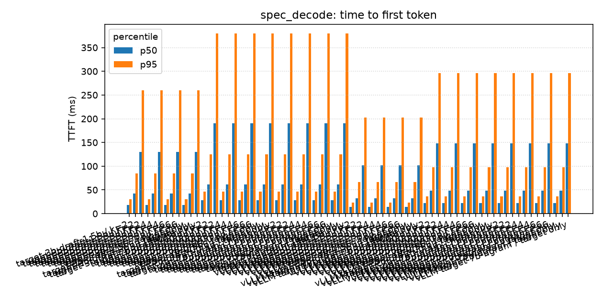
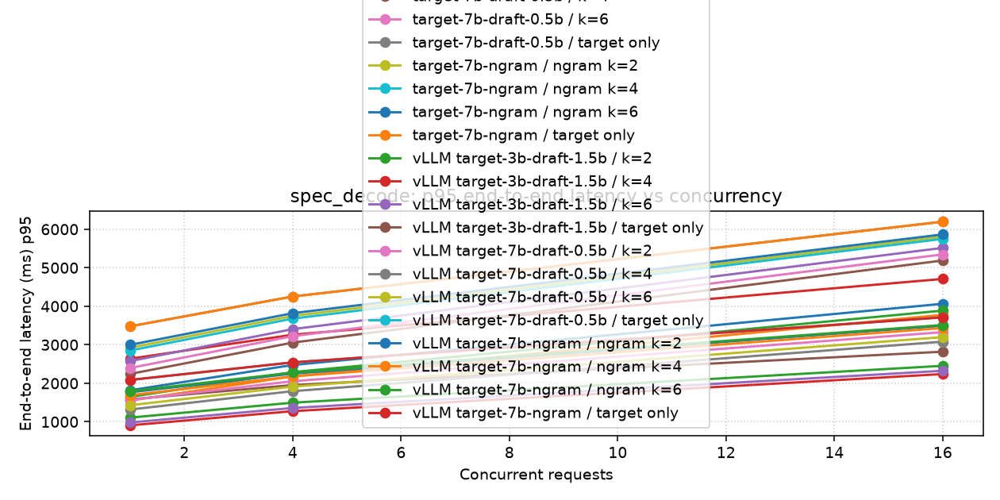

# Results

<!-- Generated by `turboserve results render`. Do not edit by hand:
     every number below is read from a result file under `results/`. -->

99 run(s) across 5 scenario(s). Each table is followed by the provenance of the runs behind it.

**Hardware:** 1x NVIDIA H100 80GB HBM3 · driver 570.86.16 · CUDA 12.8 · torch 2.6.0+cu124 · vllm 0.11.0 · $2.49/GPU-hour (vast.ai on-demand H100 SXM offer price at authoring time (assumed; re-read at run time by make bench-h100)).

**Suite:** 99 run(s) across 5 scenario(s), 6h 37m from the first run's start to the last one's finish — about $16.49 of GPU time at $2.49/hour.

| Scenario | Runs | Profiles |
| --- | --- | --- |
| [`chaos`](#chaos) | 1 | h100 |
| [`multi_lora`](#multi_lora) | 10 | h100 |
| [`naive_vs_cb`](#naive_vs_cb) | 12 | h100 |
| [`prefix_cache`](#prefix_cache) | 4 | h100 |
| [`spec_decode`](#spec_decode) | 72 | h100 |

## `chaos`

### profile `h100`

| Arm | Concurrency | Requests | Errors | TTFT p50 (ms) | TTFT p95 (ms) | ITL p50 (ms) | TPOT p95 (ms) | E2E p95 (ms) | Output tok/s | Req/s | USD / 1M out |
| --- | --- | --- | --- | --- | --- | --- | --- | --- | --- | --- | --- |
| kill:every=10s | 3 | 1212 | 0.0041 | 22.9 | 37.4 | 5.20 | 5.45 | 670.6 | 1942.7 | 19.92 | 0.356 |

_Provenance: projected; GPU NVIDIA H100 80GB HBM3; 2026-09-16; git 6878fdc. Projected reference results for the h100 profile derived from the hardware model in docs; regenerate with make bench-h100 to replace with measured runs._

Scenario-specific figures:

| Arm | replicas | faults | retries | disruptions | requests_never_routed | requests_during_faults | impaired_seconds | recovery_s_p95 |
| --- | --- | --- | --- | --- | --- | --- | --- | --- |
| kill:every=10s | 3 | kill:every=10s | 20 | 5 | 0 | 236 | 12.015 | 2.446 |

_Provenance: projected; GPU NVIDIA H100 80GB HBM3; 2026-09-16; git 6878fdc. Projected reference results for the h100 profile derived from the hardware model in docs; regenerate with make bench-h100 to replace with measured runs._

Result files:

| Arm | Concurrency | Started | File |
| --- | --- | --- | --- |
| kill:every=10s | 3 | 2026-09-16T10:36:20.837357+00:00 | [`../results/chaos/20260916T103620Z-kill-every-10s.json`](../results/chaos/20260916T103620Z-kill-every-10s.json) |

## `multi_lora`

### profile `h100`

| Arm | Concurrency | Requests | Errors | TTFT p50 (ms) | TTFT p95 (ms) | ITL p50 (ms) | TPOT p95 (ms) | E2E p95 (ms) | Output tok/s | Req/s | USD / 1M out |
| --- | --- | --- | --- | --- | --- | --- | --- | --- | --- | --- | --- |
| 10 adapters | 64 | 256 | 0.0000 | 157.8 | 378.7 | 28.09 | 32.91 | 7669.8 | 1577.1 | 10.09 | 0.439 |
| 10 adapters (vllm) | 64 | 256 | 0.0000 | 115.1 | 282.4 | 16.59 | 19.45 | 4555.5 | 2639.9 | 16.88 | 0.262 |
| 32 adapters | 64 | 256 | 0.0000 | 159.6 | 383.0 | 28.35 | 33.23 | 7743.0 | 1562.2 | 9.99 | 0.443 |
| 32 adapters (vllm) | 64 | 256 | 0.0000 | 116.3 | 285.4 | 16.73 | 19.61 | 4594.7 | 2617.3 | 16.74 | 0.264 |
| 100 adapters | 64 | 256 | 0.0000 | 162.2 | 389.2 | 28.78 | 33.73 | 7860.2 | 1538.8 | 9.84 | 0.449 |
| 100 adapters (vllm) | 64 | 256 | 0.0000 | 117.9 | 289.4 | 16.97 | 19.89 | 4660.4 | 2580.4 | 16.50 | 0.268 |
| 128 adapters | 64 | 256 | 0.0000 | 164.1 | 393.8 | 29.16 | 34.17 | 7963.0 | 1519.0 | 9.71 | 0.455 |
| 128 adapters (vllm) | 64 | 256 | 0.0000 | 119.2 | 292.7 | 17.16 | 20.12 | 4712.9 | 2551.6 | 16.32 | 0.271 |
| base only | 64 | 256 | 0.0000 | 150.0 | 360.0 | 26.86 | 31.47 | 7332.9 | 1649.6 | 10.55 | 0.419 |
| base only (vllm) | 64 | 256 | 0.0000 | 110.0 | 270.0 | 15.94 | 18.69 | 4376.6 | 2748.2 | 17.57 | 0.252 |

_Provenance: projected; GPU NVIDIA H100 80GB HBM3; 2026-09-16; git 6878fdc. Projected reference results for the h100 profile derived from the hardware model in docs; regenerate with make bench-h100 to replace with measured runs._

Relative to `base only` at concurrency 64:

| Arm vs baseline | Output tok/s | Req/s | TTFT p50 | TTFT p95 | ITL p95 | E2E p95 | USD / 1M out |
| --- | --- | --- | --- | --- | --- | --- | --- |
| 10 adapters | 0.96x | 0.96x | +5.2% | +5.2% | +4.6% | +4.6% | 1.05x |
| 32 adapters | 0.95x | 0.95x | +6.4% | +6.4% | +5.6% | +5.6% | 1.06x |
| 100 adapters | 0.93x | 0.93x | +8.1% | +8.1% | +7.2% | +7.2% | 1.07x |
| 128 adapters | 0.92x | 0.92x | +9.4% | +9.4% | +8.6% | +8.6% | 1.09x |

_Provenance: projected; GPU NVIDIA H100 80GB HBM3; 2026-09-16; git 6878fdc. Projected reference results for the h100 profile derived from the hardware model in docs; regenerate with make bench-h100 to replace with measured runs._

Relative to `base only (vllm)` at concurrency 64:

| Arm vs baseline | Output tok/s | Req/s | TTFT p50 | TTFT p95 | ITL p95 | E2E p95 | USD / 1M out |
| --- | --- | --- | --- | --- | --- | --- | --- |
| 10 adapters (vllm) | 0.96x | 0.96x | +4.6% | +4.6% | +4.1% | +4.1% | 1.04x |
| 32 adapters (vllm) | 0.95x | 0.95x | +5.7% | +5.7% | +5.0% | +5.0% | 1.05x |
| 100 adapters (vllm) | 0.94x | 0.94x | +7.2% | +7.2% | +6.5% | +6.5% | 1.07x |
| 128 adapters (vllm) | 0.93x | 0.93x | +8.4% | +8.4% | +7.7% | +7.7% | 1.08x |

_Provenance: projected; GPU NVIDIA H100 80GB HBM3; 2026-09-16; git 6878fdc. Projected reference results for the h100 profile derived from the hardware model in docs; regenerate with make bench-h100 to replace with measured runs._

Scenario-specific figures:

| Arm | num_adapters | p95_ttft_loss_pct | p95_tpot_loss_pct | p95_e2e_loss_pct |
| --- | --- | --- | --- | --- |
| 10 adapters | 10 | 5.200 | 4.581 | 4.595 |
| 10 adapters (vllm) | 10 | 4.600 | 4.070 | 4.089 |
| 32 adapters | 32 | 6.400 | 5.574 | 5.593 |
| 32 adapters (vllm) | 32 | 5.700 | 4.957 | 4.984 |
| 100 adapters | 100 | 8.100 | 7.171 | 7.192 |
| 100 adapters (vllm) | 100 | 7.200 | 6.457 | 6.484 |
| 128 adapters | 128 | 9.400 | 8.574 | 8.593 |
| 128 adapters (vllm) | 128 | 8.400 | 7.657 | 7.684 |
| base only | 0 | — | — | — |
| base only (vllm) | 0 | — | — | — |

Scenario-specific figures — `vram`:

| Arm | num_adapters | num_slots | base_bytes | adapter_pool_bytes | bytes_per_slot | resident_bytes | host_adapter_bytes | merged_bytes | lora_bytes | saved_bytes | saved_pct |
| --- | --- | --- | --- | --- | --- | --- | --- | --- | --- | --- | --- |
| 10 adapters | 10 | 10 | 15231233024 | 807403520 | 80740352 | 807403520 | 807403520 | 152312330240 | 16038636544 | 136273693696 | 89.470 |
| 32 adapters | 32 | 32 | 15231233024 | 2583691264 | 80740352 | 2583691264 | 2583691264 | 487399456768 | 17814924288 | 469584532480 | 96.345 |
| 100 adapters | 100 | 64 | 15231233024 | 5167382528 | 80740352 | 5167382528 | 8074035200 | 1523123302400 | 20398615552 | 1502724686848 | 98.661 |
| 128 adapters | 128 | 64 | 15231233024 | 5167382528 | 80740352 | 5167382528 | 10334765056 | 1949597827072 | 20398615552 | 1929199211520 | 98.954 |

Scenario-specific figures — `lora`:

| Arm | lora_registrations | lora_activations | lora_hits | lora_misses | lora_loads | lora_evictions | lora_contexts | lora_tokens | lora_adapter_tokens | lora_hit_rate | lora_adapter_token_fraction | lora_num_adapters | lora_num_slots | lora_num_resident | lora_num_pinned | lora_max_rank | lora_bytes_per_slot | lora_bytes_reserved | lora_bytes_resident | lora_bytes_host |
| --- | --- | --- | --- | --- | --- | --- | --- | --- | --- | --- | --- | --- | --- | --- | --- | --- | --- | --- | --- | --- |
| 10 adapters | 10 | 256 | 246 | 10 | 10 | 0 | 256 | 120588 | 120588 | 0.961 | 1.000 | 10 | 10 | 10 | 0 | 16 | 80740352 | 807403520 | 807403520 | 807403520 |
| 32 adapters | 32 | 256 | 224 | 32 | 32 | 0 | 256 | 120588 | 120588 | 0.875 | 1.000 | 32 | 32 | 32 | 0 | 16 | 80740352 | 2583691264 | 2583691264 | 2583691264 |
| 100 adapters | 100 | 256 | 0 | 256 | 256 | 192 | 256 | 120588 | 120588 | 0.000 | 1.000 | 100 | 64 | 64 | 0 | 16 | 80740352 | 5167382528 | 5167382528 | 8074035200 |
| 128 adapters | 128 | 256 | 0 | 256 | 256 | 192 | 256 | 120588 | 120588 | 0.000 | 1.000 | 128 | 64 | 64 | 0 | 16 | 80740352 | 5167382528 | 5167382528 | 10334765056 |

_Provenance: projected; GPU NVIDIA H100 80GB HBM3; 2026-09-16; git 6878fdc. Projected reference results for the h100 profile derived from the hardware model in docs; regenerate with make bench-h100 to replace with measured runs._

Result files:

| Arm | Concurrency | Started | File |
| --- | --- | --- | --- |
| 10 adapters | 64 | 2026-09-16T10:19:06.234610+00:00 | [`../results/multi_lora/20260916T101906Z-10-adapters.json`](../results/multi_lora/20260916T101906Z-10-adapters.json) |
| 10 adapters (vllm) | 64 | 2026-09-16T10:28:59.176633+00:00 | [`../results/multi_lora/20260916T102859Z-10-adapters--vllm.json`](../results/multi_lora/20260916T102859Z-10-adapters--vllm.json) |
| 32 adapters | 64 | 2026-09-16T10:21:06.617419+00:00 | [`../results/multi_lora/20260916T102106Z-32-adapters.json`](../results/multi_lora/20260916T102106Z-32-adapters.json) |
| 32 adapters (vllm) | 64 | 2026-09-16T10:30:49.340490+00:00 | [`../results/multi_lora/20260916T103049Z-32-adapters--vllm.json`](../results/multi_lora/20260916T103049Z-32-adapters--vllm.json) |
| 100 adapters | 64 | 2026-09-16T10:23:07.242914+00:00 | [`../results/multi_lora/20260916T102307Z-100-adapters.json`](../results/multi_lora/20260916T102307Z-100-adapters.json) |
| 100 adapters (vllm) | 64 | 2026-09-16T10:32:39.635515+00:00 | [`../results/multi_lora/20260916T103239Z-100-adapters--vllm.json`](../results/multi_lora/20260916T103239Z-100-adapters--vllm.json) |
| 128 adapters | 64 | 2026-09-16T10:25:08.256684+00:00 | [`../results/multi_lora/20260916T102508Z-128-adapters.json`](../results/multi_lora/20260916T102508Z-128-adapters.json) |
| 128 adapters (vllm) | 64 | 2026-09-16T10:34:30.149037+00:00 | [`../results/multi_lora/20260916T103430Z-128-adapters--vllm.json`](../results/multi_lora/20260916T103430Z-128-adapters--vllm.json) |
| base only | 64 | 2026-09-16T10:17:06.968122+00:00 | [`../results/multi_lora/20260916T101706Z-base-only.json`](../results/multi_lora/20260916T101706Z-base-only.json) |
| base only (vllm) | 64 | 2026-09-16T10:27:09.610174+00:00 | [`../results/multi_lora/20260916T102709Z-base-only--vllm.json`](../results/multi_lora/20260916T102709Z-base-only--vllm.json) |

## `naive_vs_cb`

### profile `h100`

| Arm | Concurrency | Requests | Errors | TTFT p50 (ms) | TTFT p95 (ms) | ITL p50 (ms) | TPOT p95 (ms) | E2E p95 (ms) | Output tok/s | Req/s | USD / 1M out |
| --- | --- | --- | --- | --- | --- | --- | --- | --- | --- | --- | --- |
| continuous batching | 32 | 256 | 0.0000 | 108.0 | 270.0 | 33.42 | 38.57 | 11199.6 | 839.8 | 2.92 | 0.824 |
| continuous batching | 64 | 256 | 0.0000 | 189.0 | 432.0 | 34.22 | 39.52 | 11564.0 | 1619.0 | 5.62 | 0.427 |
| continuous batching | 128 | 256 | 0.0000 | 351.0 | 608.1 | 54.51 | 63.33 | 18557.1 | 1980.0 | 6.87 | 0.349 |
| naive | 32 | 256 | 0.0000 | 267130.4 | 267130.4 | — | — | 267130.4 | 34.5 | 0.12 | 20.048 |
| naive | 64 | 256 | 0.0000 | 534260.9 | 534260.9 | — | — | 534260.9 | 34.5 | 0.12 | 20.048 |
| naive | 128 | 256 | 0.0000 | 1068521.7 | 1068521.7 | — | — | 1068521.7 | 34.5 | 0.12 | 20.048 |
| static batch | 32 | 256 | 0.0000 | 28012.2 | 28012.2 | — | — | 28012.2 | 329.0 | 1.14 | 2.102 |
| static batch | 64 | 256 | 0.0000 | 35242.8 | 35242.8 | — | — | 35242.8 | 523.0 | 1.82 | 1.322 |
| static batch | 128 | 256 | 0.0000 | 49481.9 | 49481.9 | — | — | 49481.9 | 745.0 | 2.59 | 0.928 |
| vLLM | 32 | 256 | 0.0000 | 80.0 | 200.0 | 20.00 | 23.08 | 6723.3 | 1399.5 | 4.86 | 0.494 |
| vLLM | 64 | 256 | 0.0000 | 140.0 | 320.0 | 20.43 | 23.60 | 6939.9 | 2697.8 | 9.37 | 0.256 |
| vLLM | 128 | 256 | 0.0000 | 260.0 | 450.0 | 32.53 | 37.80 | 11121.0 | 3299.9 | 11.46 | 0.210 |

_Provenance: projected; GPU NVIDIA H100 80GB HBM3; 2026-09-16; git 6878fdc. Projected reference results for the h100 profile derived from the hardware model in docs; regenerate with make bench-h100 to replace with measured runs._

Relative to `naive` at concurrency 32:

| Arm vs baseline | Output tok/s | Req/s | TTFT p50 | TTFT p95 | ITL p95 | E2E p95 | USD / 1M out |
| --- | --- | --- | --- | --- | --- | --- | --- |
| continuous batching | 24.34x | 24.34x | -100.0% | -99.9% | — | -95.8% | 0.04x |
| static batch | 9.54x | 9.54x | -89.5% | -89.5% | — | -89.5% | 0.10x |
| vLLM | 40.57x | 40.57x | -100.0% | -99.9% | — | -97.5% | 0.02x |

_Provenance: projected; GPU NVIDIA H100 80GB HBM3; 2026-09-16; git 6878fdc. Projected reference results for the h100 profile derived from the hardware model in docs; regenerate with make bench-h100 to replace with measured runs._

Relative to `static batch` at concurrency 32:

| Arm vs baseline | Output tok/s | Req/s | TTFT p50 | TTFT p95 | ITL p95 | E2E p95 | USD / 1M out |
| --- | --- | --- | --- | --- | --- | --- | --- |
| continuous batching | 2.55x | 2.55x | -99.6% | -99.0% | — | -60.0% | 0.39x |
| naive | 0.10x | 0.10x | +853.6% | +853.6% | — | +853.6% | 9.54x |
| vLLM | 4.25x | 4.25x | -99.7% | -99.3% | — | -76.0% | 0.24x |

_Provenance: projected; GPU NVIDIA H100 80GB HBM3; 2026-09-16; git 6878fdc. Projected reference results for the h100 profile derived from the hardware model in docs; regenerate with make bench-h100 to replace with measured runs._

Relative to `naive` at concurrency 64:

| Arm vs baseline | Output tok/s | Req/s | TTFT p50 | TTFT p95 | ITL p95 | E2E p95 | USD / 1M out |
| --- | --- | --- | --- | --- | --- | --- | --- |
| continuous batching | 46.93x | 46.93x | -100.0% | -99.9% | — | -97.8% | 0.02x |
| static batch | 15.16x | 15.16x | -93.4% | -93.4% | — | -93.4% | 0.07x |
| vLLM | 78.20x | 78.20x | -100.0% | -99.9% | — | -98.7% | 0.01x |

_Provenance: projected; GPU NVIDIA H100 80GB HBM3; 2026-09-16; git 6878fdc. Projected reference results for the h100 profile derived from the hardware model in docs; regenerate with make bench-h100 to replace with measured runs._

Relative to `static batch` at concurrency 64:

| Arm vs baseline | Output tok/s | Req/s | TTFT p50 | TTFT p95 | ITL p95 | E2E p95 | USD / 1M out |
| --- | --- | --- | --- | --- | --- | --- | --- |
| continuous batching | 3.10x | 3.10x | -99.5% | -98.8% | — | -67.2% | 0.32x |
| naive | 0.07x | 0.07x | +1415.9% | +1415.9% | — | +1415.9% | 15.16x |
| vLLM | 5.16x | 5.16x | -99.6% | -99.1% | — | -80.3% | 0.19x |

_Provenance: projected; GPU NVIDIA H100 80GB HBM3; 2026-09-16; git 6878fdc. Projected reference results for the h100 profile derived from the hardware model in docs; regenerate with make bench-h100 to replace with measured runs._

Relative to `naive` at concurrency 128:

| Arm vs baseline | Output tok/s | Req/s | TTFT p50 | TTFT p95 | ITL p95 | E2E p95 | USD / 1M out |
| --- | --- | --- | --- | --- | --- | --- | --- |
| continuous batching | 57.39x | 57.39x | -100.0% | -99.9% | — | -98.3% | 0.02x |
| static batch | 21.59x | 21.59x | -95.4% | -95.4% | — | -95.4% | 0.05x |
| vLLM | 95.65x | 95.65x | -100.0% | -100.0% | — | -99.0% | 0.01x |

_Provenance: projected; GPU NVIDIA H100 80GB HBM3; 2026-09-16; git 6878fdc. Projected reference results for the h100 profile derived from the hardware model in docs; regenerate with make bench-h100 to replace with measured runs._

Relative to `static batch` at concurrency 128:

| Arm vs baseline | Output tok/s | Req/s | TTFT p50 | TTFT p95 | ITL p95 | E2E p95 | USD / 1M out |
| --- | --- | --- | --- | --- | --- | --- | --- |
| continuous batching | 2.66x | 2.66x | -99.3% | -98.8% | — | -62.5% | 0.38x |
| naive | 0.05x | 0.05x | +2059.4% | +2059.4% | — | +2059.4% | 21.59x |
| vLLM | 4.43x | 4.43x | -99.5% | -99.1% | — | -77.5% | 0.23x |

_Provenance: projected; GPU NVIDIA H100 80GB HBM3; 2026-09-16; git 6878fdc. Projected reference results for the h100 profile derived from the hardware model in docs; regenerate with make bench-h100 to replace with measured runs._

Scenario-specific figures:

| Arm | backend | block_size | kv_bytes | kv_utilization | num_cached_prompt_tokens | num_generated_tokens | num_kv_blocks | num_preemptions | num_prompt_tokens | num_steps | prefix_hit_rate | max_in_flight_observed | warmup_requests | num_batches |
| --- | --- | --- | --- | --- | --- | --- | --- | --- | --- | --- | --- | --- | --- | --- |
| continuous batching | reference | 16 | 59930443776 | 0.040 | 0 | 74304 | 65319 | 0 | 149673 | 2396 | 0.000 | 32 | 2 | — |
| continuous batching | reference | 16 | 59930443776 | 0.080 | 0 | 74304 | 65319 | 0 | 149673 | 1235 | 0.000 | 64 | 2 | — |
| continuous batching | reference | 16 | 59930443776 | 0.080 | 0 | 74304 | 65319 | 37 | 149673 | 1235 | 0.000 | 128 | 2 | — |
| naive | naive_hf | — | — | — | — | 74304 | — | — | 149673 | — | — | 32 | 2 | 258 |
| naive | naive_hf | — | — | — | — | 74304 | — | — | 149673 | — | — | 64 | 2 | 258 |
| naive | naive_hf | — | — | — | — | 74304 | — | — | 149673 | — | — | 128 | 2 | 258 |
| static batch | static_batch | — | — | — | — | 74304 | — | — | 149673 | — | — | 32 | 2 | 3 |
| static batch | static_batch | — | — | — | — | 74304 | — | — | 149673 | — | — | 64 | 2 | 3 |
| static batch | static_batch | — | — | — | — | 74304 | — | — | 149673 | — | — | 128 | 2 | 3 |
| vLLM | — | — | — | — | — | — | — | — | — | — | — | 32 | 2 | — |
| vLLM | — | — | — | — | — | — | — | — | — | — | — | 64 | 2 | — |
| vLLM | — | — | — | — | — | — | — | — | — | — | — | 128 | 2 | — |

_Provenance: projected; GPU NVIDIA H100 80GB HBM3; 2026-09-16; git 6878fdc. Projected reference results for the h100 profile derived from the hardware model in docs; regenerate with make bench-h100 to replace with measured runs._

Result files:

| Arm | Concurrency | Started | File |
| --- | --- | --- | --- |
| continuous batching | 32 | 2026-09-16T04:42:31.140742+00:00 | [`../results/naive_vs_cb/20260916T044231Z-reference-c32.json`](../results/naive_vs_cb/20260916T044231Z-reference-c32.json) |
| continuous batching | 64 | 2026-09-16T05:29:09.630552+00:00 | [`../results/naive_vs_cb/20260916T052909Z-reference-c64.json`](../results/naive_vs_cb/20260916T052909Z-reference-c64.json) |
| continuous batching | 128 | 2026-09-16T06:13:58.506997+00:00 | [`../results/naive_vs_cb/20260916T061358Z-reference-c128.json`](../results/naive_vs_cb/20260916T061358Z-reference-c128.json) |
| naive | 32 | 2026-09-16T04:00:00+00:00 | [`../results/naive_vs_cb/20260916T040000Z-naive-hf-c32.json`](../results/naive_vs_cb/20260916T040000Z-naive-hf-c32.json) |
| naive | 64 | 2026-09-16T04:48:01.615755+00:00 | [`../results/naive_vs_cb/20260916T044801Z-naive-hf-c64.json`](../results/naive_vs_cb/20260916T044801Z-naive-hf-c64.json) |
| naive | 128 | 2026-09-16T05:33:32.499761+00:00 | [`../results/naive_vs_cb/20260916T053332Z-naive-hf-c128.json`](../results/naive_vs_cb/20260916T053332Z-naive-hf-c128.json) |
| static batch | 32 | 2026-09-16T04:37:12.043478+00:00 | [`../results/naive_vs_cb/20260916T043712Z-static-batch-c32.json`](../results/naive_vs_cb/20260916T043712Z-static-batch-c32.json) |
| static batch | 64 | 2026-09-16T05:25:13.659233+00:00 | [`../results/naive_vs_cb/20260916T052513Z-static-batch-c64.json`](../results/naive_vs_cb/20260916T052513Z-static-batch-c64.json) |
| static batch | 128 | 2026-09-16T06:10:44.543239+00:00 | [`../results/naive_vs_cb/20260916T061044Z-static-batch-c128.json`](../results/naive_vs_cb/20260916T061044Z-static-batch-c128.json) |
| vLLM | 32 | 2026-09-16T04:45:33.935502+00:00 | [`../results/naive_vs_cb/20260916T044533Z-vllm-c32.json`](../results/naive_vs_cb/20260916T044533Z-vllm-c32.json) |
| vLLM | 64 | 2026-09-16T05:31:30.171005+00:00 | [`../results/naive_vs_cb/20260916T053130Z-vllm-c64.json`](../results/naive_vs_cb/20260916T053130Z-vllm-c64.json) |
| vLLM | 128 | 2026-09-16T06:16:10.744248+00:00 | [`../results/naive_vs_cb/20260916T061610Z-vllm-c128.json`](../results/naive_vs_cb/20260916T061610Z-vllm-c128.json) |

## `prefix_cache`

### profile `h100`

| Arm | Concurrency | Requests | Errors | TTFT p50 (ms) | TTFT p95 (ms) | ITL p50 (ms) | TPOT p95 (ms) | E2E p95 (ms) | Output tok/s | Req/s | USD / 1M out |
| --- | --- | --- | --- | --- | --- | --- | --- | --- | --- | --- | --- |
| cache off | 32 | 128 | 0.0000 | 210.0 | 520.3 | 33.79 | 39.60 | 4960.7 | 699.7 | 7.29 | 0.988 |
| cache on | 32 | 128 | 0.0000 | 155.0 | 385.2 | 32.43 | 38.02 | 4711.9 | 737.8 | 7.69 | 0.937 |
| vLLM cache off | 32 | 128 | 0.0000 | 152.0 | 372.2 | 20.36 | 23.86 | 3019.1 | 1149.4 | 11.98 | 0.602 |
| vLLM cache on | 32 | 128 | 0.0000 | 113.0 | 276.2 | 19.56 | 22.92 | 2860.7 | 1213.6 | 12.65 | 0.570 |

_Provenance: projected; GPU NVIDIA H100 80GB HBM3; 2026-09-16; git 6878fdc. Projected reference results for the h100 profile derived from the hardware model in docs; regenerate with make bench-h100 to replace with measured runs._

Relative to `cache off` at concurrency 32:

| Arm vs baseline | Output tok/s | Req/s | TTFT p50 | TTFT p95 | ITL p95 | E2E p95 | USD / 1M out |
| --- | --- | --- | --- | --- | --- | --- | --- |
| cache on | 1.05x | 1.05x | -26.2% | -26.0% | -4.0% | -5.0% | 0.95x |

_Provenance: projected; GPU NVIDIA H100 80GB HBM3; 2026-09-16; git 6878fdc. Projected reference results for the h100 profile derived from the hardware model in docs; regenerate with make bench-h100 to replace with measured runs._

Relative to `vLLM cache off` at concurrency 32:

| Arm vs baseline | Output tok/s | Req/s | TTFT p50 | TTFT p95 | ITL p95 | E2E p95 | USD / 1M out |
| --- | --- | --- | --- | --- | --- | --- | --- |
| vLLM cache on | 1.06x | 1.06x | -25.7% | -25.8% | -3.9% | -5.2% | 0.95x |

_Provenance: projected; GPU NVIDIA H100 80GB HBM3; 2026-09-16; git 6878fdc. Projected reference results for the h100 profile derived from the hardware model in docs; regenerate with make bench-h100 to replace with measured runs._

Scenario-specific figures:

| Arm | shared_prefix_tokens | prefix_caching | backend | block_size | kv_bytes | kv_utilization | num_cached_prompt_tokens | num_generated_tokens | num_kv_blocks | num_preemptions | num_prompt_tokens | num_steps | prefix_hit_rate | cached_prompt_token_fraction |
| --- | --- | --- | --- | --- | --- | --- | --- | --- | --- | --- | --- | --- | --- | --- |
| cache off | 1024 | False | reference-nocache | 16 | 59930443776 | 0.050 | 0 | 12374 | 65319 | 0 | 172520 | 472 | 0.000 | 0.000 |
| cache on | 1024 | True | reference | 16 | 59930443776 | 0.050 | 103512 | 12374 | 65319 | 0 | 172520 | 421 | 0.630 | 0.605 |
| vLLM cache off | 1024 | False | — | — | — | — | — | — | — | — | — | — | — | — |
| vLLM cache on | 1024 | True | — | — | — | — | — | — | — | — | — | — | — | — |

_Provenance: projected; GPU NVIDIA H100 80GB HBM3; 2026-09-16; git 6878fdc. Projected reference results for the h100 profile derived from the hardware model in docs; regenerate with make bench-h100 to replace with measured runs._

Result files:

| Arm | Concurrency | Started | File |
| --- | --- | --- | --- |
| cache off | 32 | 2026-09-16T06:18:08.086880+00:00 | [`../results/prefix_cache/20260916T061808Z-reference-nocache.json`](../results/prefix_cache/20260916T061808Z-reference-nocache.json) |
| cache on | 32 | 2026-09-16T06:20:00.634744+00:00 | [`../results/prefix_cache/20260916T062000Z-reference.json`](../results/prefix_cache/20260916T062000Z-reference.json) |
| vLLM cache off | 32 | 2026-09-16T06:21:52.276726+00:00 | [`../results/prefix_cache/20260916T062152Z-vllm-nocache.json`](../results/prefix_cache/20260916T062152Z-vllm-nocache.json) |
| vLLM cache on | 32 | 2026-09-16T06:23:37.959540+00:00 | [`../results/prefix_cache/20260916T062337Z-vllm.json`](../results/prefix_cache/20260916T062337Z-vllm.json) |

## `spec_decode`

### profile `h100`

| Arm | Concurrency | Requests | Errors | TTFT p50 (ms) | TTFT p95 (ms) | ITL p50 (ms) | TPOT p95 (ms) | E2E p95 (ms) | Output tok/s | Req/s | USD / 1M out |
| --- | --- | --- | --- | --- | --- | --- | --- | --- | --- | --- | --- |
| target-3b-draft-1.5b / k=2 | 1 | 128 | 0.0000 | 18.0 | 30.0 | 6.53 | 7.54 | 1817.7 | 137.8 | 0.72 | 5.021 |
| target-3b-draft-1.5b / k=2 | 4 | 128 | 0.0000 | 42.0 | 85.0 | 8.79 | 10.27 | 2474.5 | 394.3 | 2.05 | 1.754 |
| target-3b-draft-1.5b / k=2 | 16 | 128 | 0.0000 | 130.0 | 260.0 | 14.32 | 16.85 | 4064.3 | 914.4 | 4.76 | 0.756 |
| target-3b-draft-1.5b / k=4 | 1 | 128 | 0.0000 | 18.0 | 30.0 | 5.55 | 6.42 | 1549.7 | 161.5 | 0.84 | 4.282 |
| target-3b-draft-1.5b / k=4 | 4 | 128 | 0.0000 | 42.0 | 85.0 | 7.73 | 9.04 | 2179.7 | 446.8 | 2.32 | 1.548 |
| target-3b-draft-1.5b / k=4 | 16 | 128 | 0.0000 | 130.0 | 260.0 | 13.28 | 15.62 | 3777.0 | 983.5 | 5.12 | 0.703 |
| target-3b-draft-1.5b / k=6 | 1 | 128 | 0.0000 | 18.0 | 30.0 | 5.91 | 6.83 | 1646.9 | 152.0 | 0.79 | 4.550 |
| target-3b-draft-1.5b / k=6 | 4 | 128 | 0.0000 | 42.0 | 85.0 | 8.12 | 9.49 | 2289.1 | 425.8 | 2.22 | 1.624 |
| target-3b-draft-1.5b / k=6 | 16 | 128 | 0.0000 | 130.0 | 260.0 | 13.68 | 16.09 | 3886.9 | 955.8 | 4.97 | 0.724 |
| target-3b-draft-1.5b / target only | 1 | 128 | 0.0000 | 18.0 | 30.0 | 9.50 | 10.99 | 2637.6 | 95.0 | 0.49 | 7.280 |
| target-3b-draft-1.5b / target only | 4 | 128 | 0.0000 | 42.0 | 85.0 | 11.62 | 13.59 | 3260.1 | 299.9 | 1.56 | 2.306 |
| target-3b-draft-1.5b / target only | 16 | 128 | 0.0000 | 130.0 | 260.0 | 16.65 | 19.59 | 4709.4 | 790.0 | 4.11 | 0.876 |
| target-7b-draft-0.5b / k=2 | 1 | 128 | 0.0000 | 28.0 | 46.0 | 9.24 | 10.68 | 2575.3 | 97.2 | 0.51 | 7.115 |
| target-7b-draft-0.5b / k=2 | 4 | 128 | 0.0000 | 62.0 | 125.0 | 12.08 | 14.13 | 3406.0 | 286.2 | 1.49 | 2.416 |
| target-7b-draft-0.5b / k=2 | 16 | 128 | 0.0000 | 190.0 | 380.0 | 19.39 | 22.81 | 5515.8 | 673.5 | 3.50 | 1.027 |
| target-7b-draft-0.5b / k=4 | 1 | 128 | 0.0000 | 28.0 | 46.0 | 8.03 | 9.28 | 2242.4 | 111.6 | 0.58 | 6.197 |
| target-7b-draft-0.5b / k=4 | 4 | 128 | 0.0000 | 62.0 | 125.0 | 10.83 | 12.66 | 3055.8 | 318.4 | 1.66 | 2.172 |
| target-7b-draft-0.5b / k=4 | 16 | 128 | 0.0000 | 190.0 | 380.0 | 18.20 | 21.41 | 5188.1 | 715.4 | 3.72 | 0.967 |
| target-7b-draft-0.5b / k=6 | 1 | 128 | 0.0000 | 28.0 | 46.0 | 8.59 | 9.93 | 2397.3 | 104.4 | 0.54 | 6.625 |
| target-7b-draft-0.5b / k=6 | 4 | 128 | 0.0000 | 62.0 | 125.0 | 11.42 | 13.35 | 3221.8 | 302.3 | 1.57 | 2.288 |
| target-7b-draft-0.5b / k=6 | 16 | 128 | 0.0000 | 190.0 | 380.0 | 18.78 | 22.09 | 5347.1 | 694.4 | 3.61 | 0.996 |
| target-7b-draft-0.5b / target only | 1 | 128 | 0.0000 | 28.0 | 46.0 | 12.52 | 14.47 | 3479.1 | 72.0 | 0.37 | 9.606 |
| target-7b-draft-0.5b / target only | 4 | 128 | 0.0000 | 62.0 | 125.0 | 15.12 | 17.68 | 4252.6 | 229.9 | 1.20 | 3.008 |
| target-7b-draft-0.5b / target only | 16 | 128 | 0.0000 | 190.0 | 380.0 | 21.85 | 25.71 | 6196.1 | 600.0 | 3.12 | 1.153 |
| target-7b-ngram / ngram k=2 | 1 | 128 | 0.0000 | 28.0 | 46.0 | 10.50 | 12.14 | 2922.5 | 85.7 | 0.45 | 8.072 |
| target-7b-ngram / ngram k=2 | 4 | 128 | 0.0000 | 62.0 | 125.0 | 13.31 | 15.56 | 3747.6 | 260.5 | 1.36 | 2.655 |
| target-7b-ngram / ngram k=2 | 16 | 128 | 0.0000 | 190.0 | 380.0 | 20.45 | 24.05 | 5807.1 | 639.9 | 3.33 | 1.081 |
| target-7b-ngram / ngram k=4 | 1 | 128 | 0.0000 | 28.0 | 46.0 | 10.24 | 11.83 | 2850.5 | 87.8 | 0.46 | 7.874 |
| target-7b-ngram / ngram k=4 | 4 | 128 | 0.0000 | 62.0 | 125.0 | 13.06 | 15.27 | 3678.5 | 265.3 | 1.38 | 2.607 |
| target-7b-ngram / ngram k=4 | 16 | 128 | 0.0000 | 190.0 | 380.0 | 20.24 | 23.81 | 5750.2 | 646.2 | 3.36 | 1.070 |
| target-7b-ngram / ngram k=6 | 1 | 128 | 0.0000 | 28.0 | 46.0 | 10.77 | 12.45 | 2998.3 | 83.5 | 0.43 | 8.281 |
| target-7b-ngram / ngram k=6 | 4 | 128 | 0.0000 | 62.0 | 125.0 | 13.57 | 15.86 | 3819.3 | 255.7 | 1.33 | 2.705 |
| target-7b-ngram / ngram k=6 | 16 | 128 | 0.0000 | 190.0 | 380.0 | 20.66 | 24.30 | 5865.2 | 633.6 | 3.30 | 1.092 |
| target-7b-ngram / target only | 1 | 128 | 0.0000 | 28.0 | 46.0 | 12.52 | 14.47 | 3479.1 | 72.0 | 0.37 | 9.606 |
| target-7b-ngram / target only | 4 | 128 | 0.0000 | 62.0 | 125.0 | 15.12 | 17.68 | 4252.6 | 229.9 | 1.20 | 3.008 |
| target-7b-ngram / target only | 16 | 128 | 0.0000 | 190.0 | 380.0 | 21.85 | 25.71 | 6196.1 | 600.0 | 3.12 | 1.153 |
| vLLM target-3b-draft-1.5b / k=2 | 1 | 128 | 0.0000 | 14.0 | 23.4 | 3.96 | 4.58 | 1107.4 | 226.0 | 1.18 | 3.060 |
| vLLM target-3b-draft-1.5b / k=2 | 4 | 128 | 0.0000 | 32.8 | 66.3 | 5.30 | 6.19 | 1495.9 | 649.3 | 3.38 | 1.065 |
| vLLM target-3b-draft-1.5b / k=2 | 16 | 128 | 0.0000 | 101.4 | 202.8 | 8.55 | 10.05 | 2452.9 | 1513.5 | 7.87 | 0.457 |
| vLLM target-3b-draft-1.5b / k=4 | 1 | 128 | 0.0000 | 14.0 | 23.4 | 3.23 | 3.74 | 907.8 | 275.8 | 1.44 | 2.507 |
| vLLM target-3b-draft-1.5b / k=4 | 4 | 128 | 0.0000 | 32.8 | 66.3 | 4.50 | 5.26 | 1275.4 | 759.3 | 3.95 | 0.911 |
| vLLM target-3b-draft-1.5b / k=4 | 16 | 128 | 0.0000 | 101.4 | 202.8 | 7.76 | 9.13 | 2239.1 | 1658.3 | 8.63 | 0.417 |
| vLLM target-3b-draft-1.5b / k=6 | 1 | 128 | 0.0000 | 14.0 | 23.4 | 3.50 | 4.05 | 980.9 | 255.3 | 1.33 | 2.710 |
| vLLM target-3b-draft-1.5b / k=6 | 4 | 128 | 0.0000 | 32.8 | 66.3 | 4.80 | 5.61 | 1358.0 | 713.8 | 3.71 | 0.969 |
| vLLM target-3b-draft-1.5b / k=6 | 16 | 128 | 0.0000 | 101.4 | 202.8 | 8.07 | 9.49 | 2323.8 | 1598.4 | 8.32 | 0.433 |
| vLLM target-3b-draft-1.5b / target only | 1 | 128 | 0.0000 | 14.0 | 23.4 | 5.69 | 6.57 | 1581.8 | 158.3 | 0.82 | 4.368 |
| vLLM target-3b-draft-1.5b / target only | 4 | 128 | 0.0000 | 32.8 | 66.3 | 6.94 | 8.11 | 1952.7 | 499.8 | 2.60 | 1.384 |
| vLLM target-3b-draft-1.5b / target only | 16 | 128 | 0.0000 | 101.4 | 202.8 | 9.90 | 11.65 | 2820.0 | 1316.5 | 6.85 | 0.525 |
| vLLM target-7b-draft-0.5b / k=2 | 1 | 128 | 0.0000 | 21.8 | 35.9 | 5.59 | 6.46 | 1565.3 | 159.9 | 0.83 | 4.325 |
| vLLM target-7b-draft-0.5b / k=2 | 4 | 128 | 0.0000 | 48.4 | 97.5 | 7.26 | 8.49 | 2053.5 | 472.3 | 2.46 | 1.465 |
| vLLM target-7b-draft-0.5b / k=2 | 16 | 128 | 0.0000 | 148.2 | 296.4 | 11.54 | 13.58 | 3327.5 | 1116.2 | 5.81 | 0.620 |
| vLLM target-7b-draft-0.5b / k=4 | 1 | 128 | 0.0000 | 21.8 | 35.9 | 4.69 | 5.42 | 1318.0 | 190.0 | 0.99 | 3.641 |
| vLLM target-7b-draft-0.5b / k=4 | 4 | 128 | 0.0000 | 48.4 | 97.5 | 6.33 | 7.39 | 1794.5 | 539.5 | 2.81 | 1.282 |
| vLLM target-7b-draft-0.5b / k=4 | 16 | 128 | 0.0000 | 148.2 | 296.4 | 10.65 | 12.53 | 3080.1 | 1203.8 | 6.26 | 0.575 |
| vLLM target-7b-draft-0.5b / k=6 | 1 | 128 | 0.0000 | 21.8 | 35.9 | 5.10 | 5.89 | 1429.8 | 175.1 | 0.91 | 3.950 |
| vLLM target-7b-draft-0.5b / k=6 | 4 | 128 | 0.0000 | 48.4 | 97.5 | 6.76 | 7.90 | 1913.4 | 506.2 | 2.63 | 1.366 |
| vLLM target-7b-draft-0.5b / k=6 | 16 | 128 | 0.0000 | 148.2 | 296.4 | 11.07 | 13.03 | 3198.1 | 1160.4 | 6.04 | 0.596 |
| vLLM target-7b-draft-0.5b / target only | 1 | 128 | 0.0000 | 21.8 | 35.9 | 7.49 | 8.65 | 2086.2 | 120.0 | 0.62 | 5.764 |
| vLLM target-7b-draft-0.5b / target only | 4 | 128 | 0.0000 | 48.4 | 97.5 | 9.02 | 10.54 | 2542.6 | 383.1 | 1.99 | 1.805 |
| vLLM target-7b-draft-0.5b / target only | 16 | 128 | 0.0000 | 148.2 | 296.4 | 12.96 | 15.25 | 3711.6 | 999.9 | 5.20 | 0.692 |
| vLLM target-7b-ngram / ngram k=2 | 1 | 128 | 0.0000 | 21.8 | 35.9 | 6.32 | 7.31 | 1766.6 | 141.7 | 0.74 | 4.882 |
| vLLM target-7b-ngram / ngram k=2 | 4 | 128 | 0.0000 | 48.4 | 97.5 | 7.97 | 9.32 | 2251.9 | 431.5 | 2.24 | 1.603 |
| vLLM target-7b-ngram / ngram k=2 | 16 | 128 | 0.0000 | 148.2 | 296.4 | 12.15 | 14.29 | 3493.2 | 1063.0 | 5.53 | 0.651 |
| vLLM target-7b-ngram / ngram k=4 | 1 | 128 | 0.0000 | 21.8 | 35.9 | 6.05 | 6.99 | 1691.2 | 148.0 | 0.77 | 4.674 |
| vLLM target-7b-ngram / ngram k=4 | 4 | 128 | 0.0000 | 48.4 | 97.5 | 7.71 | 9.01 | 2179.0 | 445.6 | 2.32 | 1.552 |
| vLLM target-7b-ngram / ngram k=4 | 16 | 128 | 0.0000 | 148.2 | 296.4 | 11.93 | 14.04 | 3434.2 | 1081.5 | 5.63 | 0.640 |
| vLLM target-7b-ngram / ngram k=6 | 1 | 128 | 0.0000 | 21.8 | 35.9 | 6.42 | 7.42 | 1792.8 | 139.6 | 0.73 | 4.955 |
| vLLM target-7b-ngram / ngram k=6 | 4 | 128 | 0.0000 | 48.4 | 97.5 | 8.06 | 9.43 | 2276.9 | 426.9 | 2.22 | 1.620 |
| vLLM target-7b-ngram / ngram k=6 | 16 | 128 | 0.0000 | 148.2 | 296.4 | 12.22 | 14.38 | 3513.0 | 1057.0 | 5.50 | 0.654 |
| vLLM target-7b-ngram / target only | 1 | 128 | 0.0000 | 21.8 | 35.9 | 7.49 | 8.65 | 2086.2 | 120.0 | 0.62 | 5.764 |
| vLLM target-7b-ngram / target only | 4 | 128 | 0.0000 | 48.4 | 97.5 | 9.02 | 10.54 | 2542.6 | 383.1 | 1.99 | 1.805 |
| vLLM target-7b-ngram / target only | 16 | 128 | 0.0000 | 148.2 | 296.4 | 12.96 | 15.25 | 3711.6 | 999.9 | 5.20 | 0.692 |

_Provenance: projected; GPU NVIDIA H100 80GB HBM3; 2026-09-16; git 6878fdc. Projected reference results for the h100 profile derived from the hardware model in docs; regenerate with make bench-h100 to replace with measured runs._

Relative to `target-3b-draft-1.5b / target only` at concurrency 1:

| Arm vs baseline | Output tok/s | Req/s | TTFT p50 | TTFT p95 | ITL p95 | E2E p95 | USD / 1M out |
| --- | --- | --- | --- | --- | --- | --- | --- |
| target-3b-draft-1.5b / k=2 | 1.45x | 1.45x | +0.0% | +0.0% | -31.3% | -31.1% | 0.69x |
| target-3b-draft-1.5b / k=4 | 1.70x | 1.70x | +0.0% | +0.0% | -41.6% | -41.2% | 0.59x |
| target-3b-draft-1.5b / k=6 | 1.60x | 1.60x | +0.0% | +0.0% | -37.9% | -37.6% | 0.62x |

_Provenance: projected; GPU NVIDIA H100 80GB HBM3; 2026-09-16; git 6878fdc. Projected reference results for the h100 profile derived from the hardware model in docs; regenerate with make bench-h100 to replace with measured runs._

Relative to `target-7b-draft-0.5b / target only` at concurrency 1:

| Arm vs baseline | Output tok/s | Req/s | TTFT p50 | TTFT p95 | ITL p95 | E2E p95 | USD / 1M out |
| --- | --- | --- | --- | --- | --- | --- | --- |
| target-7b-draft-0.5b / k=2 | 1.35x | 1.35x | +0.0% | +0.0% | -26.2% | -26.0% | 0.74x |
| target-7b-draft-0.5b / k=4 | 1.55x | 1.55x | +0.0% | +0.0% | -35.9% | -35.5% | 0.65x |
| target-7b-draft-0.5b / k=6 | 1.45x | 1.45x | +0.0% | +0.0% | -31.4% | -31.1% | 0.69x |

_Provenance: projected; GPU NVIDIA H100 80GB HBM3; 2026-09-16; git 6878fdc. Projected reference results for the h100 profile derived from the hardware model in docs; regenerate with make bench-h100 to replace with measured runs._

Relative to `target-7b-ngram / target only` at concurrency 1:

| Arm vs baseline | Output tok/s | Req/s | TTFT p50 | TTFT p95 | ITL p95 | E2E p95 | USD / 1M out |
| --- | --- | --- | --- | --- | --- | --- | --- |
| target-7b-ngram / ngram k=2 | 1.19x | 1.19x | +0.0% | +0.0% | -16.1% | -16.0% | 0.84x |
| target-7b-ngram / ngram k=4 | 1.22x | 1.22x | +0.0% | +0.0% | -18.2% | -18.1% | 0.82x |
| target-7b-ngram / ngram k=6 | 1.16x | 1.16x | +0.0% | +0.0% | -13.9% | -13.8% | 0.86x |

_Provenance: projected; GPU NVIDIA H100 80GB HBM3; 2026-09-16; git 6878fdc. Projected reference results for the h100 profile derived from the hardware model in docs; regenerate with make bench-h100 to replace with measured runs._

Relative to `vLLM target-3b-draft-1.5b / target only` at concurrency 1:

| Arm vs baseline | Output tok/s | Req/s | TTFT p50 | TTFT p95 | ITL p95 | E2E p95 | USD / 1M out |
| --- | --- | --- | --- | --- | --- | --- | --- |
| vLLM target-3b-draft-1.5b / k=2 | 1.43x | 1.43x | -0.0% | +0.0% | -30.3% | -30.0% | 0.70x |
| vLLM target-3b-draft-1.5b / k=4 | 1.74x | 1.74x | -0.0% | +0.0% | -43.1% | -42.6% | 0.57x |
| vLLM target-3b-draft-1.5b / k=6 | 1.61x | 1.61x | -0.0% | +0.0% | -38.4% | -38.0% | 0.62x |

_Provenance: projected; GPU NVIDIA H100 80GB HBM3; 2026-09-16; git 6878fdc. Projected reference results for the h100 profile derived from the hardware model in docs; regenerate with make bench-h100 to replace with measured runs._

Relative to `vLLM target-7b-draft-0.5b / target only` at concurrency 1:

| Arm vs baseline | Output tok/s | Req/s | TTFT p50 | TTFT p95 | ITL p95 | E2E p95 | USD / 1M out |
| --- | --- | --- | --- | --- | --- | --- | --- |
| vLLM target-7b-draft-0.5b / k=2 | 1.33x | 1.33x | +0.0% | +0.0% | -25.3% | -25.0% | 0.75x |
| vLLM target-7b-draft-0.5b / k=4 | 1.58x | 1.58x | +0.0% | +0.0% | -37.4% | -36.8% | 0.63x |
| vLLM target-7b-draft-0.5b / k=6 | 1.46x | 1.46x | +0.0% | +0.0% | -31.9% | -31.5% | 0.69x |

_Provenance: projected; GPU NVIDIA H100 80GB HBM3; 2026-09-16; git 6878fdc. Projected reference results for the h100 profile derived from the hardware model in docs; regenerate with make bench-h100 to replace with measured runs._

Relative to `vLLM target-7b-ngram / target only` at concurrency 1:

| Arm vs baseline | Output tok/s | Req/s | TTFT p50 | TTFT p95 | ITL p95 | E2E p95 | USD / 1M out |
| --- | --- | --- | --- | --- | --- | --- | --- |
| vLLM target-7b-ngram / ngram k=2 | 1.18x | 1.18x | +0.0% | +0.0% | -15.5% | -15.3% | 0.85x |
| vLLM target-7b-ngram / ngram k=4 | 1.23x | 1.23x | +0.0% | +0.0% | -19.2% | -18.9% | 0.81x |
| vLLM target-7b-ngram / ngram k=6 | 1.16x | 1.16x | +0.0% | +0.0% | -14.2% | -14.1% | 0.86x |

_Provenance: projected; GPU NVIDIA H100 80GB HBM3; 2026-09-16; git 6878fdc. Projected reference results for the h100 profile derived from the hardware model in docs; regenerate with make bench-h100 to replace with measured runs._

Relative to `target-3b-draft-1.5b / target only` at concurrency 4:

| Arm vs baseline | Output tok/s | Req/s | TTFT p50 | TTFT p95 | ITL p95 | E2E p95 | USD / 1M out |
| --- | --- | --- | --- | --- | --- | --- | --- |
| target-3b-draft-1.5b / k=2 | 1.31x | 1.31x | +0.0% | +0.0% | -24.4% | -24.1% | 0.76x |
| target-3b-draft-1.5b / k=4 | 1.49x | 1.49x | +0.0% | +0.0% | -33.5% | -33.1% | 0.67x |
| target-3b-draft-1.5b / k=6 | 1.42x | 1.42x | +0.0% | +0.0% | -30.1% | -29.8% | 0.70x |

_Provenance: projected; GPU NVIDIA H100 80GB HBM3; 2026-09-16; git 6878fdc. Projected reference results for the h100 profile derived from the hardware model in docs; regenerate with make bench-h100 to replace with measured runs._

Relative to `target-7b-draft-0.5b / target only` at concurrency 4:

| Arm vs baseline | Output tok/s | Req/s | TTFT p50 | TTFT p95 | ITL p95 | E2E p95 | USD / 1M out |
| --- | --- | --- | --- | --- | --- | --- | --- |
| target-7b-draft-0.5b / k=2 | 1.24x | 1.24x | +0.0% | -0.0% | -20.1% | -19.9% | 0.80x |
| target-7b-draft-0.5b / k=4 | 1.38x | 1.38x | +0.0% | -0.0% | -28.4% | -28.1% | 0.72x |
| target-7b-draft-0.5b / k=6 | 1.31x | 1.31x | +0.0% | -0.0% | -24.5% | -24.2% | 0.76x |

_Provenance: projected; GPU NVIDIA H100 80GB HBM3; 2026-09-16; git 6878fdc. Projected reference results for the h100 profile derived from the hardware model in docs; regenerate with make bench-h100 to replace with measured runs._

Relative to `target-7b-ngram / target only` at concurrency 4:

| Arm vs baseline | Output tok/s | Req/s | TTFT p50 | TTFT p95 | ITL p95 | E2E p95 | USD / 1M out |
| --- | --- | --- | --- | --- | --- | --- | --- |
| target-7b-ngram / ngram k=2 | 1.13x | 1.13x | +0.0% | -0.0% | -12.0% | -11.9% | 0.88x |
| target-7b-ngram / ngram k=4 | 1.15x | 1.15x | +0.0% | -0.0% | -13.6% | -13.5% | 0.87x |
| target-7b-ngram / ngram k=6 | 1.11x | 1.11x | +0.0% | -0.0% | -10.3% | -10.2% | 0.90x |

_Provenance: projected; GPU NVIDIA H100 80GB HBM3; 2026-09-16; git 6878fdc. Projected reference results for the h100 profile derived from the hardware model in docs; regenerate with make bench-h100 to replace with measured runs._

Relative to `vLLM target-3b-draft-1.5b / target only` at concurrency 4:

| Arm vs baseline | Output tok/s | Req/s | TTFT p50 | TTFT p95 | ITL p95 | E2E p95 | USD / 1M out |
| --- | --- | --- | --- | --- | --- | --- | --- |
| vLLM target-3b-draft-1.5b / k=2 | 1.30x | 1.30x | +0.0% | +0.0% | -23.6% | -23.4% | 0.77x |
| vLLM target-3b-draft-1.5b / k=4 | 1.52x | 1.52x | +0.0% | +0.0% | -35.1% | -34.7% | 0.66x |
| vLLM target-3b-draft-1.5b / k=6 | 1.43x | 1.43x | +0.0% | +0.0% | -30.8% | -30.5% | 0.70x |

_Provenance: projected; GPU NVIDIA H100 80GB HBM3; 2026-09-16; git 6878fdc. Projected reference results for the h100 profile derived from the hardware model in docs; regenerate with make bench-h100 to replace with measured runs._

Relative to `vLLM target-7b-draft-0.5b / target only` at concurrency 4:

| Arm vs baseline | Output tok/s | Req/s | TTFT p50 | TTFT p95 | ITL p95 | E2E p95 | USD / 1M out |
| --- | --- | --- | --- | --- | --- | --- | --- |
| vLLM target-7b-draft-0.5b / k=2 | 1.23x | 1.23x | +0.0% | +0.0% | -19.5% | -19.2% | 0.81x |
| vLLM target-7b-draft-0.5b / k=4 | 1.41x | 1.41x | +0.0% | +0.0% | -29.8% | -29.4% | 0.71x |
| vLLM target-7b-draft-0.5b / k=6 | 1.32x | 1.32x | +0.0% | +0.0% | -25.1% | -24.7% | 0.76x |

_Provenance: projected; GPU NVIDIA H100 80GB HBM3; 2026-09-16; git 6878fdc. Projected reference results for the h100 profile derived from the hardware model in docs; regenerate with make bench-h100 to replace with measured runs._

Relative to `vLLM target-7b-ngram / target only` at concurrency 4:

| Arm vs baseline | Output tok/s | Req/s | TTFT p50 | TTFT p95 | ITL p95 | E2E p95 | USD / 1M out |
| --- | --- | --- | --- | --- | --- | --- | --- |
| vLLM target-7b-ngram / ngram k=2 | 1.13x | 1.13x | +0.0% | +0.0% | -11.6% | -11.4% | 0.89x |
| vLLM target-7b-ngram / ngram k=4 | 1.16x | 1.16x | +0.0% | +0.0% | -14.5% | -14.3% | 0.86x |
| vLLM target-7b-ngram / ngram k=6 | 1.11x | 1.11x | +0.0% | +0.0% | -10.6% | -10.4% | 0.90x |

_Provenance: projected; GPU NVIDIA H100 80GB HBM3; 2026-09-16; git 6878fdc. Projected reference results for the h100 profile derived from the hardware model in docs; regenerate with make bench-h100 to replace with measured runs._

Relative to `target-3b-draft-1.5b / target only` at concurrency 16:

| Arm vs baseline | Output tok/s | Req/s | TTFT p50 | TTFT p95 | ITL p95 | E2E p95 | USD / 1M out |
| --- | --- | --- | --- | --- | --- | --- | --- |
| target-3b-draft-1.5b / k=2 | 1.16x | 1.16x | +0.0% | +0.0% | -14.0% | -13.7% | 0.86x |
| target-3b-draft-1.5b / k=4 | 1.24x | 1.24x | +0.0% | +0.0% | -20.3% | -19.8% | 0.80x |
| target-3b-draft-1.5b / k=6 | 1.21x | 1.21x | +0.0% | +0.0% | -17.9% | -17.5% | 0.83x |

_Provenance: projected; GPU NVIDIA H100 80GB HBM3; 2026-09-16; git 6878fdc. Projected reference results for the h100 profile derived from the hardware model in docs; regenerate with make bench-h100 to replace with measured runs._

Relative to `target-7b-draft-0.5b / target only` at concurrency 16:

| Arm vs baseline | Output tok/s | Req/s | TTFT p50 | TTFT p95 | ITL p95 | E2E p95 | USD / 1M out |
| --- | --- | --- | --- | --- | --- | --- | --- |
| target-7b-draft-0.5b / k=2 | 1.12x | 1.12x | +0.0% | +0.0% | -11.3% | -11.0% | 0.89x |
| target-7b-draft-0.5b / k=4 | 1.19x | 1.19x | +0.0% | +0.0% | -16.7% | -16.3% | 0.84x |
| target-7b-draft-0.5b / k=6 | 1.16x | 1.16x | +0.0% | +0.0% | -14.1% | -13.7% | 0.86x |

_Provenance: projected; GPU NVIDIA H100 80GB HBM3; 2026-09-16; git 6878fdc. Projected reference results for the h100 profile derived from the hardware model in docs; regenerate with make bench-h100 to replace with measured runs._

Relative to `target-7b-ngram / target only` at concurrency 16:

| Arm vs baseline | Output tok/s | Req/s | TTFT p50 | TTFT p95 | ITL p95 | E2E p95 | USD / 1M out |
| --- | --- | --- | --- | --- | --- | --- | --- |
| target-7b-ngram / ngram k=2 | 1.07x | 1.07x | +0.0% | +0.0% | -6.4% | -6.3% | 0.94x |
| target-7b-ngram / ngram k=4 | 1.08x | 1.08x | +0.0% | +0.0% | -7.4% | -7.2% | 0.93x |
| target-7b-ngram / ngram k=6 | 1.06x | 1.06x | +0.0% | +0.0% | -5.5% | -5.3% | 0.95x |

_Provenance: projected; GPU NVIDIA H100 80GB HBM3; 2026-09-16; git 6878fdc. Projected reference results for the h100 profile derived from the hardware model in docs; regenerate with make bench-h100 to replace with measured runs._

Relative to `vLLM target-3b-draft-1.5b / target only` at concurrency 16:

| Arm vs baseline | Output tok/s | Req/s | TTFT p50 | TTFT p95 | ITL p95 | E2E p95 | USD / 1M out |
| --- | --- | --- | --- | --- | --- | --- | --- |
| vLLM target-3b-draft-1.5b / k=2 | 1.15x | 1.15x | +0.0% | +0.0% | -13.7% | -13.0% | 0.87x |
| vLLM target-3b-draft-1.5b / k=4 | 1.26x | 1.26x | +0.0% | +0.0% | -21.6% | -20.6% | 0.79x |
| vLLM target-3b-draft-1.5b / k=6 | 1.21x | 1.21x | +0.0% | +0.0% | -18.5% | -17.6% | 0.82x |

_Provenance: projected; GPU NVIDIA H100 80GB HBM3; 2026-09-16; git 6878fdc. Projected reference results for the h100 profile derived from the hardware model in docs; regenerate with make bench-h100 to replace with measured runs._

Relative to `vLLM target-7b-draft-0.5b / target only` at concurrency 16:

| Arm vs baseline | Output tok/s | Req/s | TTFT p50 | TTFT p95 | ITL p95 | E2E p95 | USD / 1M out |
| --- | --- | --- | --- | --- | --- | --- | --- |
| vLLM target-7b-draft-0.5b / k=2 | 1.12x | 1.12x | +0.0% | +0.0% | -11.0% | -10.3% | 0.90x |
| vLLM target-7b-draft-0.5b / k=4 | 1.20x | 1.20x | +0.0% | +0.0% | -17.8% | -17.0% | 0.83x |
| vLLM target-7b-draft-0.5b / k=6 | 1.16x | 1.16x | +0.0% | +0.0% | -14.6% | -13.8% | 0.86x |

_Provenance: projected; GPU NVIDIA H100 80GB HBM3; 2026-09-16; git 6878fdc. Projected reference results for the h100 profile derived from the hardware model in docs; regenerate with make bench-h100 to replace with measured runs._

Relative to `vLLM target-7b-ngram / target only` at concurrency 16:

| Arm vs baseline | Output tok/s | Req/s | TTFT p50 | TTFT p95 | ITL p95 | E2E p95 | USD / 1M out |
| --- | --- | --- | --- | --- | --- | --- | --- |
| vLLM target-7b-ngram / ngram k=2 | 1.06x | 1.06x | +0.0% | +0.0% | -6.2% | -5.9% | 0.94x |
| vLLM target-7b-ngram / ngram k=4 | 1.08x | 1.08x | +0.0% | +0.0% | -7.9% | -7.5% | 0.92x |
| vLLM target-7b-ngram / ngram k=6 | 1.06x | 1.06x | +0.0% | +0.0% | -5.7% | -5.4% | 0.95x |

_Provenance: projected; GPU NVIDIA H100 80GB HBM3; 2026-09-16; git 6878fdc. Projected reference results for the h100 profile derived from the hardware model in docs; regenerate with make bench-h100 to replace with measured runs._

Scenario-specific figures:

| Arm | backend | block_size | kv_bytes | kv_utilization | num_cached_prompt_tokens | num_generated_tokens | num_kv_blocks | num_preemptions | num_prompt_tokens | num_steps | prefix_hit_rate | drafter | num_speculative_tokens | num_spec_steps | num_verified_seqs | num_drafted | num_accepted | num_emitted | num_target_forwards | num_draft_calls | acceptance_rate | mean_accepted_len | mean_emitted_len | draft_forwards | draft_tokens_proposed | draft_starved | draft_lookups | draft_lookup_hits | draft_lookup_hit_rate |
| --- | --- | --- | --- | --- | --- | --- | --- | --- | --- | --- | --- | --- | --- | --- | --- | --- | --- | --- | --- | --- | --- | --- | --- | --- | --- | --- | --- | --- | --- |
| target-3b-draft-1.5b / k=2 | reference | 16 | 68989943808 | 0.000 | 0 | 25017 | 116967 | 0 | 49430 | 25042 | 0.000 | model | 2 | 9463 | 9463 | 18926 | 15141 | 24604 | 9463 | 18926 | 0.800 | 1.600 | 2.600 | 18926 | 18926 | 0 | — | — | — |
| target-3b-draft-1.5b / k=2 | reference | 16 | 68989943808 | 0.002 | 0 | 25017 | 116967 | 0 | 49430 | 6280 | 0.000 | model | 2 | 2366 | 9463 | 18926 | 15141 | 24604 | 2366 | 4732 | 0.800 | 1.600 | 2.600 | 4732 | 18926 | 0 | — | — | — |
| target-3b-draft-1.5b / k=2 | reference | 16 | 68989943808 | 0.007 | 0 | 25017 | 116967 | 0 | 49430 | 1589 | 0.000 | model | 2 | 592 | 9463 | 18926 | 15141 | 24604 | 592 | 1184 | 0.800 | 1.600 | 2.600 | 1184 | 18926 | 0 | — | — | — |
| target-3b-draft-1.5b / k=4 | reference | 16 | 68989943808 | 0.000 | 0 | 25017 | 116967 | 0 | 49430 | 25042 | 0.000 | model | 4 | 6341 | 6341 | 25364 | 18262 | 24604 | 6341 | 25364 | 0.720 | 2.880 | 3.880 | 25364 | 25364 | 0 | — | — | — |
| target-3b-draft-1.5b / k=4 | reference | 16 | 68989943808 | 0.002 | 0 | 25017 | 116967 | 0 | 49430 | 6280 | 0.000 | model | 4 | 1586 | 6341 | 25364 | 18262 | 24604 | 1586 | 6344 | 0.720 | 2.880 | 3.880 | 6344 | 25364 | 0 | — | — | — |
| target-3b-draft-1.5b / k=4 | reference | 16 | 68989943808 | 0.007 | 0 | 25017 | 116967 | 0 | 49430 | 1589 | 0.000 | model | 4 | 397 | 6341 | 25364 | 18262 | 24604 | 397 | 1588 | 0.720 | 2.880 | 3.880 | 1588 | 25364 | 0 | — | — | — |
| target-3b-draft-1.5b / k=6 | reference | 16 | 68989943808 | 0.000 | 0 | 25017 | 116967 | 0 | 49430 | 25042 | 0.000 | model | 6 | 5213 | 5213 | 31278 | 19392 | 24604 | 5213 | 31278 | 0.620 | 3.720 | 4.720 | 31278 | 31278 | 0 | — | — | — |
| target-3b-draft-1.5b / k=6 | reference | 16 | 68989943808 | 0.002 | 0 | 25017 | 116967 | 0 | 49430 | 6280 | 0.000 | model | 6 | 1304 | 5213 | 31278 | 19392 | 24604 | 1304 | 7824 | 0.620 | 3.720 | 4.720 | 7824 | 31278 | 0 | — | — | — |
| target-3b-draft-1.5b / k=6 | reference | 16 | 68989943808 | 0.007 | 0 | 25017 | 116967 | 0 | 49430 | 1589 | 0.000 | model | 6 | 326 | 5213 | 31278 | 19392 | 24604 | 326 | 1956 | 0.620 | 3.720 | 4.720 | 1956 | 31278 | 0 | — | — | — |
| target-3b-draft-1.5b / target only | reference | 16 | 68989943808 | 0.000 | 0 | 25017 | 116967 | 0 | 49430 | 25042 | 0.000 | — | — | — | — | — | — | — | — | — | — | — | — | — | — | — | — | — | — |
| target-3b-draft-1.5b / target only | reference | 16 | 68989943808 | 0.002 | 0 | 25017 | 116967 | 0 | 49430 | 6280 | 0.000 | — | — | — | — | — | — | — | — | — | — | — | — | — | — | — | — | — | — |
| target-3b-draft-1.5b / target only | reference | 16 | 68989943808 | 0.007 | 0 | 25017 | 116967 | 0 | 49430 | 1589 | 0.000 | — | — | — | — | — | — | — | — | — | — | — | — | — | — | — | — | — | — |
| target-7b-draft-0.5b / k=2 | reference | 16 | 59930443776 | 0.001 | 0 | 25017 | 65319 | 0 | 49430 | 25042 | 0.000 | model | 2 | 10252 | 10252 | 20504 | 14353 | 24604 | 10252 | 20504 | 0.700 | 1.400 | 2.400 | 20504 | 20504 | 0 | — | — | — |
| target-7b-draft-0.5b / k=2 | reference | 16 | 59930443776 | 0.003 | 0 | 25017 | 65319 | 0 | 49430 | 6280 | 0.000 | model | 2 | 2563 | 10252 | 20504 | 14353 | 24604 | 2563 | 5126 | 0.700 | 1.400 | 2.400 | 5126 | 20504 | 0 | — | — | — |
| target-7b-draft-0.5b / k=2 | reference | 16 | 59930443776 | 0.012 | 0 | 25017 | 65319 | 0 | 49430 | 1589 | 0.000 | model | 2 | 641 | 10252 | 20504 | 14353 | 24604 | 641 | 1282 | 0.700 | 1.400 | 2.400 | 1282 | 20504 | 0 | — | — | — |
| target-7b-draft-0.5b / k=4 | reference | 16 | 59930443776 | 0.001 | 0 | 25017 | 65319 | 0 | 49430 | 25042 | 0.000 | model | 4 | 7070 | 7070 | 28280 | 17534 | 24604 | 7070 | 28280 | 0.620 | 2.480 | 3.480 | 28280 | 28280 | 0 | — | — | — |
| target-7b-draft-0.5b / k=4 | reference | 16 | 59930443776 | 0.003 | 0 | 25017 | 65319 | 0 | 49430 | 6280 | 0.000 | model | 4 | 1768 | 7070 | 28280 | 17534 | 24604 | 1768 | 7072 | 0.620 | 2.480 | 3.480 | 7072 | 28280 | 0 | — | — | — |
| target-7b-draft-0.5b / k=4 | reference | 16 | 59930443776 | 0.012 | 0 | 25017 | 65319 | 0 | 49430 | 1589 | 0.000 | model | 4 | 442 | 7070 | 28280 | 17534 | 24604 | 442 | 1768 | 0.620 | 2.480 | 3.480 | 1768 | 28280 | 0 | — | — | — |
| target-7b-draft-0.5b / k=6 | reference | 16 | 59930443776 | 0.001 | 0 | 25017 | 65319 | 0 | 49430 | 25042 | 0.000 | model | 6 | 5886 | 5886 | 35316 | 18717 | 24604 | 5886 | 35316 | 0.530 | 3.180 | 4.180 | 35316 | 35316 | 0 | — | — | — |
| target-7b-draft-0.5b / k=6 | reference | 16 | 59930443776 | 0.003 | 0 | 25017 | 65319 | 0 | 49430 | 6280 | 0.000 | model | 6 | 1472 | 5886 | 35316 | 18717 | 24604 | 1472 | 8832 | 0.530 | 3.180 | 4.180 | 8832 | 35316 | 0 | — | — | — |
| target-7b-draft-0.5b / k=6 | reference | 16 | 59930443776 | 0.012 | 0 | 25017 | 65319 | 0 | 49430 | 1589 | 0.000 | model | 6 | 368 | 5886 | 35316 | 18717 | 24604 | 368 | 2208 | 0.530 | 3.180 | 4.180 | 2208 | 35316 | 0 | — | — | — |
| target-7b-draft-0.5b / target only | reference | 16 | 59930443776 | 0.001 | 0 | 25017 | 65319 | 0 | 49430 | 25042 | 0.000 | — | — | — | — | — | — | — | — | — | — | — | — | — | — | — | — | — | — |
| target-7b-draft-0.5b / target only | reference | 16 | 59930443776 | 0.003 | 0 | 25017 | 65319 | 0 | 49430 | 6280 | 0.000 | — | — | — | — | — | — | — | — | — | — | — | — | — | — | — | — | — | — |
| target-7b-draft-0.5b / target only | reference | 16 | 59930443776 | 0.012 | 0 | 25017 | 65319 | 0 | 49430 | 1589 | 0.000 | — | — | — | — | — | — | — | — | — | — | — | — | — | — | — | — | — | — |
| target-7b-ngram / ngram k=2 | reference | 16 | 59930443776 | 0.001 | 0 | 25017 | 65319 | 0 | 49430 | 25042 | 0.000 | ngram | 2 | 18782 | 18782 | 37564 | 5822 | 24604 | 18782 | 37564 | 0.155 | 0.310 | 1.310 | — | 37564 | 10894 | 18782 | 7888 | 0.420 |
| target-7b-ngram / ngram k=2 | reference | 16 | 59930443776 | 0.003 | 0 | 25017 | 65319 | 0 | 49430 | 6280 | 0.000 | ngram | 2 | 4696 | 18782 | 37564 | 5822 | 24604 | 4696 | 9392 | 0.155 | 0.310 | 1.310 | — | 37564 | 10894 | 18782 | 7888 | 0.420 |
| target-7b-ngram / ngram k=2 | reference | 16 | 59930443776 | 0.012 | 0 | 25017 | 65319 | 0 | 49430 | 1589 | 0.000 | ngram | 2 | 1174 | 18782 | 37564 | 5822 | 24604 | 1174 | 2348 | 0.155 | 0.310 | 1.310 | — | 37564 | 10894 | 18782 | 7888 | 0.420 |
| target-7b-ngram / ngram k=4 | reference | 16 | 59930443776 | 0.001 | 0 | 25017 | 65319 | 0 | 49430 | 25042 | 0.000 | ngram | 4 | 16806 | 16806 | 67224 | 7798 | 24604 | 16806 | 67224 | 0.116 | 0.464 | 1.464 | — | 67224 | 9747 | 16806 | 7059 | 0.420 |
| target-7b-ngram / ngram k=4 | reference | 16 | 59930443776 | 0.003 | 0 | 25017 | 65319 | 0 | 49430 | 6280 | 0.000 | ngram | 4 | 4202 | 16806 | 67224 | 7798 | 24604 | 4202 | 16808 | 0.116 | 0.464 | 1.464 | — | 67224 | 9747 | 16806 | 7059 | 0.420 |
| target-7b-ngram / ngram k=4 | reference | 16 | 59930443776 | 0.012 | 0 | 25017 | 65319 | 0 | 49430 | 1589 | 0.000 | ngram | 4 | 1051 | 16806 | 67224 | 7798 | 24604 | 1051 | 4204 | 0.116 | 0.464 | 1.464 | — | 67224 | 9747 | 16806 | 7059 | 0.420 |
| target-7b-ngram / ngram k=6 | reference | 16 | 59930443776 | 0.001 | 0 | 25017 | 65319 | 0 | 49430 | 25042 | 0.000 | ngram | 6 | 16294 | 16294 | 97764 | 8310 | 24604 | 16294 | 97764 | 0.085 | 0.510 | 1.510 | — | 97764 | 9451 | 16294 | 6843 | 0.420 |
| target-7b-ngram / ngram k=6 | reference | 16 | 59930443776 | 0.003 | 0 | 25017 | 65319 | 0 | 49430 | 6280 | 0.000 | ngram | 6 | 4074 | 16294 | 97764 | 8310 | 24604 | 4074 | 24444 | 0.085 | 0.510 | 1.510 | — | 97764 | 9451 | 16294 | 6843 | 0.420 |
| target-7b-ngram / ngram k=6 | reference | 16 | 59930443776 | 0.012 | 0 | 25017 | 65319 | 0 | 49430 | 1589 | 0.000 | ngram | 6 | 1019 | 16294 | 97764 | 8310 | 24604 | 1019 | 6114 | 0.085 | 0.510 | 1.510 | — | 97764 | 9451 | 16294 | 6843 | 0.420 |
| target-7b-ngram / target only | reference | 16 | 59930443776 | 0.001 | 0 | 25017 | 65319 | 0 | 49430 | 25042 | 0.000 | — | — | — | — | — | — | — | — | — | — | — | — | — | — | — | — | — | — |
| target-7b-ngram / target only | reference | 16 | 59930443776 | 0.003 | 0 | 25017 | 65319 | 0 | 49430 | 6280 | 0.000 | — | — | — | — | — | — | — | — | — | — | — | — | — | — | — | — | — | — |
| target-7b-ngram / target only | reference | 16 | 59930443776 | 0.012 | 0 | 25017 | 65319 | 0 | 49430 | 1589 | 0.000 | — | — | — | — | — | — | — | — | — | — | — | — | — | — | — | — | — | — |

_Provenance: projected; GPU NVIDIA H100 80GB HBM3; 2026-09-16; git 6878fdc. Projected reference results for the h100 profile derived from the hardware model in docs; regenerate with make bench-h100 to replace with measured runs._

Result files:

| Arm | Concurrency | Started | File |
| --- | --- | --- | --- |
| target-3b-draft-1.5b / k=2 | 1 | 2026-09-16T06:31:17.056637+00:00 | [`../results/spec_decode/20260916T063117Z-target-3b-draft-1-5b-k-2.json`](../results/spec_decode/20260916T063117Z-target-3b-draft-1-5b-k-2.json) |
| target-3b-draft-1.5b / k=2 | 4 | 2026-09-16T07:01:01.714484+00:00 | [`../results/spec_decode/20260916T070101Z-target-3b-draft-1-5b-k-2.json`](../results/spec_decode/20260916T070101Z-target-3b-draft-1-5b-k-2.json) |
| target-3b-draft-1.5b / k=2 | 16 | 2026-09-16T07:19:42.099600+00:00 | [`../results/spec_decode/20260916T071942Z-target-3b-draft-1-5b-k-2.json`](../results/spec_decode/20260916T071942Z-target-3b-draft-1-5b-k-2.json) |
| target-3b-draft-1.5b / k=4 | 1 | 2026-09-16T06:35:50.660007+00:00 | [`../results/spec_decode/20260916T063550Z-target-3b-draft-1-5b-k-4.json`](../results/spec_decode/20260916T063550Z-target-3b-draft-1-5b-k-4.json) |
| target-3b-draft-1.5b / k=4 | 4 | 2026-09-16T07:03:39.106183+00:00 | [`../results/spec_decode/20260916T070339Z-target-3b-draft-1-5b-k-4.json`](../results/spec_decode/20260916T070339Z-target-3b-draft-1-5b-k-4.json) |
| target-3b-draft-1.5b / k=4 | 16 | 2026-09-16T07:21:44.007800+00:00 | [`../results/spec_decode/20260916T072144Z-target-3b-draft-1-5b-k-4.json`](../results/spec_decode/20260916T072144Z-target-3b-draft-1-5b-k-4.json) |
| target-3b-draft-1.5b / k=6 | 1 | 2026-09-16T06:39:57.996720+00:00 | [`../results/spec_decode/20260916T063957Z-target-3b-draft-1-5b-k-6.json`](../results/spec_decode/20260916T063957Z-target-3b-draft-1-5b-k-6.json) |
| target-3b-draft-1.5b / k=6 | 4 | 2026-09-16T07:06:09.176576+00:00 | [`../results/spec_decode/20260916T070609Z-target-3b-draft-1-5b-k-6.json`](../results/spec_decode/20260916T070609Z-target-3b-draft-1-5b-k-6.json) |
| target-3b-draft-1.5b / k=6 | 16 | 2026-09-16T07:23:44.025078+00:00 | [`../results/spec_decode/20260916T072344Z-target-3b-draft-1-5b-k-6.json`](../results/spec_decode/20260916T072344Z-target-3b-draft-1-5b-k-6.json) |
| target-3b-draft-1.5b / target only | 1 | 2026-09-16T06:25:23.077267+00:00 | [`../results/spec_decode/20260916T062523Z-target-3b-draft-1-5b-target-only.json`](../results/spec_decode/20260916T062523Z-target-3b-draft-1-5b-target-only.json) |
| target-3b-draft-1.5b / target only | 4 | 2026-09-16T06:58:04.676990+00:00 | [`../results/spec_decode/20260916T065804Z-target-3b-draft-1-5b-target-only.json`](../results/spec_decode/20260916T065804Z-target-3b-draft-1-5b-target-only.json) |
| target-3b-draft-1.5b / target only | 16 | 2026-09-16T07:17:35.953706+00:00 | [`../results/spec_decode/20260916T071735Z-target-3b-draft-1-5b-target-only.json`](../results/spec_decode/20260916T071735Z-target-3b-draft-1-5b-target-only.json) |
| target-7b-draft-0.5b / k=2 | 1 | 2026-09-16T07:40:26.647369+00:00 | [`../results/spec_decode/20260916T074026Z-target-7b-draft-0-5b-k-2.json`](../results/spec_decode/20260916T074026Z-target-7b-draft-0-5b-k-2.json) |
| target-7b-draft-0.5b / k=2 | 4 | 2026-09-16T08:17:11.782362+00:00 | [`../results/spec_decode/20260916T081711Z-target-7b-draft-0-5b-k-2.json`](../results/spec_decode/20260916T081711Z-target-7b-draft-0-5b-k-2.json) |
| target-7b-draft-0.5b / k=2 | 16 | 2026-09-16T08:38:07.948935+00:00 | [`../results/spec_decode/20260916T083807Z-target-7b-draft-0-5b-k-2.json`](../results/spec_decode/20260916T083807Z-target-7b-draft-0-5b-k-2.json) |
| target-7b-draft-0.5b / k=4 | 1 | 2026-09-16T07:46:14.759357+00:00 | [`../results/spec_decode/20260916T074614Z-target-7b-draft-0-5b-k-4.json`](../results/spec_decode/20260916T074614Z-target-7b-draft-0-5b-k-4.json) |
| target-7b-draft-0.5b / k=4 | 4 | 2026-09-16T08:20:12.740776+00:00 | [`../results/spec_decode/20260916T082012Z-target-7b-draft-0-5b-k-4.json`](../results/spec_decode/20260916T082012Z-target-7b-draft-0-5b-k-4.json) |
| target-7b-draft-0.5b / k=4 | 16 | 2026-09-16T08:40:19.483080+00:00 | [`../results/spec_decode/20260916T084019Z-target-7b-draft-0-5b-k-4.json`](../results/spec_decode/20260916T084019Z-target-7b-draft-0-5b-k-4.json) |
| target-7b-draft-0.5b / k=6 | 1 | 2026-09-16T07:51:30.209758+00:00 | [`../results/spec_decode/20260916T075130Z-target-7b-draft-0-5b-k-6.json`](../results/spec_decode/20260916T075130Z-target-7b-draft-0-5b-k-6.json) |
| target-7b-draft-0.5b / k=6 | 4 | 2026-09-16T08:23:05.019801+00:00 | [`../results/spec_decode/20260916T082305Z-target-7b-draft-0-5b-k-6.json`](../results/spec_decode/20260916T082305Z-target-7b-draft-0-5b-k-6.json) |
| target-7b-draft-0.5b / k=6 | 16 | 2026-09-16T08:42:28.874882+00:00 | [`../results/spec_decode/20260916T084228Z-target-7b-draft-0-5b-k-6.json`](../results/spec_decode/20260916T084228Z-target-7b-draft-0-5b-k-6.json) |
| target-7b-draft-0.5b / target only | 1 | 2026-09-16T07:33:09.940792+00:00 | [`../results/spec_decode/20260916T073309Z-target-7b-draft-0-5b-target-only.json`](../results/spec_decode/20260916T073309Z-target-7b-draft-0-5b-target-only.json) |
| target-7b-draft-0.5b / target only | 4 | 2026-09-16T08:13:49.772837+00:00 | [`../results/spec_decode/20260916T081349Z-target-7b-draft-0-5b-target-only.json`](../results/spec_decode/20260916T081349Z-target-7b-draft-0-5b-target-only.json) |
| target-7b-draft-0.5b / target only | 16 | 2026-09-16T08:35:51.939902+00:00 | [`../results/spec_decode/20260916T083551Z-target-7b-draft-0-5b-target-only.json`](../results/spec_decode/20260916T083551Z-target-7b-draft-0-5b-target-only.json) |
| target-7b-ngram / ngram k=2 | 1 | 2026-09-16T08:59:44.303850+00:00 | [`../results/spec_decode/20260916T085944Z-target-7b-ngram-ngram-k-2.json`](../results/spec_decode/20260916T085944Z-target-7b-ngram-ngram-k-2.json) |
| target-7b-ngram / ngram k=2 | 4 | 2026-09-16T09:40:34.312467+00:00 | [`../results/spec_decode/20260916T094034Z-target-7b-ngram-ngram-k-2.json`](../results/spec_decode/20260916T094034Z-target-7b-ngram-ngram-k-2.json) |
| target-7b-ngram / ngram k=2 | 16 | 2026-09-16T10:02:32.822180+00:00 | [`../results/spec_decode/20260916T100232Z-target-7b-ngram-ngram-k-2.json`](../results/spec_decode/20260916T100232Z-target-7b-ngram-ngram-k-2.json) |
| target-7b-ngram / ngram k=4 | 1 | 2026-09-16T09:06:06.449769+00:00 | [`../results/spec_decode/20260916T090606Z-target-7b-ngram-ngram-k-4.json`](../results/spec_decode/20260916T090606Z-target-7b-ngram-ngram-k-4.json) |
| target-7b-ngram / ngram k=4 | 4 | 2026-09-16T09:43:43.764585+00:00 | [`../results/spec_decode/20260916T094343Z-target-7b-ngram-ngram-k-4.json`](../results/spec_decode/20260916T094343Z-target-7b-ngram-ngram-k-4.json) |
| target-7b-ngram / ngram k=4 | 16 | 2026-09-16T10:04:46.274429+00:00 | [`../results/spec_decode/20260916T100446Z-target-7b-ngram-ngram-k-4.json`](../results/spec_decode/20260916T100446Z-target-7b-ngram-ngram-k-4.json) |
| target-7b-ngram / ngram k=6 | 1 | 2026-09-16T09:12:21.534344+00:00 | [`../results/spec_decode/20260916T091221Z-target-7b-ngram-ngram-k-6.json`](../results/spec_decode/20260916T091221Z-target-7b-ngram-ngram-k-6.json) |
| target-7b-ngram / ngram k=6 | 4 | 2026-09-16T09:46:51.498549+00:00 | [`../results/spec_decode/20260916T094651Z-target-7b-ngram-ngram-k-6.json`](../results/spec_decode/20260916T094651Z-target-7b-ngram-ngram-k-6.json) |
| target-7b-ngram / ngram k=6 | 16 | 2026-09-16T10:06:59.351839+00:00 | [`../results/spec_decode/20260916T100659Z-target-7b-ngram-ngram-k-6.json`](../results/spec_decode/20260916T100659Z-target-7b-ngram-ngram-k-6.json) |
| target-7b-ngram / target only | 1 | 2026-09-16T08:52:27.597273+00:00 | [`../results/spec_decode/20260916T085227Z-target-7b-ngram-target-only.json`](../results/spec_decode/20260916T085227Z-target-7b-ngram-target-only.json) |
| target-7b-ngram / target only | 4 | 2026-09-16T09:37:12.302942+00:00 | [`../results/spec_decode/20260916T093712Z-target-7b-ngram-target-only.json`](../results/spec_decode/20260916T093712Z-target-7b-ngram-target-only.json) |
| target-7b-ngram / target only | 16 | 2026-09-16T10:00:16.813147+00:00 | [`../results/spec_decode/20260916T100016Z-target-7b-ngram-target-only.json`](../results/spec_decode/20260916T100016Z-target-7b-ngram-target-only.json) |
| vLLM target-3b-draft-1.5b / k=2 | 1 | 2026-09-16T06:48:25.240921+00:00 | [`../results/spec_decode/20260916T064825Z-vllm-target-3b-draft-1-5b-k-2.json`](../results/spec_decode/20260916T064825Z-vllm-target-3b-draft-1-5b-k-2.json) |
| vLLM target-3b-draft-1.5b / k=2 | 4 | 2026-09-16T07:11:06.183418+00:00 | [`../results/spec_decode/20260916T071106Z-vllm-target-3b-draft-1-5b-k-2.json`](../results/spec_decode/20260916T071106Z-vllm-target-3b-draft-1-5b-k-2.json) |
| vLLM target-3b-draft-1.5b / k=2 | 16 | 2026-09-16T07:27:38.454735+00:00 | [`../results/spec_decode/20260916T072738Z-vllm-target-3b-draft-1-5b-k-2.json`](../results/spec_decode/20260916T072738Z-vllm-target-3b-draft-1-5b-k-2.json) |
| vLLM target-3b-draft-1.5b / k=4 | 1 | 2026-09-16T06:51:49.090326+00:00 | [`../results/spec_decode/20260916T065149Z-vllm-target-3b-draft-1-5b-k-4.json`](../results/spec_decode/20260916T065149Z-vllm-target-3b-draft-1-5b-k-4.json) |
| vLLM target-3b-draft-1.5b / k=4 | 4 | 2026-09-16T07:13:19.079448+00:00 | [`../results/spec_decode/20260916T071319Z-vllm-target-3b-draft-1-5b-k-4.json`](../results/spec_decode/20260916T071319Z-vllm-target-3b-draft-1-5b-k-4.json) |
| vLLM target-3b-draft-1.5b / k=4 | 16 | 2026-09-16T07:29:29.711560+00:00 | [`../results/spec_decode/20260916T072929Z-vllm-target-3b-draft-1-5b-k-4.json`](../results/spec_decode/20260916T072929Z-vllm-target-3b-draft-1-5b-k-4.json) |
| vLLM target-3b-draft-1.5b / k=6 | 1 | 2026-09-16T06:54:53.286722+00:00 | [`../results/spec_decode/20260916T065453Z-vllm-target-3b-draft-1-5b-k-6.json`](../results/spec_decode/20260916T065453Z-vllm-target-3b-draft-1-5b-k-6.json) |
| vLLM target-3b-draft-1.5b / k=6 | 4 | 2026-09-16T07:15:26.482520+00:00 | [`../results/spec_decode/20260916T071526Z-vllm-target-3b-draft-1-5b-k-6.json`](../results/spec_decode/20260916T071526Z-vllm-target-3b-draft-1-5b-k-6.json) |
| vLLM target-3b-draft-1.5b / k=6 | 16 | 2026-09-16T07:31:19.548361+00:00 | [`../results/spec_decode/20260916T073119Z-vllm-target-3b-draft-1-5b-k-6.json`](../results/spec_decode/20260916T073119Z-vllm-target-3b-draft-1-5b-k-6.json) |
| vLLM target-3b-draft-1.5b / target only | 1 | 2026-09-16T06:44:14.855095+00:00 | [`../results/spec_decode/20260916T064414Z-vllm-target-3b-draft-1-5b-target-only.json`](../results/spec_decode/20260916T064414Z-vllm-target-3b-draft-1-5b-target-only.json) |
| vLLM target-3b-draft-1.5b / target only | 4 | 2026-09-16T07:08:41.956584+00:00 | [`../results/spec_decode/20260916T070841Z-vllm-target-3b-draft-1-5b-target-only.json`](../results/spec_decode/20260916T070841Z-vllm-target-3b-draft-1-5b-target-only.json) |
| vLLM target-3b-draft-1.5b / target only | 16 | 2026-09-16T07:25:44.765906+00:00 | [`../results/spec_decode/20260916T072544Z-vllm-target-3b-draft-1-5b-target-only.json`](../results/spec_decode/20260916T072544Z-vllm-target-3b-draft-1-5b-target-only.json) |
| vLLM target-7b-draft-0.5b / k=2 | 1 | 2026-09-16T08:02:00.885861+00:00 | [`../results/spec_decode/20260916T080200Z-vllm-target-7b-draft-0-5b-k-2.json`](../results/spec_decode/20260916T080200Z-vllm-target-7b-draft-0-5b-k-2.json) |
| vLLM target-7b-draft-0.5b / k=2 | 4 | 2026-09-16T08:28:40.626005+00:00 | [`../results/spec_decode/20260916T082840Z-vllm-target-7b-draft-0-5b-k-2.json`](../results/spec_decode/20260916T082840Z-vllm-target-7b-draft-0-5b-k-2.json) |
| vLLM target-7b-draft-0.5b / k=2 | 16 | 2026-09-16T08:46:38.913269+00:00 | [`../results/spec_decode/20260916T084638Z-vllm-target-7b-draft-0-5b-k-2.json`](../results/spec_decode/20260916T084638Z-vllm-target-7b-draft-0-5b-k-2.json) |
| vLLM target-7b-draft-0.5b / k=4 | 1 | 2026-09-16T08:06:09.744928+00:00 | [`../results/spec_decode/20260916T080609Z-vllm-target-7b-draft-0-5b-k-4.json`](../results/spec_decode/20260916T080609Z-vllm-target-7b-draft-0-5b-k-4.json) |
| vLLM target-7b-draft-0.5b / k=4 | 4 | 2026-09-16T08:31:07.724641+00:00 | [`../results/spec_decode/20260916T083107Z-vllm-target-7b-draft-0-5b-k-4.json`](../results/spec_decode/20260916T083107Z-vllm-target-7b-draft-0-5b-k-4.json) |
| vLLM target-7b-draft-0.5b / k=4 | 16 | 2026-09-16T08:48:35.956215+00:00 | [`../results/spec_decode/20260916T084835Z-vllm-target-7b-draft-0-5b-k-4.json`](../results/spec_decode/20260916T084835Z-vllm-target-7b-draft-0-5b-k-4.json) |
| vLLM target-7b-draft-0.5b / k=6 | 1 | 2026-09-16T08:09:54.254874+00:00 | [`../results/spec_decode/20260916T080954Z-vllm-target-7b-draft-0-5b-k-6.json`](../results/spec_decode/20260916T080954Z-vllm-target-7b-draft-0-5b-k-6.json) |
| vLLM target-7b-draft-0.5b / k=6 | 4 | 2026-09-16T08:33:28.331384+00:00 | [`../results/spec_decode/20260916T083328Z-vllm-target-7b-draft-0-5b-k-6.json`](../results/spec_decode/20260916T083328Z-vllm-target-7b-draft-0-5b-k-6.json) |
| vLLM target-7b-draft-0.5b / k=6 | 16 | 2026-09-16T08:50:31.394777+00:00 | [`../results/spec_decode/20260916T085031Z-vllm-target-7b-draft-0-5b-k-6.json`](../results/spec_decode/20260916T085031Z-vllm-target-7b-draft-0-5b-k-6.json) |
| vLLM target-7b-draft-0.5b / target only | 1 | 2026-09-16T07:57:00.864690+00:00 | [`../results/spec_decode/20260916T075700Z-vllm-target-7b-draft-0-5b-target-only.json`](../results/spec_decode/20260916T075700Z-vllm-target-7b-draft-0-5b-target-only.json) |
| vLLM target-7b-draft-0.5b / target only | 4 | 2026-09-16T08:26:01.409776+00:00 | [`../results/spec_decode/20260916T082601Z-vllm-target-7b-draft-0-5b-target-only.json`](../results/spec_decode/20260916T082601Z-vllm-target-7b-draft-0-5b-target-only.json) |
| vLLM target-7b-draft-0.5b / target only | 16 | 2026-09-16T08:44:39.305729+00:00 | [`../results/spec_decode/20260916T084439Z-vllm-target-7b-draft-0-5b-target-only.json`](../results/spec_decode/20260916T084439Z-vllm-target-7b-draft-0-5b-target-only.json) |
| vLLM target-7b-ngram / ngram k=2 | 1 | 2026-09-16T09:23:51.128020+00:00 | [`../results/spec_decode/20260916T092351Z-vllm-target-7b-ngram-ngram-k-2.json`](../results/spec_decode/20260916T092351Z-vllm-target-7b-ngram-ngram-k-2.json) |
| vLLM target-7b-ngram / ngram k=2 | 4 | 2026-09-16T09:52:41.949943+00:00 | [`../results/spec_decode/20260916T095241Z-vllm-target-7b-ngram-ngram-k-2.json`](../results/spec_decode/20260916T095241Z-vllm-target-7b-ngram-ngram-k-2.json) |
| vLLM target-7b-ngram / ngram k=2 | 16 | 2026-09-16T10:11:12.793922+00:00 | [`../results/spec_decode/20260916T101112Z-vllm-target-7b-ngram-ngram-k-2.json`](../results/spec_decode/20260916T101112Z-vllm-target-7b-ngram-ngram-k-2.json) |
| vLLM target-7b-ngram / ngram k=4 | 1 | 2026-09-16T09:28:19.799357+00:00 | [`../results/spec_decode/20260916T092819Z-vllm-target-7b-ngram-ngram-k-4.json`](../results/spec_decode/20260916T092819Z-vllm-target-7b-ngram-ngram-k-4.json) |
| vLLM target-7b-ngram / ngram k=4 | 4 | 2026-09-16T09:55:13.967205+00:00 | [`../results/spec_decode/20260916T095513Z-vllm-target-7b-ngram-ngram-k-4.json`](../results/spec_decode/20260916T095513Z-vllm-target-7b-ngram-ngram-k-4.json) |
| vLLM target-7b-ngram / ngram k=4 | 16 | 2026-09-16T10:13:10.939341+00:00 | [`../results/spec_decode/20260916T101310Z-vllm-target-7b-ngram-ngram-k-4.json`](../results/spec_decode/20260916T101310Z-vllm-target-7b-ngram-ngram-k-4.json) |
| vLLM target-7b-ngram / ngram k=6 | 1 | 2026-09-16T09:32:41.048454+00:00 | [`../results/spec_decode/20260916T093241Z-vllm-target-7b-ngram-ngram-k-6.json`](../results/spec_decode/20260916T093241Z-vllm-target-7b-ngram-ngram-k-6.json) |
| vLLM target-7b-ngram / ngram k=6 | 4 | 2026-09-16T09:57:44.176653+00:00 | [`../results/spec_decode/20260916T095744Z-vllm-target-7b-ngram-ngram-k-6.json`](../results/spec_decode/20260916T095744Z-vllm-target-7b-ngram-ngram-k-6.json) |
| vLLM target-7b-ngram / ngram k=6 | 16 | 2026-09-16T10:15:08.690167+00:00 | [`../results/spec_decode/20260916T101508Z-vllm-target-7b-ngram-ngram-k-6.json`](../results/spec_decode/20260916T101508Z-vllm-target-7b-ngram-ngram-k-6.json) |
| vLLM target-7b-ngram / target only | 1 | 2026-09-16T09:18:51.106849+00:00 | [`../results/spec_decode/20260916T091851Z-vllm-target-7b-ngram-target-only.json`](../results/spec_decode/20260916T091851Z-vllm-target-7b-ngram-target-only.json) |
| vLLM target-7b-ngram / target only | 4 | 2026-09-16T09:50:02.733714+00:00 | [`../results/spec_decode/20260916T095002Z-vllm-target-7b-ngram-target-only.json`](../results/spec_decode/20260916T095002Z-vllm-target-7b-ngram-target-only.json) |
| vLLM target-7b-ngram / target only | 16 | 2026-09-16T10:09:13.186382+00:00 | [`../results/spec_decode/20260916T100913Z-vllm-target-7b-ngram-target-only.json`](../results/spec_decode/20260916T100913Z-vllm-target-7b-ngram-target-only.json) |

