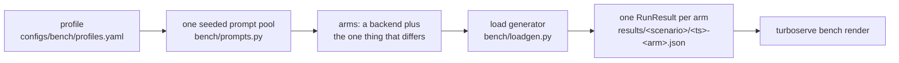
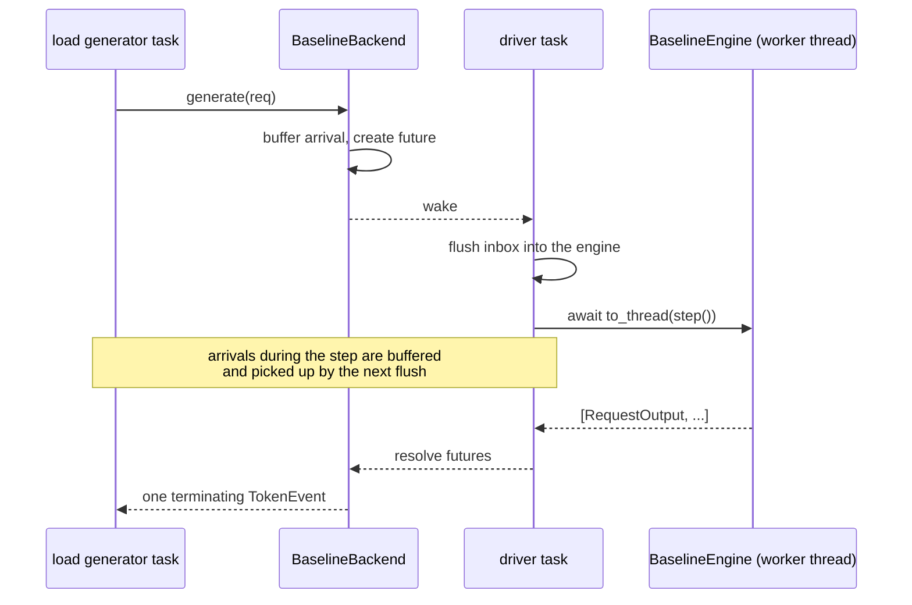

# Benchmark scenarios

The experiments themselves: what each one varies, what it holds fixed, and why. The
metric definitions, the percentile convention, the result-file schema and the rendering
pipeline are in [`benchmarking.md`](benchmarking.md); this page is about the
`src/turboserve/bench/scenarios/` modules and the `turboserve bench` command group.

## Contents

- [The shape of a scenario](#the-shape-of-a-scenario)
- [`naive-vs-cb` — what batching is worth](#naive-vs-cb--what-batching-is-worth)
- [`prefix-cache` — what a shared system prompt is worth](#prefix-cache--what-a-shared-system-prompt-is-worth)
- [`chaos` — what the gateway hides](#chaos--what-the-gateway-hides)
- [`loadgen` — driving a server someone else started](#loadgen--driving-a-server-someone-else-started)
- [`spec-decode` and `multi-lora`](#spec-decode-and-multi-lora)
- [The baseline adapter](#the-baseline-adapter)
- [Running the whole suite](#running-the-whole-suite)
- [How this is tested](#how-this-is-tested)
- [Limitations](#limitations)

## The shape of a scenario

Every scenario is the same five steps, and only the middle one differs:



The shared steps live in `bench/scenarios/common.py`, so a scenario module reads as a
description of an experiment rather than as a second copy of the harness. Three parts of it
decide whether a result means anything:

- **One prompt pool per scenario, not per arm.** Two arms given different prompts are not
  comparable. `build_prompt_pool` draws once from the profile's ranges with the profile's
  seed, and every arm is handed the same list.
- **Token ids, not text.** `build_requests` sends `prompt.token_ids`; re-tokenising text can
  merge a token across a boundary and change what is shared or cached.
- **The renderer's conventions, written once.** `open_run` sets `config["label"]`,
  `config["backend"]`, `config["baseline_label"]` and `config["load"]`, and `write_run`
  attaches `summary["derived"]` *after* `finish()` (which replaces `summary` wholesale).

A scenario is invoked as `turboserve bench <name> --profile h100`. Every scenario accepts
`--profiles PATH` to point at a different profiles file, `--results-dir` to relocate the
output, and `--slo-ttft-ms` / `--slo-tpot-ms` / `--slo-e2e-ms` to score goodput against an
objective the run records alongside the numbers.

## `naive-vs-cb` — what batching is worth

Four arms, one prompt pool, one load generator:

| Arm | Label in tables | Served by |
| --- | --- | --- |
| `naive_hf` | `naive` | `NaiveHFEngine` — one request per `transformers.generate` call |
| `static_batch` | `static batch` | `StaticBatchHFEngine` — fixed-size padded batches |
| `reference` | `continuous batching` | this repository's `LLMEngine` via `LocalEngineBackend` |
| `vllm` | `vLLM` | an OpenAI-compatible server named by `--url` |

The sweep is over the profile's concurrencies; each (arm, concurrency) pair writes its own
result file, and the rendered relative table is grouped by concurrency because arms are only
comparable at the same offered load. `naive` is the baseline every other arm is measured
against, recorded in *every* arm's `config["baseline_label"]` so the comparison survives one
file being deleted. Every arm except the static-batch one also names `static batch` in
`config["compare_to"]`, which makes the renderer draw a second relative table: sequential
decoding is the floor, but continuous batching *against a padded static batch* is the
comparison this scenario exists for, and it should be a rendered number rather than one
ratio divided by another.

Three controls, each of which changes the answer if dropped:

**Prefix caching is off by default** (`--prefix-caching` turns it on). The same prompt pool
is sent at every concurrency, so a warm cache would make the later runs of the sweep look
faster for a reason this scenario is not about.

**`ignore_eos` is on**, the default of `build_requests`, so each arm generates exactly the
requested number of tokens rather than stopping at a different point per engine.

**Every request asks for the same number of output tokens** — the mean of the profile's
output range, or `--output-tokens N`. This one is forced rather than chosen:
`transformers.generate` applies one sampling configuration to a whole batch, and
`StaticBatchHFEngine` raises on a heterogeneous batch rather than silently serving it with
the first request's settings. The honest consequence is stated in
[Limitations](#limitations).

```bash
uv run turboserve bench naive-vs-cb --profile h100
uv run turboserve bench naive-vs-cb --profile h100 --arm vllm --url http://127.0.0.1:8000
```

`summary["derived"]` carries the engine's own counters for the arm that reported them
(`num_steps`, `num_preemptions`, `kv_utilization`, `num_kv_blocks`, `num_batches` …) plus
`max_in_flight_observed`, which is how a run whose client was the bottleneck becomes visible
instead of silently wrong.

## `prefix-cache` — what a shared system prompt is worth

One prompt pool whose members share a literal prefix of the profile's length, sent to arms
that differ in exactly one flag:

| Arm | Served by |
| --- | --- |
| `cache off` | the reference engine with `SchedulerConfig.enable_prefix_caching=False` |
| `cache on` | the same engine with it enabled |
| `vLLM cache off` | an OpenAI-compatible server at `--baseline-url` |
| `vLLM cache on` | an OpenAI-compatible server at `--url` |

Two URLs rather than one, because on vLLM prefix caching is a *launch* flag: a client cannot
turn it off for a single request, and comparing one server against itself would measure
nothing. For the same reason the two vLLM arms name `vLLM cache off` as their baseline while
the two engine arms name `cache off`: each pair is only meaningful against its own engine's
control, and measuring vLLM-with-cache against this repository's engine-without-cache would
report the difference between two engines as if it were the cache's doing.

The measured phase is preceded by warm-up requests carrying the same prefix
(`--warmup`, one by default). A block is indexed in the prefix cache only once its tokens
are known computed, so requests admitted in the same scheduler step that computes a prefix
cannot hit on it; measuring the cold step would report the cost of *filling* the cache as if
it were the cost of using it. A steady-state service has a warm cache, which is the thing
being characterised.

`summary["derived"]` records `prefix_hit_rate` and `num_cached_prompt_tokens` straight from
the engine, plus `cached_prompt_token_fraction` — the engine's cached-token count over the
prompt tokens this run's successful requests sent, clamped to 1.0 because the engine's
counter also covers the warm-up.

```bash
uv run turboserve bench prefix-cache --profile h100
uv run turboserve bench prefix-cache --profile h100 \
  --url http://cache-on:8000 --baseline-url http://cache-off:8001
```

## `chaos` — what the gateway hides

This scenario owns no fault injection. It sizes a [`ChaosSpec`](canary-and-chaos.md#part-ii--chaos) from the profile's
`chaos` block — fleet size, arrival rate, duration, request shape, and a default
`kill:every=<fault_interval_s>s` schedule — runs `ChaosHarness`, and then adds the three
keys the report renderer needs (`label`, `backend`, `load`) to the result the harness wrote.
Everything about faults, replicas and recovery is documented in [`canary-and-chaos.md`](canary-and-chaos.md#part-ii--chaos).

Load is open-loop on purpose. A closed loop slows down exactly when the fleet does, so
queueing never grows and a fault is invisible; holding offered load constant is the only way
to see what the gateway's retry and health logic manages to absorb.

The replicas are mock servers, and the result file says so (`replica_engine: "mock"`). The
experiment is about the gateway's failure policy; putting a real checkpoint behind each
replica would measure a GPU instead, and would need three of them.

```bash
uv run turboserve bench chaos --profile h100
uv run turboserve bench chaos --profile h100 --faults 'kill:every=15s,grace=5s' --faults 'error:p=0.01'
```

`summary["derived"]` surfaces `replicas`, `faults`, `retries`, `disruptions`,
`requests_during_faults`, `impaired_seconds` and `recovery_s_p95`; the full chaos block the
harness computes stays at `summary["chaos"]`.

## `loadgen` — driving a server someone else started

The one command in this group that owns no experiment. It takes a URL, sends load at it, and
writes one result file. That is what the Kubernetes end-to-end job needs: it installs the
chart and then drives the *deployed* gateway while pods are being deleted underneath it.

```bash
turboserve bench loadgen --url http://gateway:8000 --rps 20 --duration 60 --out run.json
```

Those four flags are the contract `deploy/kind/e2e.sh` depends on; the job then asserts on
`summary.error_rate` with `deploy/kind/assert_error_rate.py`.

The driver follows from the flags, and the rule changes what the numbers mean:

- **With `--rps`** the load is open loop — Poisson arrivals at that rate, and the client does
  not slow down when the server does, so queueing delay and the tail are free to grow.
  `--concurrency` then only caps simultaneous requests, as a safety valve against an
  unresponsive server accumulating unbounded tasks, and is recorded when it is used.
- **Without `--rps`** the load is closed loop at `--concurrency`: a capacity measurement, in
  which latency cannot run away because the client is the brake.

Prompts are synthetic token ids and **no tokenizer is loaded** unless `--tokenizer` names
one. A server addressed by URL may serve a model whose tokenizer is not on this machine at
all — the mock gateway in the kind job serves no real model — and the job here is to produce
requests of the right shape. `--prompt-set sharegpt` and `--prompt-set file` do need
`--tokenizer` and `--prompt-path`, because their prompts are text and their token lengths
cannot be known without one.

`--model` defaults to the first model the server advertises on `/v1/models`, so the kind job
does not have to know what the chart deployed.

## `spec-decode` and `multi-lora`

Both scenarios can be driven against a vLLM server as well as against the in-process engine,
and both say so in the arm's *name*, because the renderer identifies an arm by its label and
two engines writing into the same results directory would otherwise produce rows that look
like one measurement made twice. `spec-decode` takes `--label-prefix "vLLM "`, which prefixes
each arm and its pair's target-only baseline (`--label` remains the way to name a remote
server whose speculative settings this process did not choose, and it declares no baseline);
`multi-lora --backend vllm` names its arms `<n> adapters (vllm)` against a control called
`base only (vllm)`.


The speculative-decoding and multi-LoRA scenarios belong to the engine packages of the
same name, and their scenario modules are registered **optionally**:
`bench/cli.py` imports `turboserve.bench.scenarios.spec_decode` and
`turboserve.bench.scenarios.multi_lora` when this app is built, and a module that is not
present is logged and skipped rather than breaking every other benchmark command. The same
tolerance `load_builtin_backends` applies to the backend registry, for the same reason: an
installation that trims the package still has a working `bench loadgen`.

Discovery looks for, in order, a `typer.Typer` the module exports or a command function; the
names tried are in `OPTIONAL_SCENARIOS` (`spec_decode_app`, `spec_decode_command`, `app`,
`command`, `main`, `run`, and the `multi_lora` equivalents). A Typer object is mounted as a
sub-command group with `add_typer`; a callable is registered as a single command with
`command`. `turboserve bench --help` therefore always tells the truth about what this build
can do.

## The baseline adapter

`BaselineBackend` (in `common.py`) gives a blocking `transformers` baseline the gateway's
`Backend` surface, so that *one* load generator drives every arm of a comparison rather than
one driver per engine kind.



Three properties follow from that design and are pinned by tests:

1. **The engine is touched from one task only.** `step()` runs in a worker thread because
   `generate` is a long blocking call that must not hold the event loop; arrivals are
   buffered and flushed *between* steps rather than mutating the engine's queue concurrently.
2. **Co-arriving requests land in one batch**, and a request that arrives while a batch is
   generating waits for the next one. That is the head-of-line delay static batching has and
   continuous batching does not, and here it is a consequence of the design rather than a
   simulation of it. `batch_window_s` (10 ms by default) is the only knob that influences
   what is measured, which is why it is a named constructor argument.
3. **Exactly one event per request.** `transformers.generate` returns nothing until the whole
   completion exists, so a client observes it all at once and its time-to-first-token equals
   its end-to-end time. Fabricating a per-token trickle would invent a TTFT that nothing
   measured. See [Limitations](#limitations).

## Running the whole suite

`scripts/run_all_benchmarks.sh` is a thin sequence of `turboserve bench` invocations — the
order, and which optional arms this machine can run. Every decision about what a scenario
measures lives in the scenario module.

```bash
PROFILE=h100 ./scripts/run_all_benchmarks.sh
VLLM_URL=http://127.0.0.1:8000 PROFILE=h100 ./scripts/run_all_benchmarks.sh
DRY_RUN=1 ./scripts/run_all_benchmarks.sh     # print the commands, run nothing
```

| Variable | Effect |
| --- | --- |
| `PROFILE` | workload profile (default `h100`) |
| `RESULTS_DIR` | where result JSON is written (default `results`) |
| `VLLM_URL` | an OpenAI-compatible vLLM server; enables every `vllm` arm |
| `VLLM_BASELINE_URL` | a second vLLM server started **without** `--enable-prefix-caching`, the prefix-cache control arm |
| `TURBOSERVE` | how to invoke the CLI (default `uv run --frozen turboserve`) |
| `SKIP` | space-separated scenario names to skip |
| `ADAPTERS_DIR` | LoRA adapters the `multi-lora` scenario serves (default `adapters`) |
| `EXTRA_<SCENARIO>` | extra flags for one scenario, e.g. `EXTRA_CHAOS="--mode inprocess"` |
| `DRY_RUN=1` | print the commands instead of running them |
| `CONTINUE_ON_ERROR=1` | keep going when one scenario fails; the failures are listed at the end |

The script ends with `turboserve bench render`, the only step that produces a number a human
reads — and it reads them all from the JSON files, never from anything typed by hand.

Prices come from the environment: `scripts/vastai/run_remote.sh` exports
`TURBOSERVE_GPU_PRICE_PER_HOUR` and `TURBOSERVE_GPU_PRICE_SOURCE` on the measurement host,
and every scenario copies them into its result file. Nothing in this module invents a price;
an unparsable value is dropped with a warning, so a result has no cost column rather than a
fabricated one.

## How this is tested

`tests/unit/test_scenarios.py`, on CPU, with no network and no GPU.

| Area | What is pinned |
| --- | --- |
| URL and range parsing | `/v1` appended exactly once and never twice; non-HTTP and empty URLs rejected; `N` and `MIN:MAX` token ranges, including inverted and malformed ones |
| Prompt pools | exact token lengths, a literally identical shared prefix, round-robin tenants, ids inside the vocabulary bound, reproducibility from the seed, and a prefix as long as the shortest prompt rejected |
| Result plumbing | the result path naming the scenario and slugging the arm; SLO overrides merging with the profile's; the GPU price read from the provisioning environment and dropped when unparsable |
| `BaselineBackend` | one terminating event carrying the tokens and a usage block; co-arriving requests in one batch; a late arrival waiting for the next batch; a request the engine refuses failing without killing the driver; health, models and idempotent close |
| `naive-vs-cb` | all three local arms run against the cached tiny Qwen2 checkpoint and write files that round-trip through the schema, with the label, baseline label, load block and uniform output length; the arms receiving identical prompts and token counts; an arm the profile does not declare rejected |
| `prefix-cache` | the cache-off arm reporting no cached tokens and no hits while the cache-on arm reports both, from the same prompt pool; a `vllm` arm without a URL rejected |
| `chaos` | a real run through the in-process fleet with a kill schedule, producing the renderer's keys, a chaos block and at least one disruption; the schedule defaulting to the profile's kill cadence |
| `loadgen` | the CLI against a mock gateway on a **real loopback socket**, in both open and closed loop, writing a file with an error rate and a TTFT tail; `--no-index` honoured; `--rps` without `--duration` refused |
| `bench` app | the shipped commands present; optional scenarios attached as a command or as a sub-app from a synthetic module, and skipped when absent; `render` writing both pages from result files; the package's lazy exports resolving |

The end-to-end scenario tests use two to four very short requests against a tiny random
checkpoint. They assert that a scenario produces a *valid, complete* result file with the
right conventions — never that a number in it is any particular value. Figures produced by
a test run are never published; see CONTRIBUTING.md,
["No numbers without a results JSON"](../CONTRIBUTING.md#no-numbers-without-a-results-json).

## Limitations

**Uniform output length in `naive-vs-cb`.** Because the baselines cannot express a per-request
token limit inside one batch, every arm of that scenario asks for the same number of output
tokens. The scenario therefore does not show the part of continuous batching's advantage that
comes from retiring short sequences early and admitting new ones in their place — it
understates it. Input lengths stay heterogeneous, so the padding waste of a static batch is
still measured. The other scenarios, which have no baseline arm, keep the profile's full
output distribution.

**The baselines' TTFT equals their E2E.** A blocking `generate` call produces nothing until
it is finished. The baselines do stamp an honest engine-side first-token time in
`RequestTiming`, but a client cannot observe it, and the load generator records what the
client observed. Throughput is unaffected, which is what those arms exist to bound.

**The concurrency sweep reuses one backend per arm.** A checkpoint is loaded once per arm
rather than once per load level. Nothing in the sweep depends on engine state — prefix
caching is off and the previous load has drained — but a future arm that did carry state
between runs would need the backend rebuilt.

**`cached_prompt_token_fraction` includes the warm-up.** The engine's cached-token counter
covers every request it served, including the warm-up ones, while the denominator is the
measured phase; the value is clamped to 1.0. `prefix_hit_rate`, taken straight from the
engine, has the same property. Both are reported as engine counters, not as a per-request
measurement.

**Single-process load generation.** Inherited from `bench/loadgen.py`: at very high offered
rates the client's event loop bottlenecks before the server does.
`max_in_flight_observed` is recorded in every scenario's derived block so such a run is
visible rather than silently wrong.

**No scenario has been run on a GPU or against a real vLLM server.** Every path above was
exercised on CPU with a tiny random checkpoint and, for the HTTP arms, against this
repository's own mock gateway over a loopback socket. The `vllm` arms are built from the
same `OpenAICompatBackend` the gateway uses in production and are covered by that module's
tests, but no vLLM process has been contacted from a development checkout.
