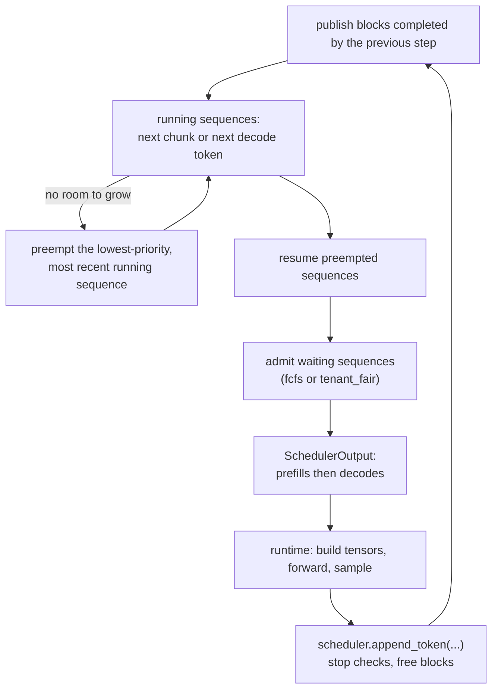

# Scheduler

`src/turboserve/engine/core/scheduler.py`, with `sequence.py` and `block_manager.py`.

The scheduler is the engine's only decision maker. Once per step it answers one question --
*which sequences run in the next forward pass, and with how many tokens each* -- and hands
the answer to the runtime as a `SchedulerOutput`. Everything else in the engine reacts to
that object.

## Why it looks like this

A naive server runs one request at a time, or pads a fixed batch to the longest member and
waits for all of it to finish. Both waste the GPU: the first leaves it idle between
requests, the second leaves it computing padding, and neither can admit a request that
arrives one millisecond after the batch started. Three mechanisms remove those three
wastes, and this module implements all of them.

**Continuous batching** (iteration-level scheduling, introduced by Orca). There is no batch
object at all. There is a set of *running* sequences and a per-step budget; a sequence joins
the set when it is admitted and leaves it the step it finishes, so a finished request frees
its slot for the next arrival immediately instead of at the end of a batch.

**Chunked prefill** (Sarathi). Prefill is compute-bound and decode is memory-bound, and a
long prompt's prefill would otherwise block every decoding sequence for its whole duration --
a latency spike visible to every other tenant. A prompt is therefore split across steps to
fit the step's token budget, and the leftover budget of a decode-heavy step is filled with
prefill work.

**Recompute preemption.** The KV cache is finite. When a running sequence needs a new block
and none is available, some sequence must give its blocks up. This engine drops them and
re-runs the prefill later (recompute) rather than copying them to host memory (swap):
recompute needs no pinned host buffer and no PCIe transfer, and with the prefix cache in
front of it the recomputation usually turns back into a cache hit, because the blocks the
victim published on its way out are still there when it is resumed.

## Data structures

| Type | Module | What it is |
| --- | --- | --- |
| `Sequence` | `sequence.py` | One request: tokens, block table, progress, timing, RNG |
| `SeqStatus` | `sequence.py` | `WAITING`, `RUNNING`, `PREEMPTED`, `FINISHED` |
| `ScheduledSeq` | `scheduler.py` | One sequence's share of one step (a snapshot) |
| `SchedulerOutput` | `scheduler.py` | The whole step: scheduled entries, preemptions, counts |
| `SchedulerConfig` | `types.py` | Budgets, block size, policy, tenant weights |
| `BlockManager` | `block_manager.py` | Admission, adoption, growth and release of KV blocks |

### One progress counter

`Sequence.num_computed_tokens` counts tokens whose KV is already in the cache, whatever put
it there: a prefix-cache hit, a completed prefill chunk, or a decode step. So the tokens
still to compute are always `num_tokens - num_computed_tokens`, and prefill, chunked prefill
and decode become the same arithmetic instead of three special cases -- a decoding sequence
simply has exactly one uncomputed token, the one it sampled last step. That is what
`Sequence.num_new_tokens_to_compute(budget)` returns.

### The step, as a batch

`SchedulerOutput.scheduled` is ordered **prefills first, then decodes**, which is the layout
`AttnMetadata` documents, so attention implementations can split the batch by counting
rather than sorting. Each entry is a snapshot -- its token ids, KV slots, block table and
post-step context length are copied at schedule time -- so the runtime can build tensors,
run the model and feed tokens back in any order without the description of the batch
shifting underneath it.

## The step loop



The order is deliberate. Running sequences come first because a client is already waiting on
their tokens and a burst of admissions must not become a latency spike for everybody already
in flight. Preempted sequences come next, ahead of the waiting queue, because they are the
only sequences that can be *losing* work; resuming them promptly is what keeps preemption
from becoming livelock. New admissions come last, and stop at the first request the KV pool
cannot fund, so a later small request cannot indefinitely jump an earlier large one.

The runtime's side of the contract:

```python
out = scheduler.schedule()  # pick the batch, assign KV slots
meta = out.build_attn_metadata(block_size)  # tensors for the attention layers
hidden = model(out.input_token_ids(), out.positions(), kv_cache, meta)
logits = model.compute_logits(hidden, out.sample_indices())
for item, token in zip(out.sampled(), sampler(logits, ...).token_ids):
    scheduler.append_token(item.seq, token, eos_token_id=eos)
```

`schedule()` advances each scheduled sequence's `num_computed_tokens` immediately, because
the forward pass is going to run over exactly those tokens and two sources of truth would
eventually disagree. Blocks completed by a step are published to the prefix cache at the
start of the *next* step; see [`prefix-caching.md`](prefix-caching.md) for why.

## Budgets and preemption

A step is bounded by `max_num_batched_tokens` (its compute budget) and `max_num_seqs` (its
bookkeeping budget). Both are hard: no step ever exceeds either, and no sequence appears
twice in one step.

When `BlockManager.can_append` says a running sequence cannot grow, `_pick_victim` chooses
the **lowest-priority, most recently admitted** sequence among those not already scheduled
in this step. Lowest priority first because that is what priority is for; most recent as the
tie-break because it has done the least work and so costs the least to recompute, and
because preempting the oldest sequence would repeatedly punish whoever has waited longest.
Sequences already scheduled in the step being built are off limits: their KV slots are in
the batch and the forward pass is about to write them. If the only candidate left is the
requesting sequence itself, it preempts itself and returns to the queue -- giving up the
newest work is better than failing a request.

## Admission policies

`fcfs` is a single FIFO queue: strict arrival order, which is the right default when one
tenant owns the deployment.

`tenant_fair` is weighted fair queueing. Each tenant carries a virtual time that advances by
`1 / weight` every time one of its requests is admitted, and the tenant with the smallest
virtual time goes next (ties broken by tenant id, so scheduling stays deterministic). Two
properties follow, and both are tested:

* **Proportional share.** Admissions are split in proportion to the configured weights.
* **Bounded wait.** A tenant of weight `w` gets a turn at least every `sum(weights) / w`
  admissions, plus at most one step of phase offset when it joins an already-running
  schedule. No amount of queued work from a heavy tenant can starve a light one, because a
  tenant's virtual time stands still exactly while it is not being served.

The virtual clock is self-clocked (SCFQ): it reads the virtual time of the most recently
admitted request, and a tenant that goes idle and becomes backlogged again restarts at
`max(its own virtual time, that clock)` rather than at the stale value it stopped on. An
idle tenant therefore cannot bank credit for the time it was away and then monopolise the
engine when it returns; its share is a share of the current epoch.

## How it is tested

`tests/unit/test_scheduler.py` (23 tests) drives workloads to completion through a step loop
that stands in for the runtime, asserting invariants after every step with
`Scheduler.check_invariants()`:

* step budgets and `max_num_seqs` are never exceeded, and no sequence is scheduled twice;
* chunked prefill splits a long prompt exactly at the budget, and disabling it schedules
  whole prompts only -- with a prompt that could never fit rejected at `add_request` rather
  than stalling in the queue forever;
* the batch is prefills-then-decodes and `build_attn_metadata` passes `AttnMetadata.validate`,
  with `input_token_ids`, `positions` and `sample_indices` agreeing with it;
* scheduling is deterministic: two identical schedulers produce identical step traces;
* a deliberately tiny KV pool forces preemption, every request still finishes with the full
  number of output tokens, `num_computed_tokens` is monotone for every sequence except
  across its own preemptions, and the block pool is whole at the end;
* the victim is the lowest-priority, most recent sequence, and a resumed sequence re-adopts
  its cached prefix;
* `tenant_fair` splits admissions by weight and bounds the light tenant's wait, while a
  tenant that goes idle cannot bank credit -- tested both for a tenant that has never been
  served and for one that was served, went idle and came back;
* abort works from every state, stop tokens and EOS retire a sequence and release its
  blocks, and timings are stamped once and can be injected.

`tests/unit/test_sequence.py` (15 tests) and `tests/unit/test_block_manager.py` (17 tests)
cover the pieces underneath.

Run them with:

```bash
uv run pytest tests/unit/test_scheduler.py tests/unit/test_sequence.py tests/unit/test_block_manager.py
```

## Limitations

* **One sequence per request.** There is no beam search and no `n > 1` sampling; a request
  is a sequence. Adding either means a sequence *group* sharing a prompt block table, which
  the block manager's reference counting already supports but the scheduler does not model.
* **Preemption is recompute only.** Swapping KV to host memory is not implemented. For very
  long prompts with no cached prefix, recompute is the more expensive choice.
* **Priority affects preemption, not admission.** The waiting queue is FIFO (or fair-queued
  by tenant); `priority` only decides who gets preempted. Strict priority admission would
  need its own starvation guard.
* **Head-of-line blocking at admission.** If the request at the head of the queue cannot be
  funded, admission stops for that step rather than skipping it. That is what prevents a
  stream of small requests from starving a large one, and it means a single oversized
  request slows admissions until it fits.
* **No stop strings.** `Sequence.check_stop` handles EOS, stop token ids and `max_tokens`.
  Stop *strings* need detokenised text and live in the runtime's incremental detokeniser.
* **The cost model is tokens, not FLOPs.** A prefill token and a decode token cost the same
  against `max_num_batched_tokens`, although their arithmetic intensity differs. A more
  accurate budget would weigh them differently.

## References

* Yu et al., *Orca: A Distributed Serving System for Transformer-Based Generative Models*,
  OSDI 2022 -- iteration-level (continuous) batching.
* Kwon et al., *Efficient Memory Management for Large Language Model Serving with
  PagedAttention*, SOSP 2023 -- paged KV, block tables, recompute vs swap preemption.
* Agrawal et al., *SARATHI: Efficient LLM Inference by Piggybacking Decodes with Chunked
  Prefills*, 2023, and *Taming Throughput-Latency Tradeoff in LLM Inference with
  Sarathi-Serve*, OSDI 2024 -- chunked prefill and the stall it removes.
* Demers, Keshav and Shenker, *Analysis and Simulation of a Fair Queueing Algorithm*,
  SIGCOMM 1989 -- the virtual-time argument behind `tenant_fair`'s bounded wait.
* Golestani, *A Self-Clocked Fair Queueing Scheme for Broadband Applications*, INFOCOM 1994
  -- the self-clocked virtual time `tenant_fair` uses as the floor for a returning tenant.
