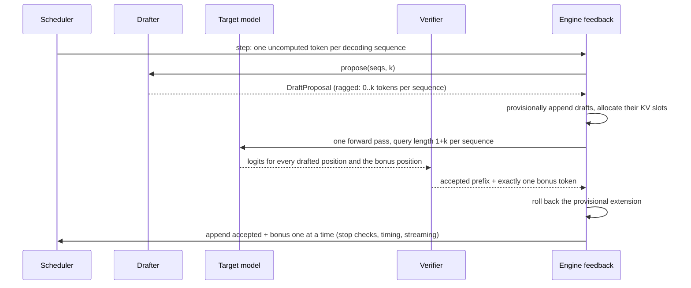

# Speculative decoding

`src/turboserve/engine/spec/` — a drafter proposes the next `k` tokens, the target model
checks all `k+1` positions in one forward pass, and a verification rule decides how many
guesses to keep **without changing the distribution of the output**.

| File | Contents |
| --- | --- |
| `verifier.py` | The two acceptance rules and the sampler transform chain they share. Pure functions over tensors. |
| `drafter.py` | The `Drafter` protocol, the padded `DraftProposal` record, and `ModelDrafter` (a second small model with its own paged KV cache). |
| `ngram.py` | `NgramDrafter`: prompt-lookup drafting, no model at all. |
| `spec_engine.py` | `SpeculativeConfig`, `SpecStats` and `SpeculativeLLMEngine`, a subclass of `LLMEngine` that replaces two methods. |

## 1. Why it works at all

Decoding one token reads every weight of the model and multiplies each by a single row of
activations. That is a memory-bandwidth problem, not an arithmetic one: the same weight read
could have served many rows. Speculative decoding buys those rows. A cheap drafter guesses
`k` tokens, the target scores the `k+1` positions those guesses create in one pass, and the
positions whose guesses were right are kept for free.

Two papers define the scheme, independently and at the same time: Leviathan, Kalman and Matias,
*Fast Inference from Transformers via Speculative Decoding* (ICML 2023), and Chen et al.,
*Accelerating Large Language Model Decoding with Speculative Sampling* (2023). The n-gram
drafter comes from Saxena, *Prompt Lookup Decoding* (2023).

The property that makes it usable in production is that it is not an approximation. A
speculative engine and an ordinary one are **distributionally identical**: for a greedy
request they emit the same token ids, and for a sampled request they emit draws from the same
distribution. Everything below exists to keep that true.

## 2. The step



Steps 3 and 6 are the whole trick and the whole risk.

**Provisional extension.** A sequence about to decode has exactly one uncomputed token. Adding
`k` draft tokens gives it `1+k`, which makes its slice of the packed batch look exactly like a
chunked prefill: a rectangle of queries against a cached context, with the causal offset
`context_len - query_len`. That is why verification needs **no new attention kernel** — the
reference paged-attention path already handles it, and it is tested there. (The Triton decode
kernel is only used for steps where every query length is one, so verification steps take the
reference path on every device.)

**Rollback.** After verification the extension is undone completely: the draft tokens are
removed from the sequence and `num_computed_tokens` goes back to where the scheduler left it.
The accepted tokens are then appended one at a time through the base engine's own feedback
path, so the model's EOS set, `stop_token_ids`, `max_tokens`, stop strings, timing stamps,
incremental detokenisation and block release all behave exactly as without speculation. As
each accepted token is appended, `num_computed_tokens` follows it up to a cap — the number of
draft tokens that were accepted, whose KV really is in the cache — and then stops, leaving the
bonus token uncomputed, which is precisely the state an ordinary decode step leaves behind.

The tempting shortcut is to keep the accepted tokens in place and report only the bonus. It
would skip the engine's stop checks for every accepted token, so a speculating request could
emit tokens past its `max_tokens` or past a stop string. The rollback costs a few list
operations per step and removes that class of bug entirely.

Rejected draft tokens leave KV behind in slots the sequence still owns; whatever tokens end up
at those positions overwrite them. No block is leaked and none is freed early.

## 3. Verification

### Greedy requests

`verify_greedy` accepts a draft token exactly when it is the token the target's own `argmax`
would have chosen at that position, stops at the first disagreement, and emits the target's
choice there as the bonus. The emitted continuation is therefore the target's greedy
continuation, token for token. `tests/unit/test_spec_engine.py` asserts that against the
ordinary engine's output for a batch of prompts, at `k ∈ {2, 4}`.

### Sampled requests

`verify_rejection_sampling` implements modified rejection sampling. With `p` the target's
distribution at a position and `q` the draft's, a drafted token `x` is kept with probability
`min(1, p(x)/q(x))`; on a rejection the replacement is drawn from the normalised residual
`max(0, p - q)`. The emitted token is then distributed **exactly** as `p`:

```
P[emit x] = q(x)·min(1, p(x)/q(x)) + (rejection mass)·residual(x)/Σ residual
          = min(q(x), p(x))       + max(0, p(x) - q(x))
          = p(x)
```

because the rejection mass `Σ_y max(0, q(y) - p(y))` and `Σ_z max(0, p(z) - q(z))` are the same
number (both are the total variation distance between `p` and `q`), so the two factors cancel.
`tests/unit/test_spec_verifier.py` tests that identity the only way a distributional claim can
be tested: many thousands of draws through the real code path, then a chi-square
goodness-of-fit test against `p` on a four-token vocabulary, with a seeded generator so the
test is a deterministic replay.

`p` and `q` are both the **post-processing** distributions: repetition penalty, then
temperature, then top-k, then top-p, in that order, applied with the same functions
`turboserve.engine.core.sampler` uses. Reusing them is what keeps the guarantee true if either
changes. A consequence worth knowing: a draft token the target has truncated to zero
probability is rejected with certainty, so top-p and top-k mean the same thing with and
without speculation.

### A drafter with no distribution

`NgramDrafter` copies tokens out of the context; there is no `q`. The verifier reads a missing
`draft_probs` as a **point mass** on the proposed token, which is a distribution like any
other: acceptance probability `p(x)`, residual `p` with `x` removed. The identity above still
holds, so n-gram drafting is exact for sampled requests too, not only greedy ones. (The
original spec for this module restricted it to greedy verification; implementing the point-mass
case is strictly more general and is covered by its own chi-square test.)

## 4. Drafters

### `ModelDrafter`

A second, smaller causal LM with **its own** weights, KV cache and block manager. It cannot
share the target's blocks — different layer count, KV head count and head dimension — and its
cache has to survive rejections, so it keeps one mirror `Sequence` per target sequence.

The mirror holds the token ids the draft model has actually processed. At the start of every
`propose`, the drafter compares them with what the target now holds and rewinds the mirror to
the longest shared prefix. Only tokens the drafter itself proposed can ever differ, so the
scan is `O(k)` from the end rather than `O(sequence length)` — and because the check is
against the tokens themselves, the drafter needs no report of the verification outcome and
cannot drift out of step with the target if one were lost.

The invariant the whole thing rests on: between calls a mirror's KV covers all but the last of
its tokens. That last token is the query of the first draft step, so a draft step is an
ordinary decode step and `k` of them are `k` small forward passes. The first call for a
sequence pays a catch-up pass over its prompt, chunked by a token budget.

Prefix caching is deliberately off on the draft pool: draft blocks live only as long as their
target request and are never shared between requests, so a cache would add hashing and an
eviction policy for no hits.

**Memory ordering.** When the engine builds the drafter itself, the draft model and its pool
are created *before* the target engine profiles device memory, so the target's pool is sized
from what is genuinely left. The other order leaves nothing for the draft model on a device
the target has already filled. `draft_num_blocks` sizes the draft pool exactly; leaving it
unset profiles the device and takes `draft_gpu_memory_utilization` of it.

### `NgramDrafter`

Take the last `n` tokens of the sequence, find where that exact n-gram occurred earlier in the
same sequence, propose what followed it. Longest `n` first, most recent occurrence first. No
weights, no cache, no forward pass — the cost is a few vectorised comparisons over the
sequence's own ids.

It is a narrow trick and it proposes nothing unless the sequence repeats itself, which is
exactly the shape of summarisation, document question-answering, code completion inside a file
and structured output with recurring field names. Where the continuation is novel it proposes
nothing and the engine decodes normally.

### Ragged proposals are normal

A `DraftProposal` is padded and carries a per-row length. A row of length zero means "no
speculation for this sequence this step", and the engine turns that into an ordinary
single-token decode with no special case anywhere: verification of an empty draft is a single
draw from a single row. Rows come back short when the n-gram lookup finds nothing, when the
draft pool cannot fund more blocks, or when the sequence is near `draft_max_model_len`.
**Speculation never causes a preemption**: a draft the target's KV pool cannot fund is
shortened, possibly to nothing.

## 5. Configuration

`EngineConfig.speculative` is an untyped mapping precisely so that the shared engine
configuration does not grow a field per drafter option. `SpeculativeConfig` is where it becomes
typed, with `extra="forbid"`, so a misspelt key fails at startup rather than being ignored.

| Key | Meaning |
| --- | --- |
| `method` | `model` or `ngram`. |
| `draft_model` (alias `model`) | Repo id or path of the draft model; required for `method: model`. |
| `num_speculative_tokens` (alias `k`) | How many tokens to draft per step. |
| `draft_num_blocks`, `draft_block_size` | Draft KV pool size; unset profiles memory. |
| `draft_gpu_memory_utilization` | Share of the device the profiled draft pool may take. |
| `draft_max_model_len`, `draft_max_num_batched_tokens` | Draft-side length and catch-up budget. |
| `ngram_min`, `ngram_max` | N-gram lengths the lookup tries, longest first. |
| `max_batch_size` | Skip speculation in steps with more decoding sequences than this. |

`max_batch_size` exists because the trade stops paying once the batch alone keeps the device
busy — speculation spends arithmetic to save forward passes, and a wide batch has no
arithmetic to spare. Leaving it unset speculates at every batch size; setting it is how a
deployment draws that line for its own hardware, and the benchmark scenario is how it finds
out where the line is.

```python
from turboserve.engine.core.types import EngineConfig
from turboserve.engine.spec import SpeculativeLLMEngine

config = EngineConfig(
    model="Qwen/Qwen2.5-7B-Instruct",
    speculative={"draft_model": "Qwen/Qwen2.5-0.5B-Instruct", "k": 4},
)
with SpeculativeLLMEngine(config) as engine:
    engine.add_request("r1", "Summarise the following document: ...")
    while engine.has_unfinished():
        for output in engine.step():
            print(output.text_delta, end="")
```

To serve it through the gateway, build the engine yourself and hand it to the local backend,
which accepts an already-built engine:

```python
from turboserve.engine.runtime.async_engine import AsyncLLMEngine
from turboserve.gateway.backends.local_engine import LocalEngineBackend

backend = LocalEngineBackend(engine=AsyncLLMEngine(SpeculativeLLMEngine(config)))
```

## 6. Statistics

`SpeculativeLLMEngine.spec_stats()` returns a `SpecStats` record and `stats()` merges it into
the engine's flat statistics dictionary alongside the drafter's own counters:

`num_spec_steps`, `num_verified_seqs`, `num_drafted`, `num_accepted`, `num_emitted`,
`num_target_forwards`, `num_draft_calls`, `acceptance_rate`, `mean_accepted_len`,
`mean_emitted_len`, plus `drafter` and `num_speculative_tokens`.

Sequences that were offered no draft are excluded from `num_verified_seqs` and from the
acceptance figures: counting them would drag the mean accepted length towards zero for steps
in which nothing was speculated. They are still counted in the engine's ordinary token
counters, because they really did emit a token.

## 7. The benchmark scenario

`src/turboserve/bench/scenarios/spec_decode.py`, wired into the benchmark application as
`turboserve bench spec-decode`:

```
turboserve bench spec-decode --profile h100 --out results/spec_decode/
turboserve bench spec-decode --profile dev-2060 --dry-run
turboserve bench spec-decode --profile h100 --pair target-7b-ngram --k 4 --concurrency 1
turboserve bench spec-decode --profile h100 --backend vllm --url http://host:8000/v1 \
    --label "vllm k=4"
```

For every target/draft pair in the profile it runs a baseline arm (the target alone) and one
arm per `k`, at every configured concurrency, and writes one result file per arm. `--out`
names the directory exactly; `--results-dir` follows the repository convention and appends
`spec_decode/` itself, defaulting to `TURBOSERVE_RESULTS_DIR`.

Everything that could bias the comparison is held fixed: the prompt pool is built once per
pair from a seeded generator and sent as **token ids** to every arm, sampling is greedy with
`ignore_eos` so each request produces exactly the number of output tokens the profile asked
for, and every arm is driven by the same load generator through the same backend interface.
The prompt pool, the result-file conventions, the SLO merge and the engine options come from
`turboserve.bench.scenarios.common`, the harness every scenario in this repository shares —
so two scenarios cannot drift apart in how they name an arm or seed a prompt set.

Each arm's result carries the standard per-request record set plus, under
`summary["derived"]`, the shared engine counters *and* this scenario's speculation counters
(`SPEC_STAT_KEYS`) — the numbers that explain the throughput figure next to them. A remote
(`--backend vllm`) arm carries no speculation counters: a server's acceptance rate is not
visible to this process, and the scenario does not invent one. Because a server's
speculative settings are fixed at its launch, `--url` collapses the arm list to one arm per
pair and concurrency, named by `--label`.

Check the plan with `--dry-run` before committing a machine to it, and render the tables
afterwards with `turboserve bench render`.

## 8. How this is tested

`tests/unit/test_spec_verifier.py` (no model, no cache):

- greedy acceptance of the longest agreeing prefix, and the bonus at the first disagreement;
- the chi-square test of the distribution identity, for a model drafter's `q` and for the
  point-mass case;
- the token after an accepted draft is target-distributed too;
- `p == q` accepts everything; a token outside the target's support is never emitted;
- the zero-residual fallback, and every shape and device check.

`tests/unit/test_spec_engine.py` (CPU, cached tiny-random checkpoints) compares the speculative
engine against the ordinary one under drafters chosen to force all three regimes:

- a draft model that **is** the target, so acceptance is total (`k ∈ {2, 4}`);
- an n-gram drafter under a KV pool small enough to force preemption, so drafts are partly
  accepted while sequences are also being rolled back and recomputed;
- a deliberately wrong drafter, so every draft is rejected.

In every case the token ids must equal the ordinary engine's. It also covers mixed
prefill/decode steps, `max_tokens` under sampled verification, abort and close releasing draft
state, the vocabulary-mismatch refusal, `max_batch_size`, and the drafters' own behaviour. The
benchmark scenario is covered in the same file: arm planning and its refusals, the backend a
speculative arm really gets, one arm run end to end on the tiny model with its result file
read back (label, baseline label, load block and the derived speculation counters), the CLI's
dry run and option validation, and that `turboserve bench spec-decode` is registered.

Both files run on CPU in seconds, use no network, and load nothing larger than the tiny-random
models in the shared Hugging Face cache.

## 9. Limitations

- **Nothing here has been run on a GPU in this repository.** Per `PLAN.md` §2a all development
  and testing was CPU-only on tiny random checkpoints. The CUDA-specific paths are the ones the
  base engine already documents (fp16 execution, memory profiling); speculation adds no kernel
  of its own.
- **Verification steps do not use the Triton decode kernel.** A `1+k` query length is not a
  decode-only batch, so those steps take the reference paged-attention path on every device.
  A varlen kernel over block tables would be the next thing to write.
- **The verify batch can exceed `max_num_batched_tokens`** by up to `k` tokens per decoding
  sequence: the scheduler sizes the step, and the drafts are added afterwards. This is
  deliberate — refusing to speculate because the budget is exactly full would make the feature
  disappear under load — but a deployment sizing activation memory to the last byte should
  account for it.
- **One drafter per engine.** There is no per-request choice of `k` or of drafter, and no
  dynamic `k` that adapts to the acceptance rate it is seeing. `max_batch_size` is the only
  adaptivity, and it is a static threshold.
- **No tree attention.** Drafts are a single chain, not a tree of candidate continuations as
  in Medusa or EAGLE-style decoding. A tree would need the attention mask to express it, which
  the packed layout cannot today.
- **`ModelDrafter` assumes a shared tokenizer.** The engine refuses a draft model whose
  vocabulary size differs from the target's, because a mismatch produces fluent nonsense at a
  plausible acceptance rate rather than an error. Models with the same vocabulary size but
  different token orderings cannot be detected this way and must not be paired.
- **The draft model's own KV pool is not resized at runtime.** If the target's pool grows
  hungry the draft pool does not shrink; a starved draft pool simply stops speculating, which
  the `draft_starved` counter reports.

## 10. See also

- `docs/engine.md` — the engine this subclasses, and where memory sizing happens.
- `docs/scheduler.md` — the step protocol, chunked prefill and preemption the rollback coexists with.
- `docs/model.md` — the packed variable-length batch layout verification reuses.
- `docs/benchmarking.md` — metric definitions and how result files become tables.
