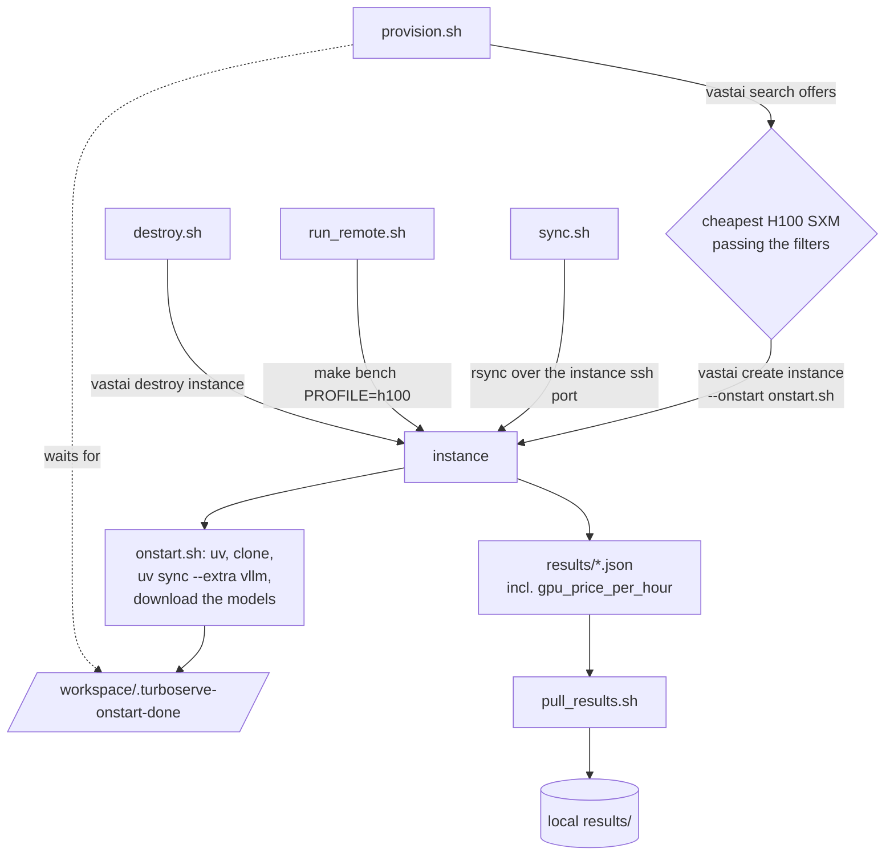

# Running the suite on a rented H100

Every published number in this repository comes from one NVIDIA H100 80GB rented on
vast.ai. A development checkout is for writing code and running CPU unit tests; nothing
timed there is published. This page is how the gap is crossed:
[`scripts/vastai/`](../scripts/vastai) rents the machine, prepares it, runs the suite and
brings the results home.



## Five commands

```bash
uv tool install vastai && vastai set api-key <key>
vastai create ssh-key "$(cat ~/.ssh/id_ed25519.pub)"

export HF_TOKEN=hf_...                   # only for gated checkpoints
scripts/vastai/provision.sh              # rent + prepare; 10-30 min, mostly downloads
scripts/vastai/sync.sh                   # push this working tree
scripts/vastai/run_remote.sh             # make bench PROFILE=h100
scripts/vastai/pull_results.sh           # bring results/ back
scripts/vastai/destroy.sh                # stop the meter
make results                             # render tables and plots from the JSON
```

`make bench-h100` chains the same steps. Every flag and environment variable is tabulated in
[`scripts/vastai/README.md`](../scripts/vastai/README.md); this page is the reasoning.

## Five facts about vast.ai, and what each one forced

**An instance is a container.** You choose the image when you create the instance, and there
is no nested Docker inside it. So neither the Helm chart nor `docker-compose.yml` can be
used on vast.ai. vLLM is pip-installed into the instance (`uv sync --extra vllm`) and
started with [`deploy/vllm/launch.sh`](../deploy/vllm/launch.sh), with the gateway running
as a process beside it.

The second production engine is reached the same way. This repository ships **no `sglang`
extra** — `uv.lock` is the resolution every CPU test run installs, and a second heavyweight
engine in it would change that environment for everyone — so SGLang is installed into the
instance beside the project environment (`uv pip install "sglang[all]"`), or the instance is
rented from the pinned `lmsysorg/sglang:v0.5.3` image instead of the pytorch one, and
started with [`deploy/sglang/launch.sh`](../deploy/sglang/launch.sh). Either way the
benchmark harness only ever needs its URL: `SGLANG_URL` (and `SGLANG_BASELINE_URL` for the
prefix-cache control server) enable its arms, exactly as `VLLM_URL` enables vLLM's. See
[`deploy/sglang/README.md`](../deploy/sglang/README.md).

Measuring an engine this repository does not deploy — TGI, Triton — means renting a second
instance from that engine's official image, not running a second container.

The image is pinned to `pytorch/pytorch:2.6.0-cuda12.4-cudnn9-devel`. The repository's torch
is a cu124 wheel; an image on a different CUDA minor either refuses to load it or silently
falls back to something slower, and either way the measurement is no longer the one that was
intended. The same care applies to an engine image chosen instead of it: pin the tag, and
record it — `turboserve bench` copies whatever the server reports on `/version` and
`/get_server_info` into every result file that server produced.

**The price is per instance and belongs in the results.** `provision.sh` records the
instance's `dph_total` in its state file. `run_remote.sh` exports it as
`TURBOSERVE_GPU_PRICE_PER_HOUR`, with `TURBOSERVE_GPU_PRICE_SOURCE="vast.ai instance price
at run time"`, and the benchmark writes both into every result file as `gpu_price_per_hour`
and `price_source`. Cost per million tokens is then derived from the price actually paid,
never from a figure someone remembered. Rented prices move; the recorded one is what makes
an old result still legible.

**Disk is per instance and models are downloaded there.** Nothing large is ever rsynced from
the laptop: `sync.sh` excludes `.venv/`, `results/`, `adapters/` and every cache, and
`onstart.sh` pulls the checkpoints straight from Hugging Face over the instance's link,
which is an order of magnitude faster than a home connection. Gated repositories need
`HF_TOKEN`, which is passed into the instance's environment at creation time.

**ssh is the only interface, on a non-standard port.** Every script takes
`-p $VAST_SSH_PORT`. `provision.sh` asks for a direct endpoint (`--ssh --direct`) rather than
the vast.ai proxy, because rsync over the proxy is slow enough to be worth avoiding.

**Two engines, two servers, one client.** The suite measures whichever production servers
are reachable, in separate invocations: `naive-vs-cb --arm vllm --url ...`, then
`naive-vs-cb --arm sglang --url ...`, and the same split for `prefix-cache`, whose control
arm is a second server per engine because on both of them the prefix cache is a launch flag.
One `--url` is one server, so a row can always be traced to the process that produced it.
`scripts/run_all_benchmarks.sh` does this from `VLLM_URL`, `VLLM_BASELINE_URL`, `SGLANG_URL`
and `SGLANG_BASELINE_URL`; whichever are unset simply skip their arms. Running both engines
at once on one 80 GB card is not the plan — each wants most of the device for weights and KV
cache, so they are started one after the other.

**`ncu` may not work.** Nsight Systems (`nsys`) works inside containers. Nsight Compute's
hardware counters usually need `NVreg_RestrictProfilingToAdminUsers=0` set on the *host*,
which a rented instance cannot change. If `ncu` fails, record its exact error rather than
working around it — the failure is information about the environment, and a profile
collected some other way is not comparable.

## Why `provision.sh` waits for a marker

ssh answers minutes before the instance is usable: the on-start script is still installing
torch and downloading a 15 GB checkpoint. A benchmark started at the moment ssh comes up
measures the download.

So `onstart.sh` writes `/workspace/.turboserve-onstart-done` as its last act, and
`provision.sh` polls for that file, not for the port. Follow the preparation live with
`vastai logs <id>`; it also lands in `/var/log/onstart.log` on the instance.

The on-start script clones the repository so the instance is useful on its own.
`sync.sh` then rsyncs the laptop's working tree over that clone, which is how uncommitted
code gets measured — the common case during development, and the reason a clone alone is not
enough.

## Why runs survive a dropped connection

`run_remote.sh` starts the command under `nohup` and tails its log, rather than running it in
the ssh session directly. A benchmark suite runs for tens of minutes on a machine billing by
the hour; a closed laptop lid must not kill it. Reconnecting is re-running the script, which
reattaches to the same log. `nohup` rather than `setsid` because `nohup` execs into the
command, so the remote shell still has the real pid to `wait` on and the exit status still
comes back through ssh.

## Cost discipline

- `MAX_PRICE` (default `$4.00/hr`) makes `provision.sh` refuse to rent above a ceiling, so a
  price spike cannot quietly rent something absurd.
- `DRY_RUN=1 scripts/vastai/provision.sh` prints the five cheapest matching offers and
  stops. Worth doing first; H100 prices on vast.ai move by the hour.
- The offer filters ask for `reliability > 0.98` and `inet_down >= 300` Mbps. Both are
  cost decisions rather than fussiness: a machine that drops mid-run costs the whole run,
  and a slow link turns a model download into an extra hour of billing.
- `destroy.sh` lists the result files still on the instance before it asks for
  confirmation. The expensive mistake is not the GPU time, it is the run whose output was
  only ever on that disk.
- Destroying is permanent and takes the disk with it, including the model cache. Leaving an
  instance *stopped* keeps the disk at a lower rate; the scripts do not do this, because a
  forgotten stopped instance is how a bill grows quietly.

## The two profiles

Scenarios take `--profile`, which selects models and sizes from `configs/bench/profiles.yaml`.

| Profile | Where it runs | What it is for |
| --- | --- | --- |
| `h100` | the rented instance | The published results. 7B/3B targets, 1.5B/0.5B drafts, full concurrency sweeps. |
| `dev-2060` | a small consumer GPU | Checking that a scenario runs end to end. Tiny models, tiny sweeps; its output is never published as a result. |

`onstart.sh` pre-downloads the `h100` profile's four Qwen2.5 checkpoints
(7B, 3B, 1.5B, 0.5B — the targets and their speculative-decoding drafts). Override with
`TURBOSERVE_MODELS`.

## FP8 arms

The `h100` profile declares two more arms for `naive-vs-cb`, `vllm_fp8` and `sglang_fp8`:
the same two production engines serving the same checkpoint with FP8 weights and an FP8 KV
cache. On the instance they are one environment variable each on the launcher —

```bash
QUANT=fp8 PORT=8002 deploy/vllm/launch.sh &     # then VLLM_FP8_URL=http://127.0.0.1:8002/v1
QUANT=fp8 PORT=30002 deploy/sglang/launch.sh &  # then SGLANG_FP8_URL=http://127.0.0.1:30002/v1
```

— and `scripts/run_all_benchmarks.sh` runs each arm when its URL is set, exactly as
`VLLM_URL` and `SGLANG_URL` gate the bf16 ones. The reason they are separate servers rather
than a request parameter is that a numeric format is decided when the weights load; the
reason they are separate *runs* is that one H100 holds one of these servers at a time, so
the suite starts a server, sweeps it, stops it, and starts the next. The Kubernetes
equivalent is `engine.quantization: fp8` ([`kubernetes.md`](kubernetes.md#fp8-on-hopper)).

FP8 halves both quantities the instance is sized by — the 7B checkpoint's weights drop from
about 15 GiB to about 7.6, a KV token from 57344 bytes to 28672 — so the fp8 servers fit
beside a larger KV pool at the same `--gpu-memory-utilization`. `onstart.sh` downloads the
bf16 checkpoints only: the default path quantizes them at load time, and a pre-quantized
`-FP8` repository is an extra download this suite does not ask for (`FP8_MODEL` in either
launcher serves one if you have it).

## What has been run from this checkout

The scripts have been syntax-checked (`bash -n`, in CI on every push) and their embedded
Python helpers — offer selection and instance-status parsing — have been exercised against
recorded `vastai` JSON shapes. They have **not** been run against the vast.ai API from this
checkout: doing so rents a GPU. The first real execution is the run that produces the
measured results, and `results/` will say so: every file records its hardware, its software
versions, its price and its `provenance`.
